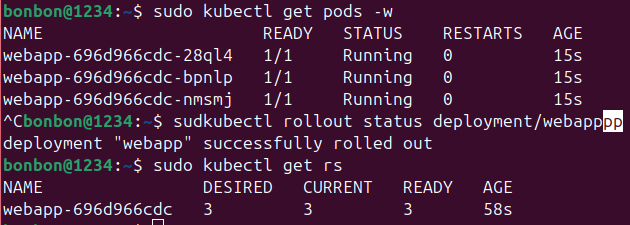
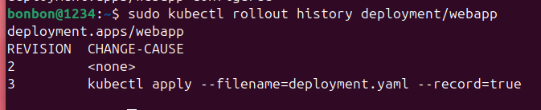
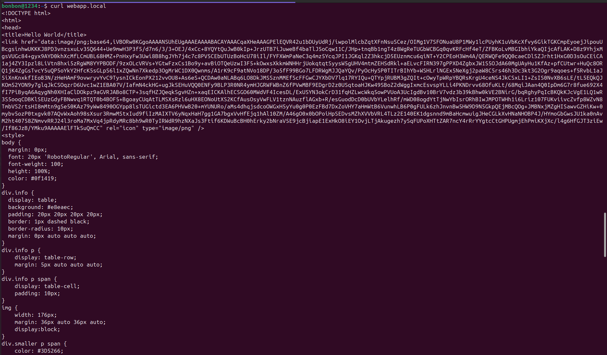
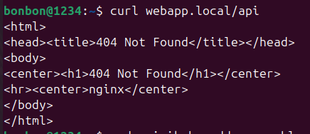

## Пара 5 — Kubernetes: Deployment, Service, Ingress
Команда "kubectl get pods" отображает 3 пода с названием webapp и статусом Running.

"kubectl rollout history deployment/webapp"  используется  для просмотра истории изменений (ревизий) конкретного Deployment с именем webapp. Она показывает список версий, которые были развернуты, что позволяет отслеживать изменения конфигурации и версии образа контейнера.

Ответ от curl webapp.local:

Ответ от curl webapp.local/api:

P.S. ответы получились по факту разными, но я правда хз почему такой странный ответ от второго webapp(((
