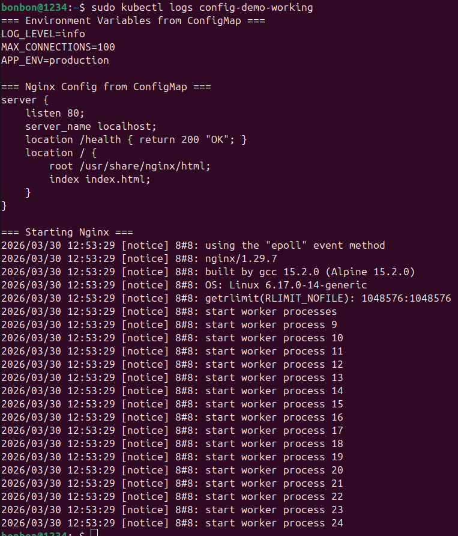
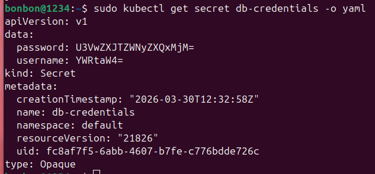
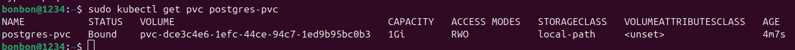
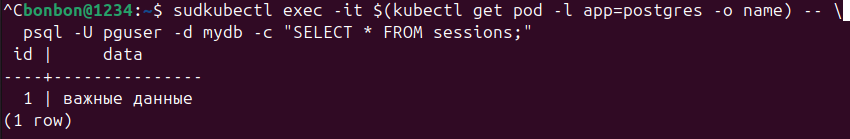

# Пара 6 — Kubernetes: ConfigMap, Secret, PersistentVolume
Под config-demo показывает, что все 3 способа передачи конфигмап работают: переменные окружения из конфигмап, монтирование файла конфигурации из конфигмап и вывод командной строки:

kubectl get secret db-credentials -o yaml: данные сохранились в формате base64 - это видно исходя из секции дата, в котором закодированы значения пароль и имя пользователя:

kubectl get pvc postgres-pvc — статус Bound. Данная команда для просмотра информации о PVC:

Данные не потерялись при пересоздании пода и раньше вставленная запись сохранилась:
