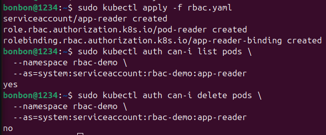
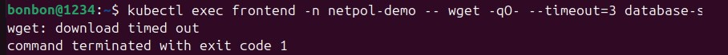
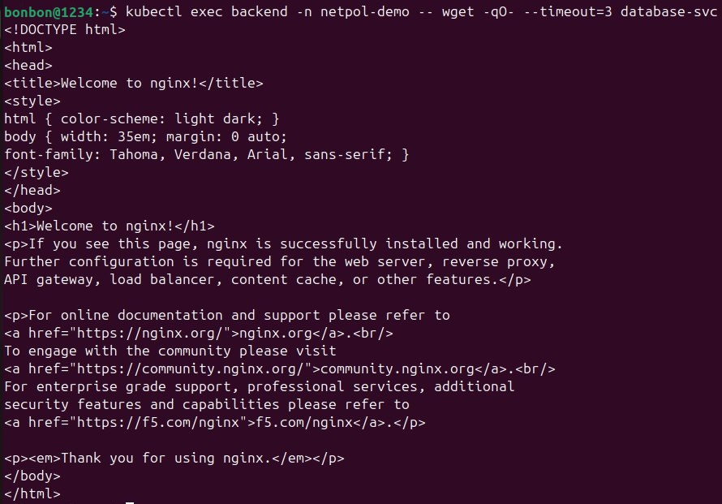
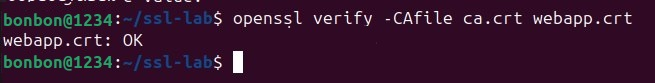
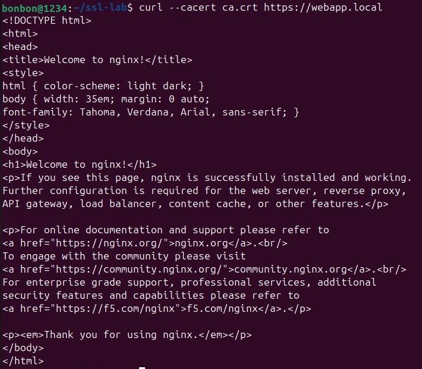

# Пара 7 — Безопасность Kubernetes: RBAC, NetworkPolicy, Falco
Применим конфигурацию под названием RBAC(применение безопасности по принципу использования наименьших привилегий). Проверим права на чтение подов: sudo kubectl auth can-i list pods \
--namespace rbac-demo \
--as=system:serviceaccount:rbac-demo:app-reader. Вывод говорит о том, что поды разрешено читать. Проверим права на удаление подов: sudo kubectl auth can-i delete pods \
--namespace rbac-demo \
--as=system:serviceaccount:rbac-demo:app-reader. Поды нельзя удалять.

Команда "kubectl exec frontend -- wget database-svc" нужна, чтобы под frontented подключился к базе данных за 3 секунды, однако он не может это сделать, потому что сетевая политика запрещает этот трафик.

Команда "kubectl exec backend -n netpol-demo -- wget -qO- --timeout=3 database-svc" показывает успешное получение HTML-страницы nginx:

Команда "openssl verify -CAfile ca.crt webapp.crt" проверяет, что сертификат webapp.crt был подписан центром CА:

Команда "curl --cacert ca.crt https://webapp.local" показывает,что ответ от nginx был получен:
