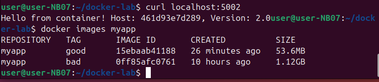
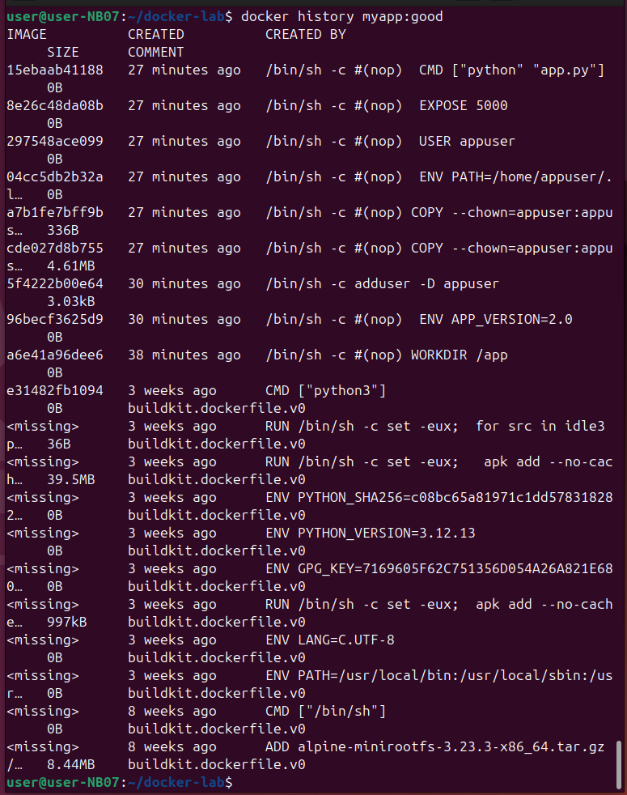
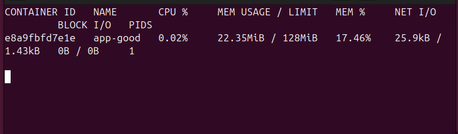

Первая команда: curl localhost:5002
Эта команда отправляет запрос к программе, запущенной на этом же компьютере через порт 5002. В ответ программа печатает текст. Это означает, что контейнер с приложением работает.
Вторая команда: docker images myapp
Эта команда показывает список сохранённых версий (образов) приложения с названием myapp. В таблице две строки:
    Версия с тегом good (размер 53.6 МБ)
    Версия с тегом bad (размер 1.12 ГБ)
docker images нужен, чтобы посмотреть, какие версии приложения есть на компьютере, сравнить их размеры и время создания. Версия good лучше, потому что она занимает гораздо меньше места, чем bad.

На скриншоте виден результат команды docker history myapp:good.
Эта команда показывает список всех шагов, из которых собран контейнер версии good.
В таблице сверху (последние шаги):
    Запуск файла app.py
    Открытие порта 5000
    Создание отдельного пользователя
    Копирование двух маленьких файлов внутрь
Внизу (первые шаги):
    Взята минимальная версия Linux (Alpine) размером 8.44 МБ
    Установлен Python
    Добавлены библиотеки
Команда позволяет посмотреть, из чего состоит контейнер.

На скриншоте показан результат работы команды, которая следит за работающими контейнерами в реальном времени.
Таблица показывает информацию об одном запущенном контейнере с именем app-good:
- CPU % — 0.02% (почти не нагружает процессор)
- MEM USAGE / LIMIT — использует 22.35 МБ 
- NET I/O — передано 25.9 кБ данных и 1.43 кБ получено
- BLOCK I/O — 0 байт прочитано и записано на диск (ничего не сохранялось)
- PIDS — 1 (внутри работает один процесс)

https://hub.docker.com/r/karket03/flask-demo
ссылка на мой лк