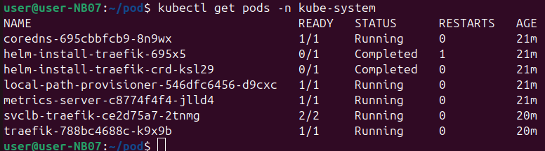
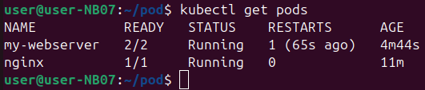
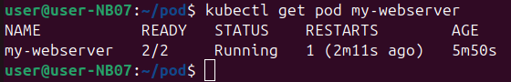
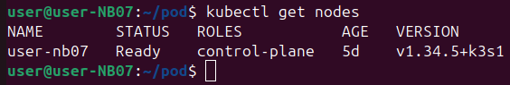

На скриншоте команда `kubectl get pods -n kube-system`. Она показывает служебные контейнеры кластера. В выводе видно, что почти все работают (статус `Running`), а два установщика уже завершили свою задачу (статус `Completed`). Команда нужна, чтобы проверить, всё ли в порядке с внутренними службами.

На скриншоте команда `kubectl get pods`. Она показывает контейнеры (поды) в текущей папке кластера.
- `my-webserver` — 2 контейнера внутри, оба работают, был один перезапуск
- `nginx` — 1 контейнер, работает, перезапусков не было
Команда чтобы быстро посмотреть, какие поды запущены и всё ли с ними в порядке.

На скриншоте команда `kubectl get pod my-webserver`. Она показывает информацию только об одном конкретном поде с именем `my-webserver`.
- Внутри пода два контейнера (2/2 готовы)
- Статус — работает (Running)
- Был один перезапуск (произошёл 2 минуты назад)
- Работает уже почти 6 минут
нужна когда нужно посмотреть состояние не всех подов, а только одного конкретного.

На скриншоте команда `kubectl get nodes`. Она показывает список компьютеров (узлов), из которых состоит кластер Kubernetes.
- Есть один узел с именем `user-nb07`
- Статус `Ready` — узел готов к работе
- Роль `control-plane` — это главный управляющий узел
- Работает 5 дней
- Версия `v1.34.5+k3s1` (используется лёгкая сборка K3s)
нужно чтобы проверить, сколько узлов в кластере, все ли они работают и кто из них главный. В данном случае кластер состоит всего из одного компьютера, который сам себя и управляет.