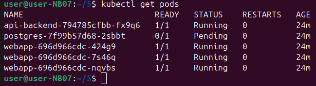
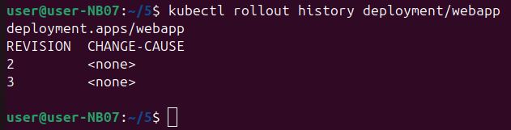
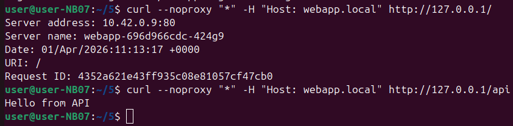

На скриншоте команда `kubectl get pods`. Она просто показывает все контейнеры, которые запущены в кластере.
- `api-backend` — работает
- `postgres` — не работает, висит в статусе `Pending` (ждёт)
- `webapp` — три штуки, все работают
Проблема: 
База данных (`postgres`) не запустилась. Уже 24 минуты ждёт. Статус `Pending` значит, что кластер не может её запустить — возможно, не хватает памяти или места на диске.
Команда чтобы быстро увидеть, всё ли работает. Тут сразу видно, что с базой данных проблема.

На скриншоте команда `kubectl rollout history deployment/webapp`. Она показывает историю обновлений приложения `webapp`.
- Есть две версии (ревизии): номер 2 и номер 3
- В столбце `CHANGE-CAUSE` написано `<none>` — значит, при обновлении не оставили пояснение, что именно меняли
команда чтобы посмотреть, сколько раз обновляли приложение и какие версии были. Если после обновления что-то сломалось, можно откатиться на старую версию. Здесь непонятно, чем версия 2 отличается от версии 3, потому что пояснений не оставили.

Первая команда:
Отправляет запрос к приложению `webapp.local` по адресу `127.0.0.1`. В ответе видно:
- Адрес сервера: `10.42.0.9:80`
- Имя конкретного пода: `webapp-696d966cdc-424g9`
- Дата и время запроса
Вторая команда:
Отправляет запрос к адресу `/api`. В ответе приходит: `Hello from API`
Надо чтобы проверить, что приложение работает и правильно отвечает на запросы. В первом ответе видно, какой именно под обработал запрос (показывает имя конкретного контейнера). Во втором — проверяется, что часть с API тоже работает и возвращает текст.