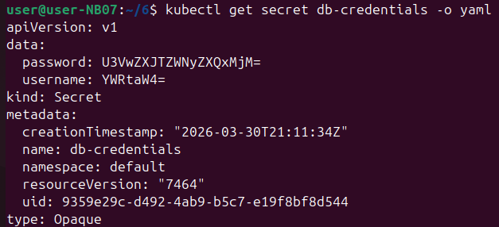
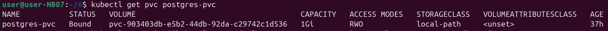
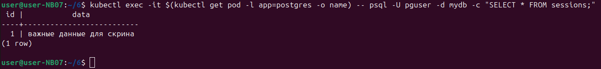
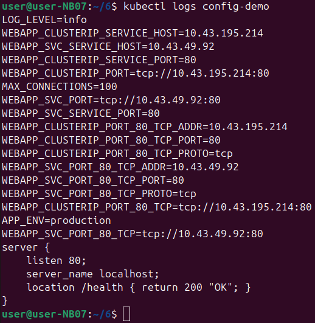

На скриншоте команда `kubectl get secret db-credentials -o yaml`. Она показывает секретные данные (логин и пароль от базы данных) в удобном для чтения формате.
- Внутри есть `username` и `password`
- Но они закодированы — написаны непонятными буквами и цифрами
- На самом деле `YWRtaW4=` — это `admin`, а `U3VwZXJtZWNyZXQxMjM=` — это `SuperSecret123`
Она чтобы посмотреть, какие логины и пароли сохранены в кластере. Данные хранятся в закодированном виде, чтобы случайно не увидеть их глазами, но при желании их можно расшифровать.

На скриншоте команда `kubectl get pvc postgres-pvc`.  
PVC — это «заявка на место для хранения данных». 
- Статус `Bound` — значит, место выделено успешно  
- Размер — `1 Gi` (один гигабайт)  
- База данных сможет сохранять данные на диск, даже если перезапустится
Проверить, получила ли база данных обещанное место для хранения. Если статус `Bound` — всё хорошо. Если `Pending` — значит, места не хватает или что-то настроено неправильно.

На скриншоте команда, которая заходит внутрь контейнера с базой данных и выполняет запрос к таблице `sessions`.
Что происходит
- `kubectl get pod -l app=postgres -o name` — находит имя пода с базой данных
- `kubectl exec -it` — заходит внутрь этого пода
- `psql -U pguser -d mydb -c "SELECT * FROM sessions;"` — запускает SQL-запрос к базе данных
Что в ответе
Таблица `sessions` содержит одну запись: номер 1 и текст «важные данные для скрипа» 
Надо чтобы проверить, какие данные на самом деле лежат в базе. Полезно для отладки — например, чтобы убедиться, что приложение правильно сохраняет информацию.

На скриншоте команда `kubectl logs config-demo`. Она показывает логи (внутренние сообщения) контейнера с именем `config-demo`.
В выводе
- Переменные окружения: `LOG_LEVEL=info`, `MAX_CONNECTIONS=100`, `APP_ENV=production`
- Адреса и порты сервисов, к которым может обращаться контейнер
- Небольшой фрагмент настройки веб-сервера (nginx)
Посмотреть, какие настройки получил контейнер при запуске (переменные окружения) и как он сконфигурирован. Логи помогают понять, правильно ли приложение запустилось и не выдаёт ли ошибки. В данном случае видно, что контейнер вывел свои настройки и готов работать.