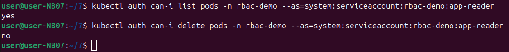
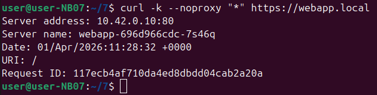
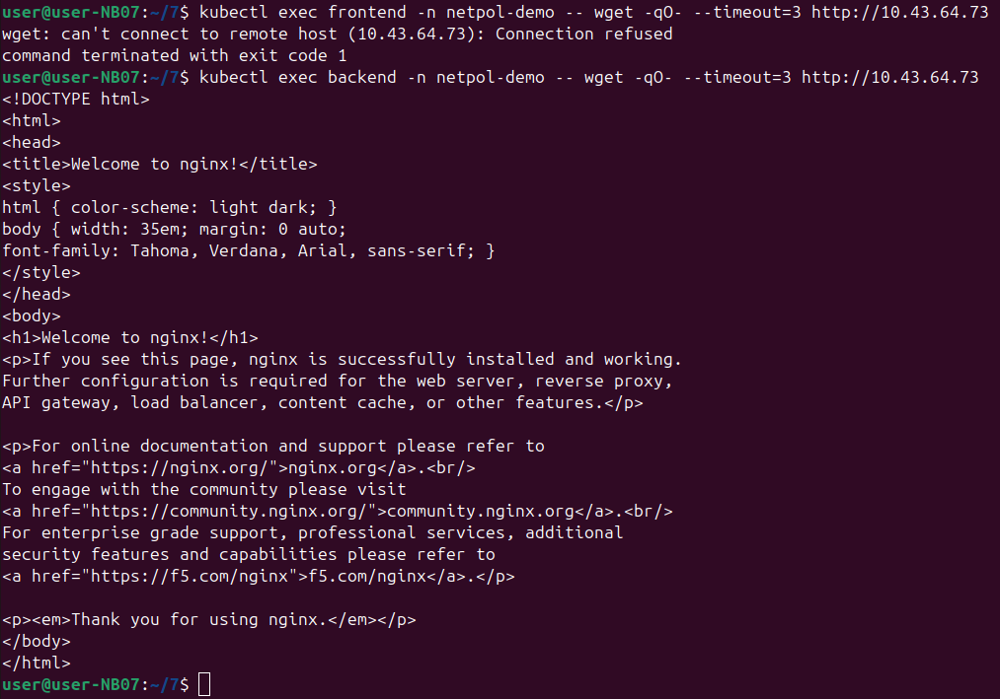

На скриншоте две команды `kubectl auth can-i`. Они проверяют, есть ли у определённого пользователя права на выполнение действий в кластере.
Первая команда:
У пользователя `app-reader` спрашивают: «Можешь посмотреть список контейнеров (pods) в папке `rbac-demo`?»  
Ответ: `yes` — может.
Вторая команда: 
Спрашивают: «Можешь удалять контейнеры в той же папке?»  
Ответ: `no` — не может.
Проверить, правильно ли настроены права доступа. Пользователю `app-reader` дали право только смотреть, но не удалять. Это сделано специально для безопасности — чтобы случайно не сломать работающие приложения.

На скриншоте команда `curl -k --noproxy "*" https://webapp.local`. Она отправляет защищённый запрос (через HTTPS) к приложению `webapp.local`.
Что означает `-k`:
Отключить проверку сертификата безопасности. Используется для тестов, когда сертификат самодельный или не настроен правильно.
Что видно в ответе:
- Адрес сервера: `10.42.0.10:80`
- Имя пода, который обработал запрос: `webapp-696d966cdc-7s46q`
- Дата и время запроса 
Проверить, что приложение работает по защищённому протоколу (HTTPS). Даже с отключённой проверкой сертификата видно, что запрос прошёл успешно и приложение ответило.

На скриншоте две команды. Они проверяют, может ли один контейнер достучаться до другого по сети.
Первая команда: 
Из контейнера `frontend` пытаются подключиться к адресу `10.43.64.73`.  
Ответ: `Connection refused` — подключение отклонено. Доступа нет.
Вторая команда: 
Из контейнера `backend` пытаются подключиться к тому же адресу.  
Ответ: пришла целая веб-страница nginx — подключение успешно.
Сетевые правила настроены так, что `backend` может общаться с этим сервером, а `frontend` — нет. 
Проверить сетевую изоляцию в кластере. Администраторы могут запретить одним приложениям доступ к другим для безопасности. Здесь видно, что правила работают — `frontend` заблокирован, а `backend` имеет доступ.