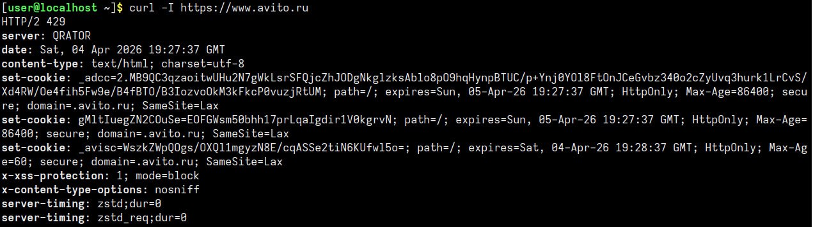

Так, ну в этой лабе сначала я вставил скрипт для поломки сети. Опять же, часть скрипта с `common.sh` пришлось убрать, так как из-за отсутствия такого подскрипта у меня основной скрипт не запускается.

А еще я добавил в скрипт переменную `BACKUP_NET="/tmp/net_backup"`, так как без нее он не запускается (видимо, она находится в том самом подскрипте `common.sh`). На данном моменте я еще не знал, что подскрипт common.sh лежит на гитхабе.

В результате выполнения скрипта ломается сеть, а именно: резолвер, порядок разрешения имен и маршрут по умолчанию.

Чтобы починить, я сначала отредактировал файл `/etc/nsswitch.conf` через `nano`: в строку `hosts` просто дописал значение `dns`. Это разрешило системе обращаться к службе DNS для получения адресов сайтов (до этого поиск был ограничен только локальным файлом `/etc/hosts`).

Потом я отредачил файл `/etc/resolv.conf`. Тут я заменил нерабочий адрес на публичный DNS-сервер `8.8.8.8`, что позволило системе связывать домены с их реальными IP-адресами.

И, наконец, я прописал маршрут по умолчанию через команду `ip route add default via 192.168.122.1`. Без этого пакеты не знали бы, как выйти за пределы локальной сети в инет. Айпишник для команды предварительно посмотрел через `ip -br a`.

После фикса я проверил сеть через `curl -I https://www.avito.ru`. В результате вывелся HTTP-ответ от Avito, следовательно, всё заработало.

Ссылка на видос: https://asciinema.org/a/ymJoToR0KvUtDRKa
💡

