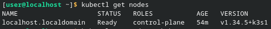
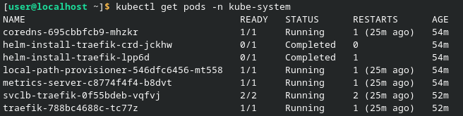
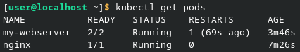
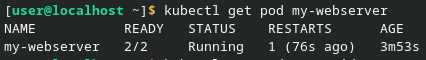

1. Вывод `kubectl get nodes`\
Все узлы кластера (ноды) находятся в статусе Ready. Легковесный кластер k3s успешно развернут и готов к работе

    

2. Вывод `kubectl get pods -n kube-system`\
Все системные компоненты кластера успешно запущены (находятся в статусах Running или Completed), ошибок в работе Control Plane нет

     

__Вопрос 1:__ Какие поды в kube-system всегда должны быть Running?\
__Ответ:__ В статусе Running всегда должны находиться критически важные компоненты кластера. Как видно из вывода, для кластера k3s это: локальный DNS-сервер (coredns), сервер метрик (metrics-server), а также сетевой контроллер и провайдер хранилища (traefik, local-path-provisioner). Основные компоненты управления, такие как kube-apiserver и scheduler, в k3s не отображаются как поды, так как для экономии ресурсов работают как единый фоновый процесс на самом узле

3. Вывод `kubectl get pods`\
Оба тестовых пода успешно запущены. Под nginx запущен с одним контейнером (статус 1/1), а под my-webserver, поднятый из YAML-манифеста, работает с двумя контейнерами (основной сервер и sidecar для логов, статус 2/2)

    

4. Вывод `kubectl get pod my-webserver`\
Демонстрация механизма самовосстановления. После принудительного убийства процесса nginx (kill 1), счетчик RESTARTS у пода увеличился на единицу, а статус мгновенно вернулся в Running

     

__Вопрос 2:__ Почему Pod не удалился, а перезапустился? Кто за это отвечает?\
__Ответ:__ Pod не удалился, так как командой мы завершили только процесс внутри самого контейнера, а не удалили объект Pod из кластера. За автоматический перезапуск упавшего контейнера отвечает локальный агент kubelet, который следит за тем, чтобы текущее состояние пода совпадало с желаемым (так как по умолчанию поды всегда перезапускаются при падении)