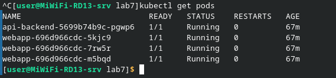
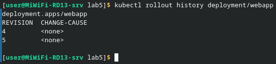
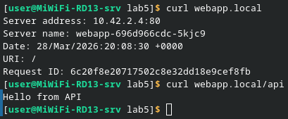

1. ___Вывод `kubectl get pods`___\
Итоговая проверка состояния всех компонентов. В кластере запущены три копии (реплики) основного веб-приложения и один вспомогательный сервис API. Все поды находятся в статусе Running, что говорит о стабильной работе всей системы после настройки маршрутов

    

2. ___Вывод `kubectl rollout history deployment/webapp`___\
Это проверка истории версий нашего приложения. В списке отображаются ревизии, которые создавались при каждом изменении деплоймента (например, при обновлении образа или смене настроек). Наличие нескольких ревизий позволяет быстро откатить приложение назад, если в новой версии нашлась ошибка

    

3. ___Проверка работы Ingress через curl___\
Демонстрация работы внешнего маршрутизатора. При обращении к домену webapp.local открывается основная страница, а при добавлении пути /api трафик автоматически уходит на другой сервис (backend). Это подтверждает, что Ingress правильно распределяет запросы в зависимости от их адреса

    

4. ___В чем разница между сервисами ClusterIP и NodePort___\
ClusterIP дает приложению внутренний адрес, который виден только другим программам внутри кластера — это безопасно. NodePort открывает определенный порт на всех узлах (нодах) кластера, что позволяет зайти в приложение снаружи, просто введя IP-адрес сервера

