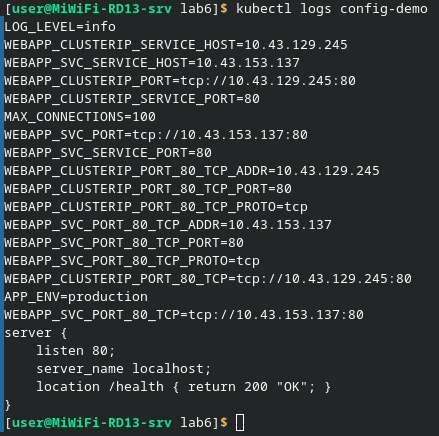
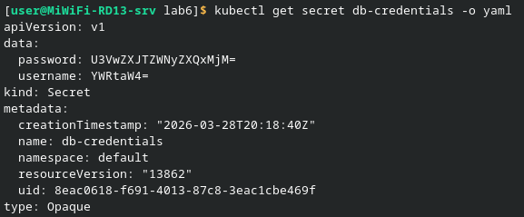
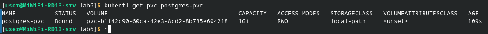
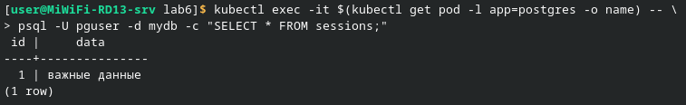

1. ___Вывод `kubectl logs config-demo`___\
В этом блоке проверяется работа с ConfigMap. На скриншоте видно, что настройки успешно передались в контейнер разными способами: как обычные переменные окружения (например, APP_ENV=production) и как целый примонтированный файл конфигурации server { ... }. Это позволяет менять настройки программы, не пересобирая её образ

     

2. ___Вывод `kubectl get secret db-credentials -o yaml`___\
Для безопасного хранения паролей был использован объект Secret. При просмотре через формат yaml видно, что данные (логин и пароль) представлены в виде кодировки base64. Это скрывает их от случайного взгляда, но для реальной защиты нужно использовать дополнительные методы шифрования, так как base64 легко расшифровать

      

3. ___Вывод `kubectl get pvc postgres-pvc`___\
Здесь показан результат создания запроса на постоянное хранилище (PVC). Статус Bound означает, что кластер успешно нашел и выделил виртуальный «жесткий диск» объемом 1 ГБ для нашей базы данных. В случае с k3s был использован класс хранилища local-path

    

4. ___Проверка сохранения данных (SELECT)___\
Это тест на сохранение данных. Сначала информация записывается в базу данных PostgreSQL, после чего принудительно удаляется под с базой. Kubernetes автоматически создал новый под, подключил к нему тот же диск (PVC), и запрос SELECT показал, что все данные сохранились. Это доказывает, что база данных защищена от сбоев

    

