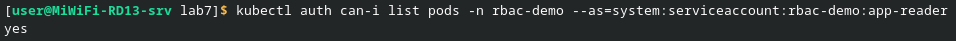
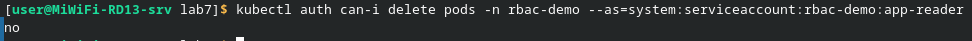
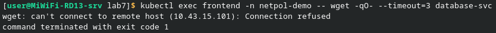
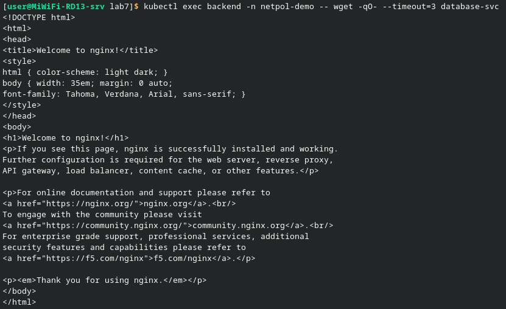
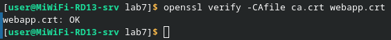
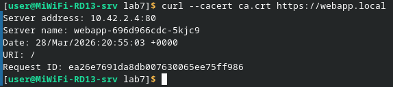

1. ___Вывод `kubectl auth can-i list pods -n rbac-demo --as=system:serviceaccount:rbac-demo:app-reader`___\
В этом блоке проверяется корректность настройки RBAC (Role-Based Access Control). С помощью команды can-i мы имитируем действия сервисного аккаунта app-reader. Результат yes подтверждает, что роль назначена верно и у данного аккаунта есть права на просмотр списка подов в конкретном пространстве имен

     

2. ___Вывод `kubectl auth can-i delete pods -n rbac-demo --as=system:serviceaccount:rbac-demo:app-reader`___\
Здесь демонстрируется реализация разграничения прав доступа. Мы проверяем, может ли тот же аккаунт app-reader удалять ресурсы. Результат no доказывает, что политика безопасности настроена правильно: пользователь имеет права только на чтение и не может совершать деструктивные действия в кластере

     

3. ___Проверка ограничения трафика через NetworkPolicy___\
На скриншоте показана работа сетевой политики, ограничивающей доступ к базе данных. При попытке обращения к сервису database-svc из пода frontend запрос завершается ошибкой Connection refused. Это подтверждает, что сетевая изоляция настроена верно и доступ из внешнего сегмента (фронтенда) к БД напрямую закрыт

      

4. ___Проверка разрешенного трафика (NetworkPolicy)___\
В отличие от предыдущего шага, запрос к базе данных выполняется из пода backend. Здесь сетевая политика разрешает соединение, и мы видим успешный ответ от сервера (HTML-код страницы nginx). Это доказывает, что правила фильтрации трафика настроены избирательно и позволяют компонентам системы взаимодействовать только по разрешенным маршрутам

     

5. ___Проверка цепочки сертификатов (OpenSSL)___\
Здесь выполняется проверка подлинности созданного сертификата приложения webapp.crt. С помощью утилиты openssl мы сопоставляем его с корневым сертификатом ca.crt. Статус OK подтверждает, что цепочка доверия выстроена верно, сертификат валиден и подписан нашим центром сертификации

    

6. ___Тестирование HTTPS соединения через curl___\
Финальная проверка работоспособности TLS в кластере. Выполняется запрос к веб-приложению по защищенному протоколу HTTPS. Флаг --cacert позволяет curl доверять нашему локальному CA. Успешный вывод метаданных запроса (ID, дата, адрес) подтверждает, что шифрование настроено корректно и сервер успешно идентифицирует себя

    