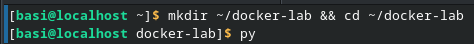
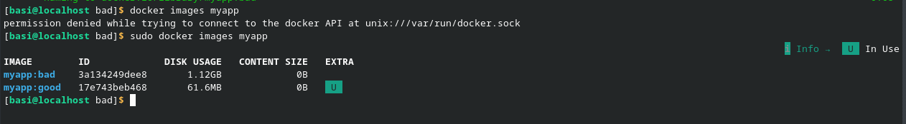
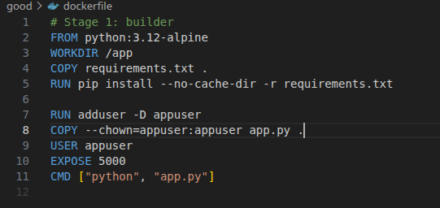
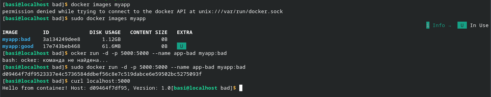
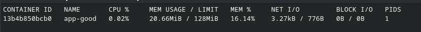
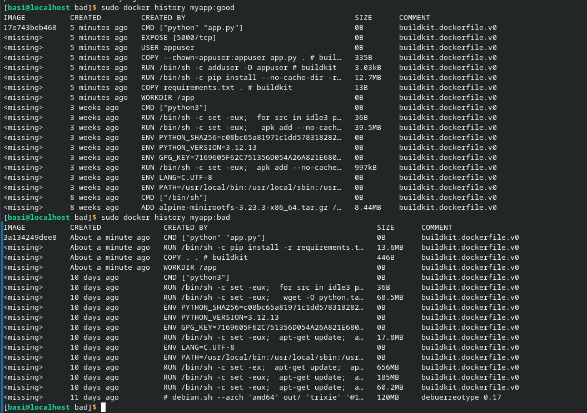
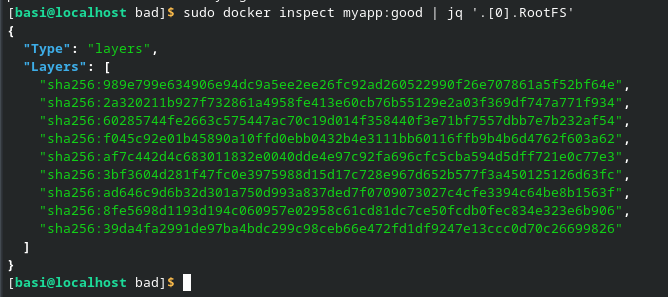
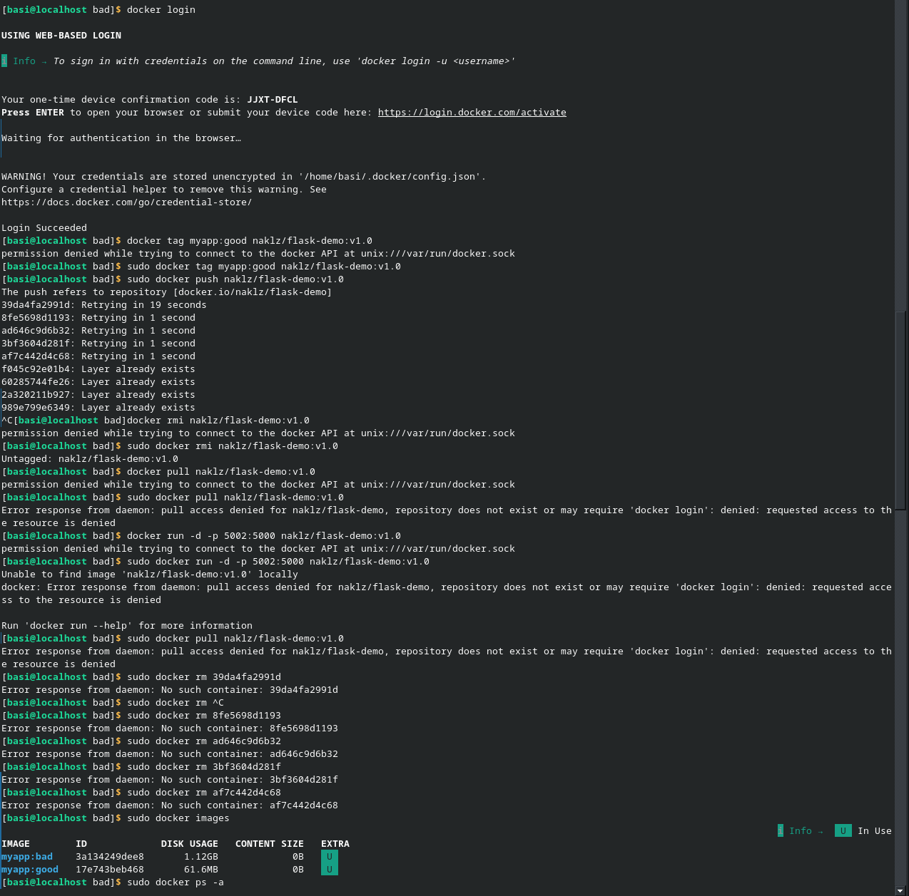

Изначально были созданы папки для работы

На втором этапе были созданы 2 докера: плохой и хороший. С помощью них были созданы контейнеры. Плохой докер собирался дольше и весил больше, чем хороший. Для хорошего докера также были применены ограничения.

Плохой образ тяжёлый потому что:
Базовый образ python:3.12 — полная версия весит ~900MB

Копируется всё — COPY . . переносит все файлы из текущей директории, включая ненужные
Кеш pip не очищен — pip install сохраняет кеш пакетов
Нет оптимизации слоёв — все команды в одном слое без очистки временных файлов

На 3 этапе больших проблем не возникло, кроме работы dive. Он жаловался, что у него нет прав, хотя команда была применена с правами администратора.

На 4 блоке я столкнулся с проблемой, что докер не хотел пушиться на сайт. Вероятно проблема была из-за того, что при пуше докера утилита видит удалённые 'Фантомные' образы и не может их запушить. Я пробовал удалять их и перезагружать докер, но всё равно вылетала данная ошибка.