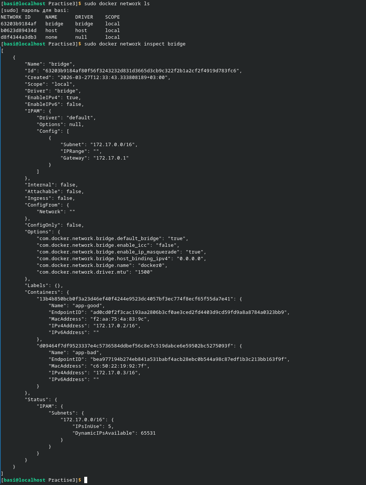
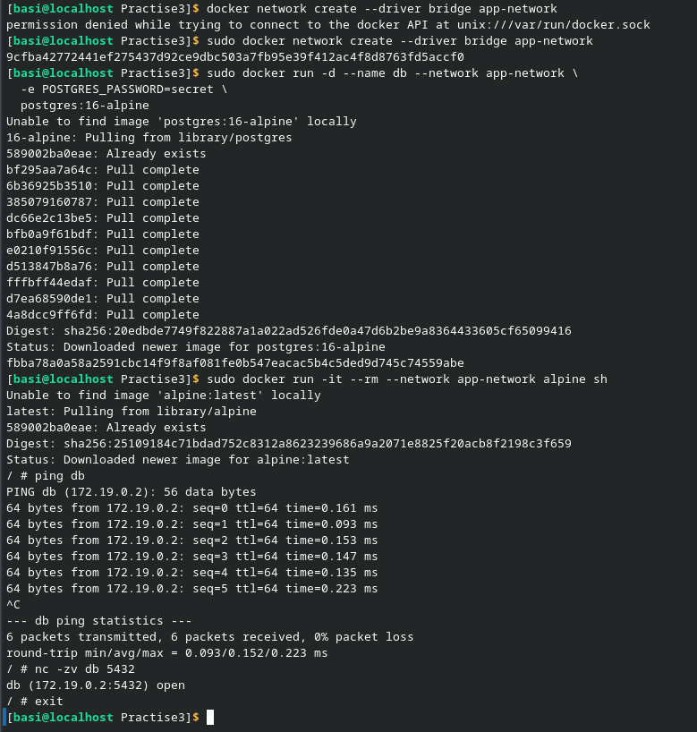
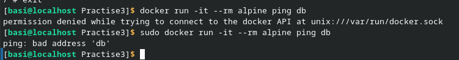
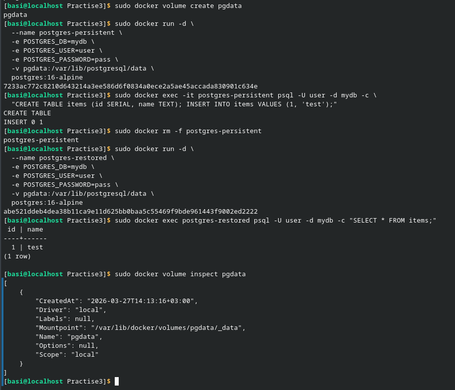
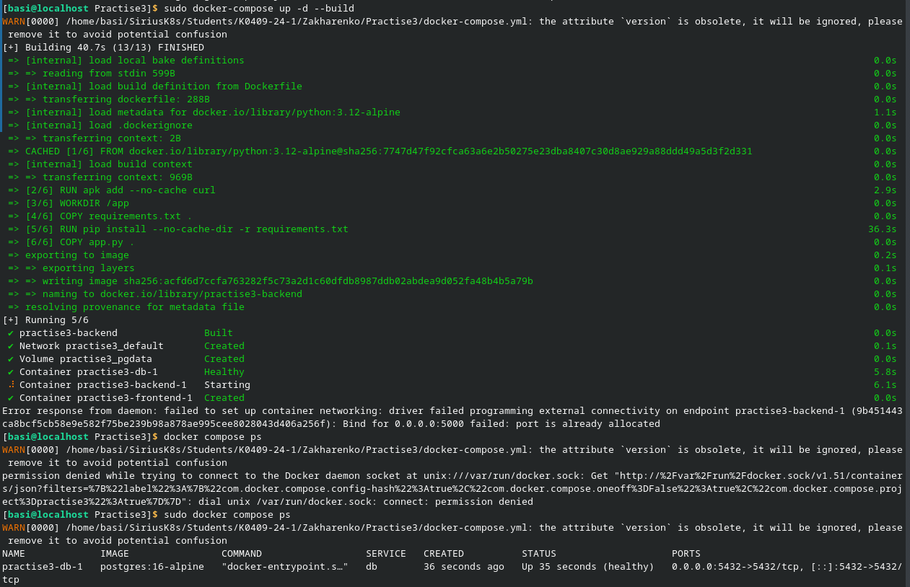
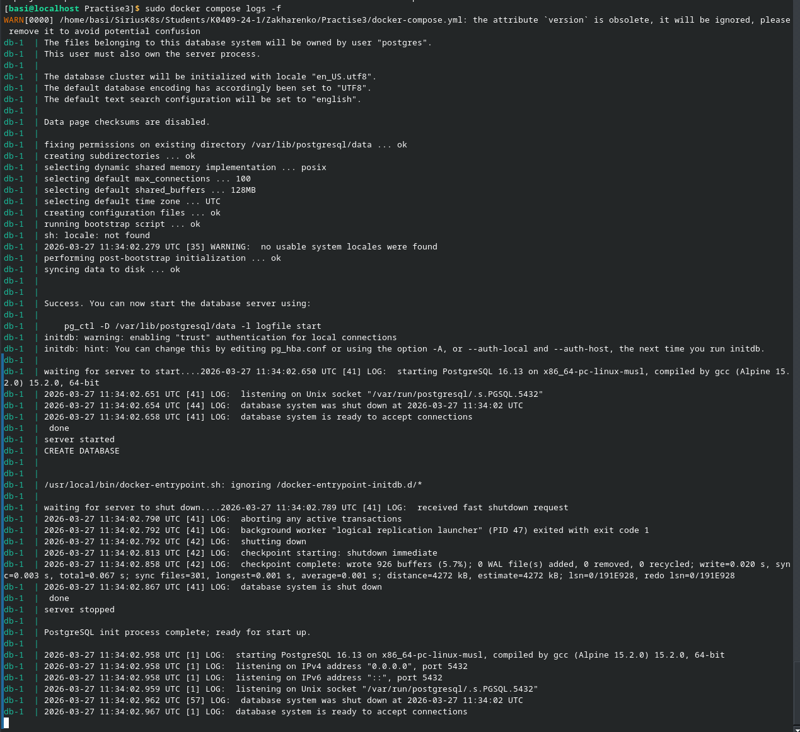
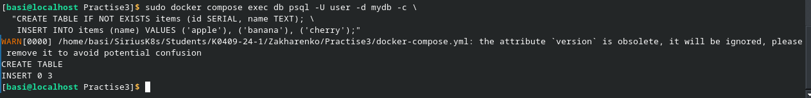
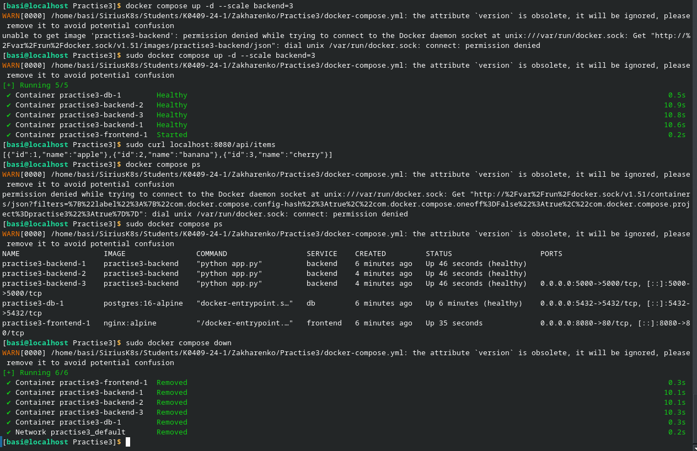
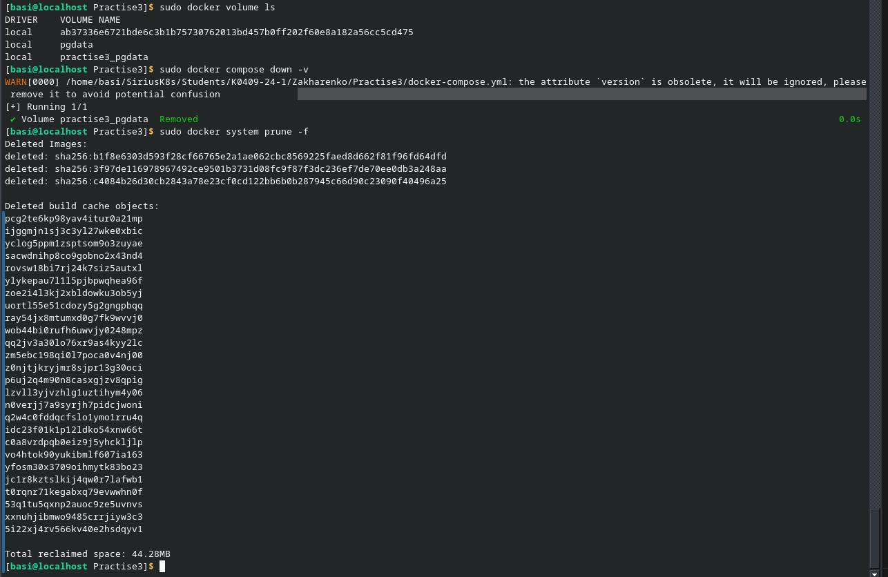

В первом блоке были просмотрены сети и запущены два контейнера в новой изолированной сети. На данном этапе проблем не возникло и были сделаны выводы, что network - это namespace + DNS.

На втором блоке также не возникло никаких проблем. Были проведены эксперименты с volume и контейнером.

На 3 этапе были созданы скрипты для бекэнда и фронтенда. Затем была создана база данных и с добавленными позже данными.

На последнем этапе были выведены данные о volume и удалены images.