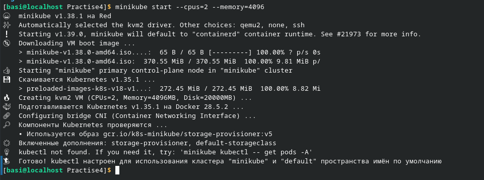
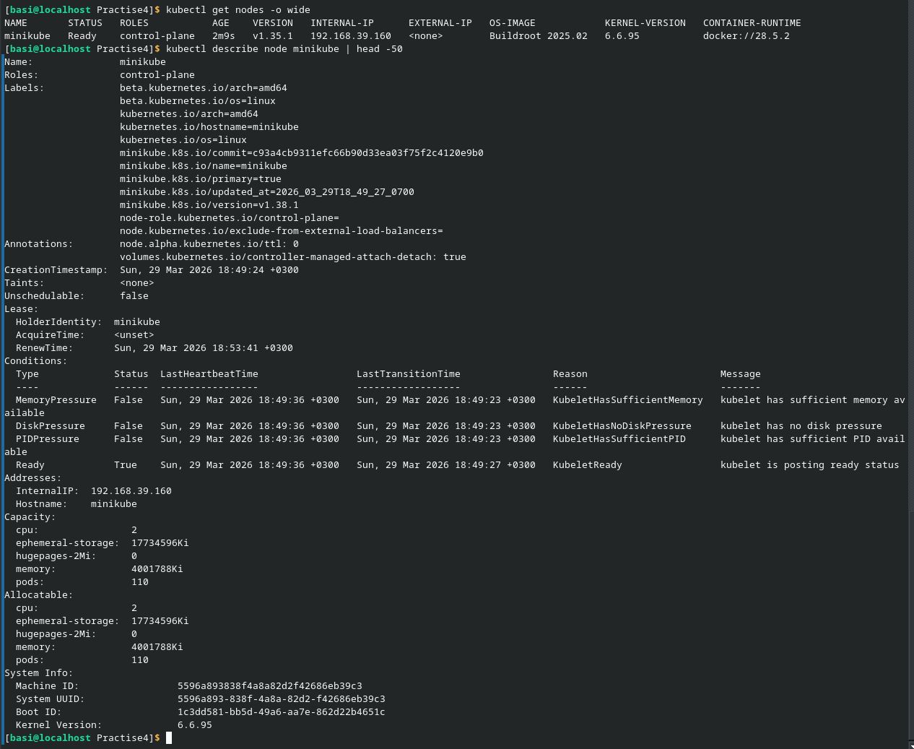
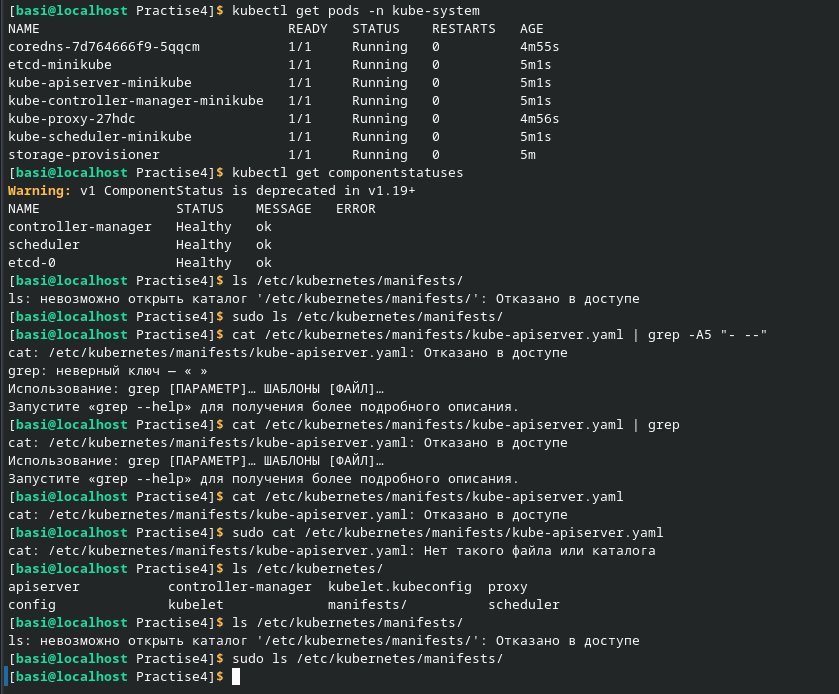
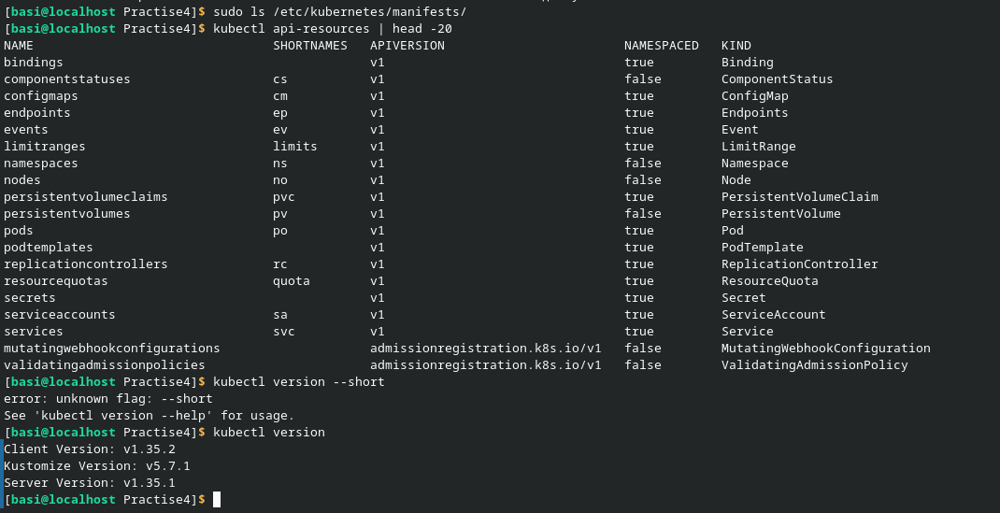
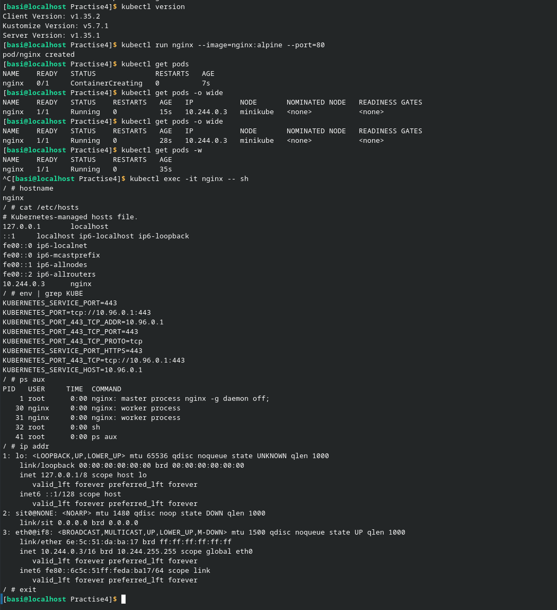
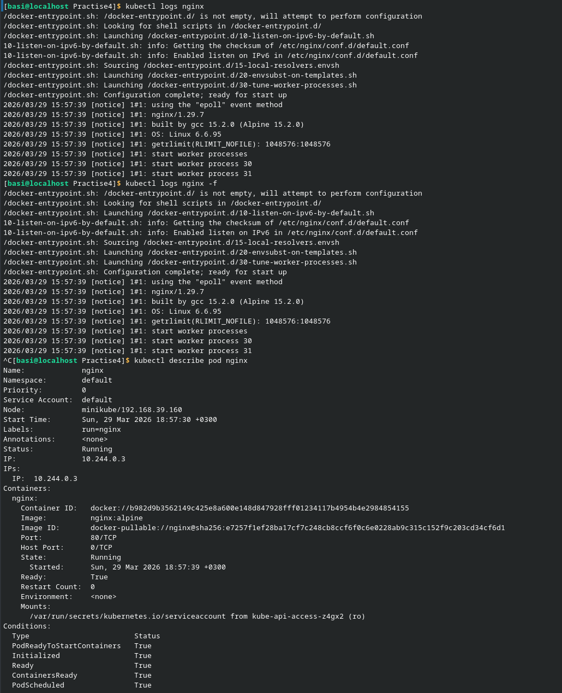
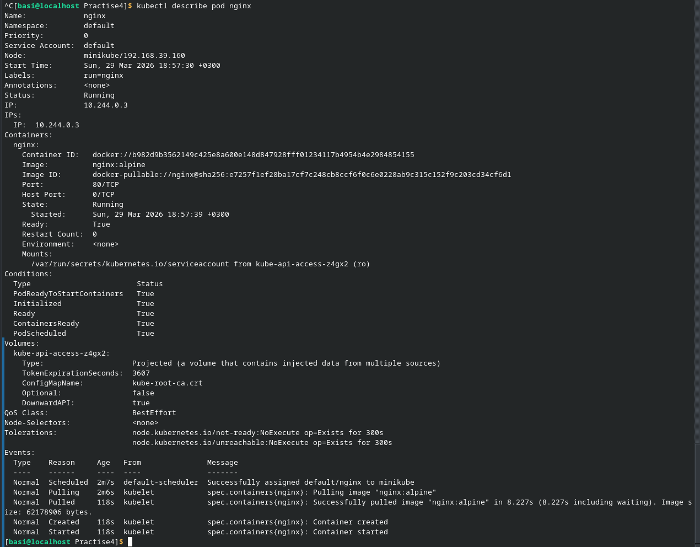
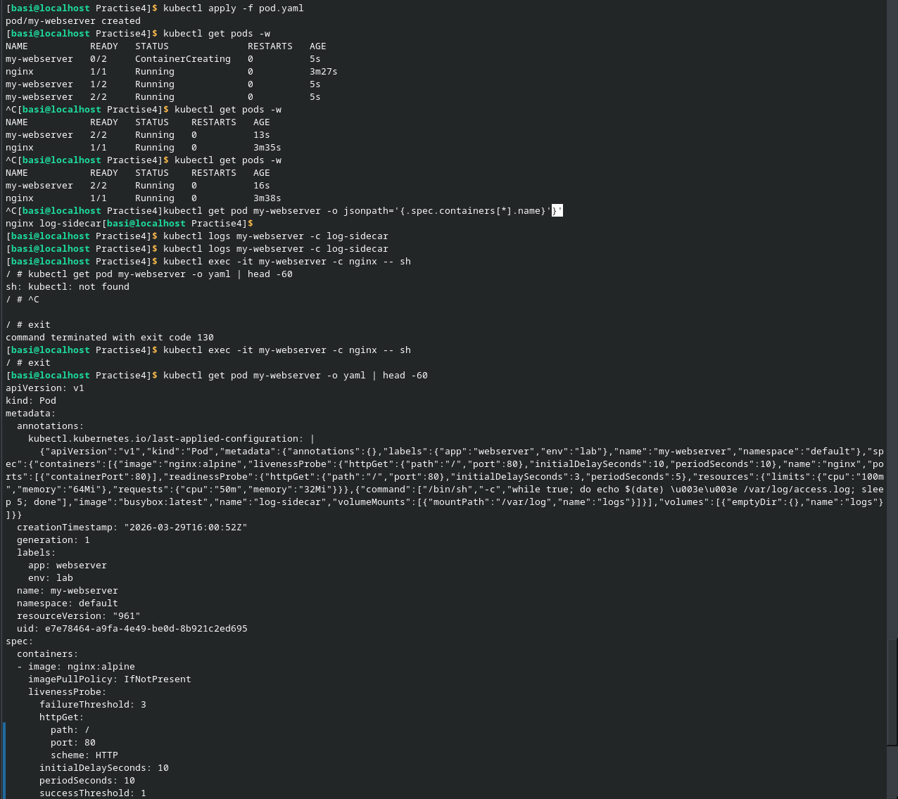
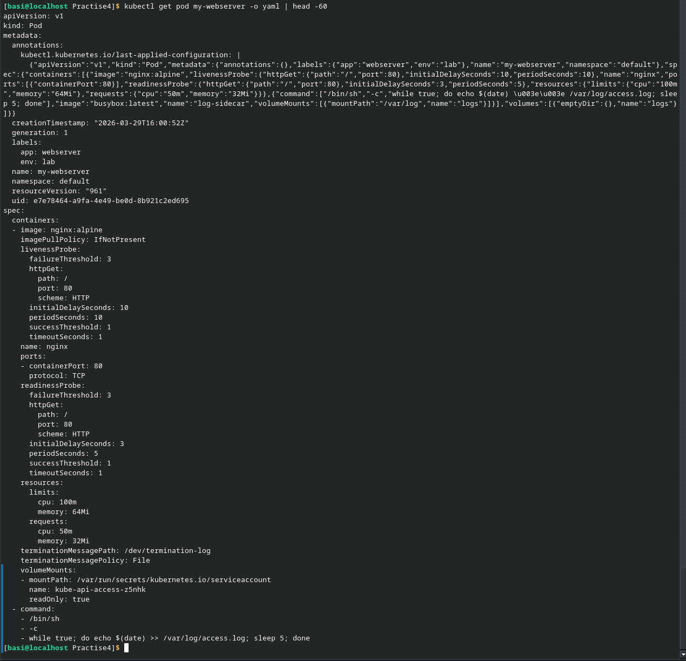
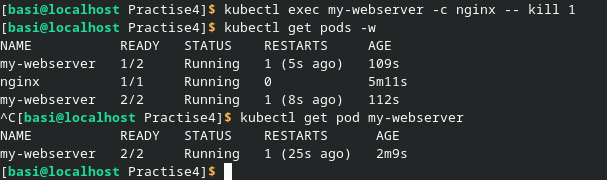

Сначала я установил и запустил minicube на компьютере и приступил к выполнению лабораторной работы. По лабораторной работе пролем не возникло. В первом блоке применялись команды с информацией. В пространстве kube-system всегда должны быть в состоянии Running поды, обеспечивающие работу Control Plane и базовых сервисов кластера Kubernetes (coredns, kube-proxy, kube-apiserver).

Во втором блоке был запущен под. Он был промониторен, был осуществлён вход внутрь пода.

 В третьем блоке был создан YAML файл для пода. Он также был проанализирован с помощью разных команд и был осуществлён вход в этот под.

На последнем блоке был убит процесс nginx и просмотрены последствия данного действия. Счётчик рестартов увеличился, под не удалился. Pod не удалился, а перезапустился, потому что Kubernetes пытается поддерживать желаемое состояние (desired state) для пода. Это происходит за счёт агентов и контроллеров.

