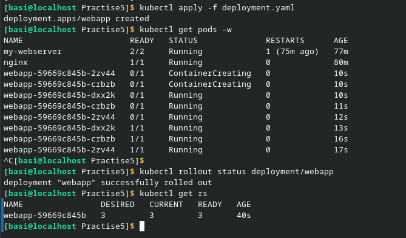
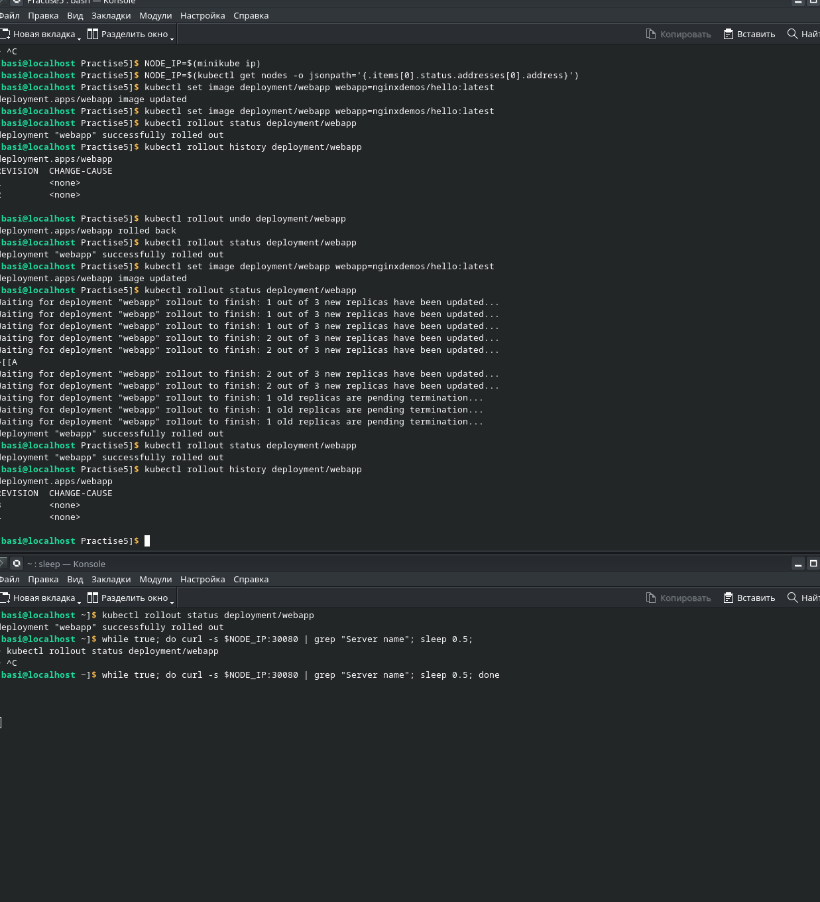
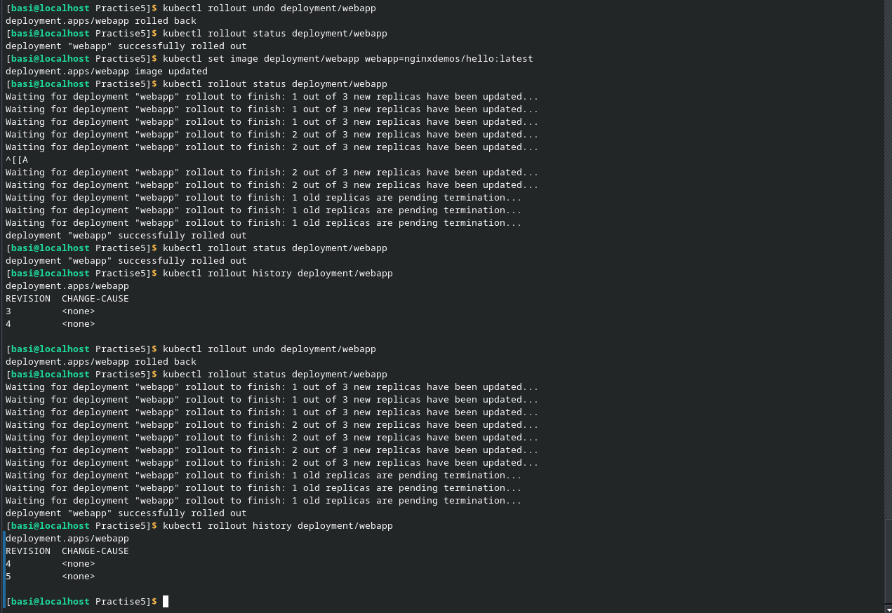
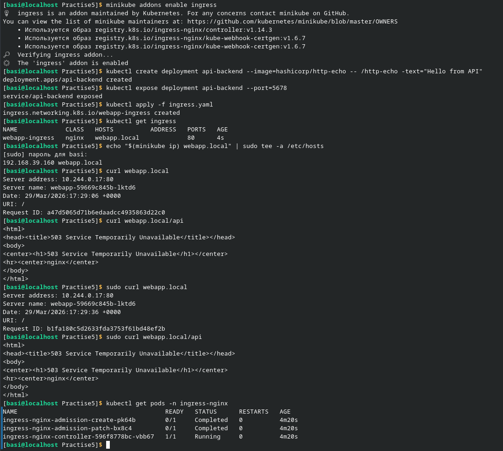
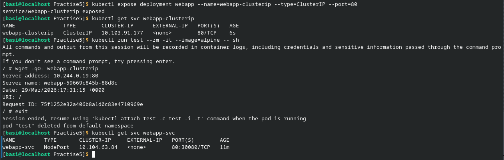

В первом блоке лабораторной работы не возникло никаких трудностей. Был создан YAML файл. Он был принят и изучен. Был проведен мониторинг поднятия 3-х подов.

Во втором блоке возникли первые трудности. Почему-то в дополнительной консоли не отображались логи, хотя я создавал какую-либо активность. Возможно это связано с дистрибутивом (я не знаю что ещё может быть), либо я как-то супер криво установил и поднял minicube. Остальные команды применялись успешно.

В третьем блоке лабораторной работы был создан ещё один YAML файл. Перед этим также был установлен Ungress Controller и созданы поды. Проблема возникла на этапе вывода информации с помощью curl. Они выводили не текст, а htlm-код с указанием ошибки (первый curl выводил адрес и дату сайта). Возможно ошибка также связана с кривой установка minicube.

В последнем блоке не возникло никаких трудностей и команды успешно исполнялись.
