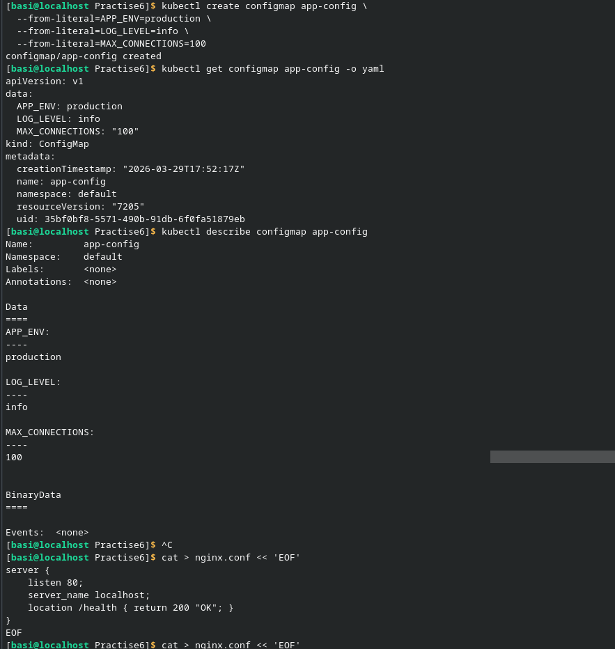
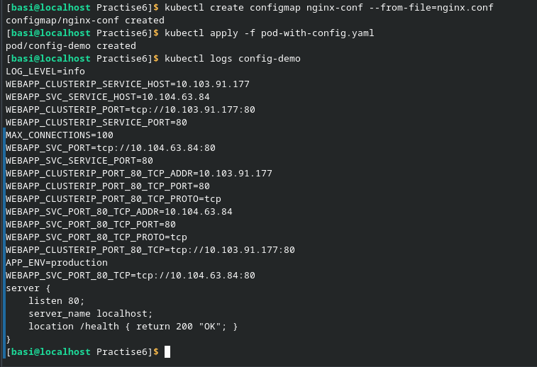
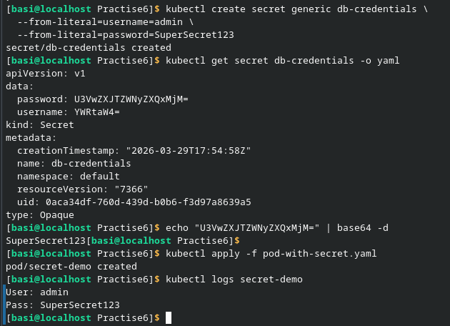
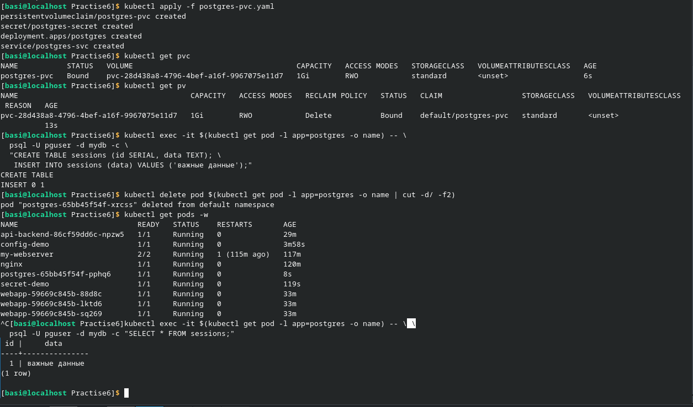

В первом блоке лабораторной работы был создан YAML файл для пода с конфигом. Также были созданы ConfigMAPs из литералов и из файла. Затем просмотрели логи конфига с переменными.

На этом блоке были изучены способы защиты Secret с помощью шифрования. Был создан YAML файл для пода с секретом. Также рассмотрели декодировку шифра.

В последнем блоке был создан файл YAML с базой данных. После принятия файла были проверены PVC, который имел статус BOUND и создал автоматически файл pv. Затем в базу данных были вставлены важные данные, после чего был удалён под. Автоматически был создан новый под, а файлы остались невредимы.
