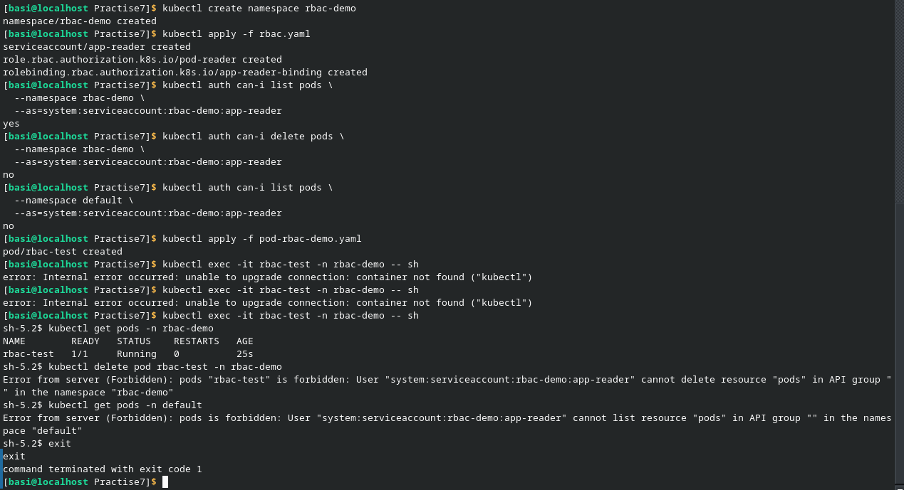
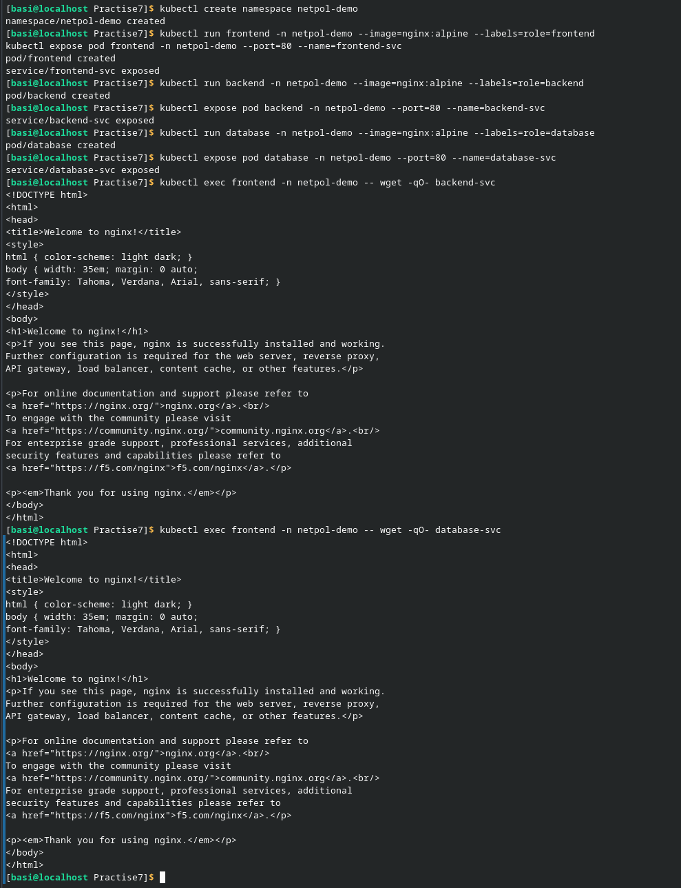
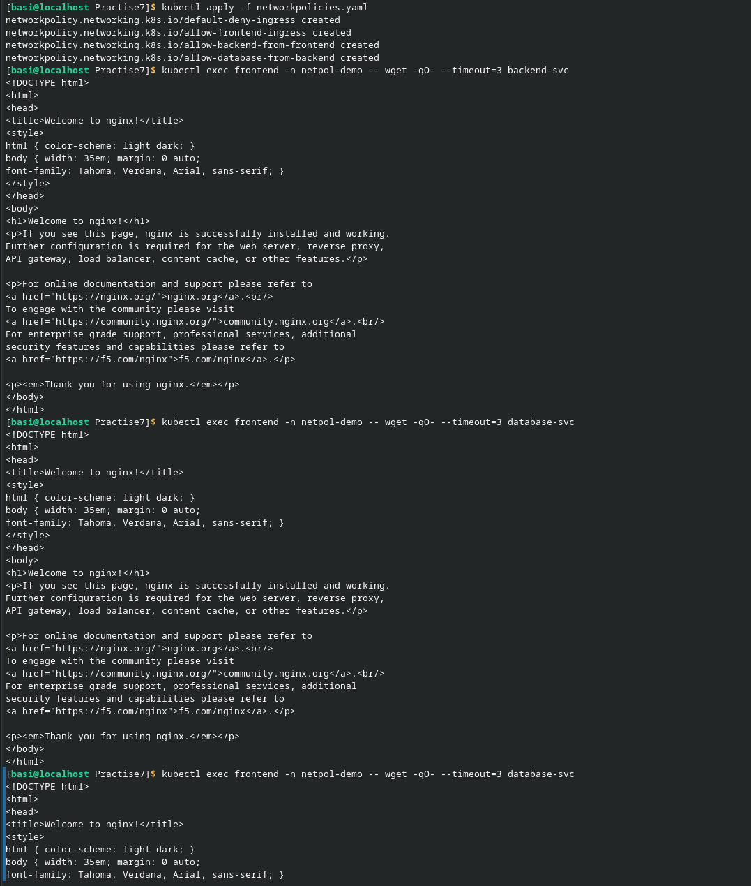
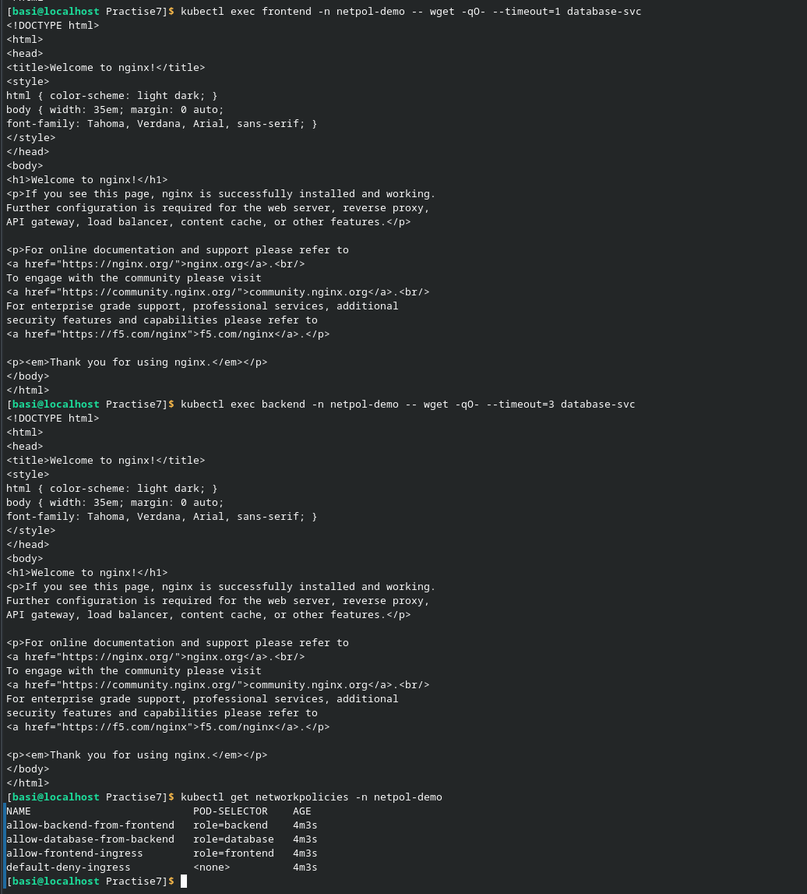
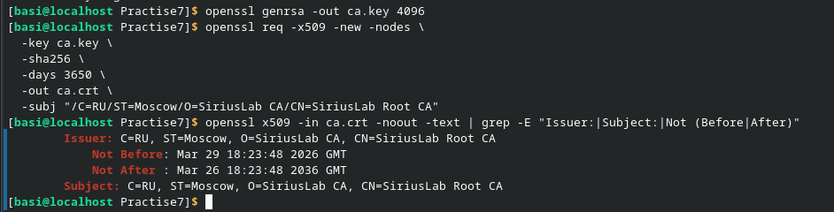
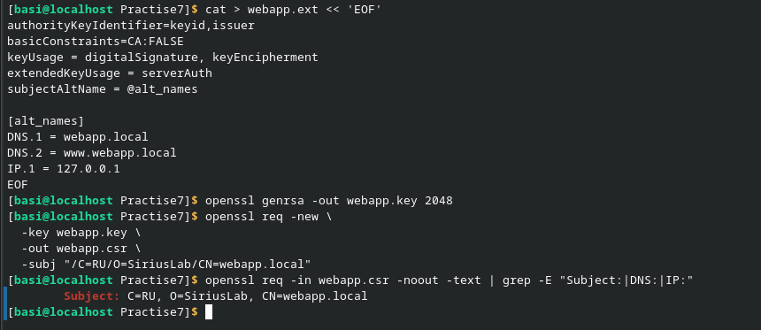
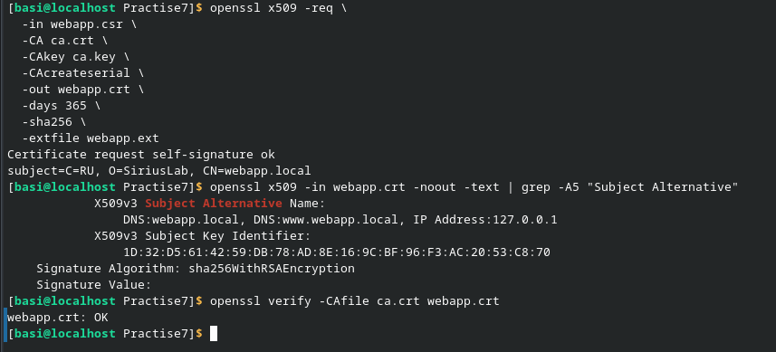
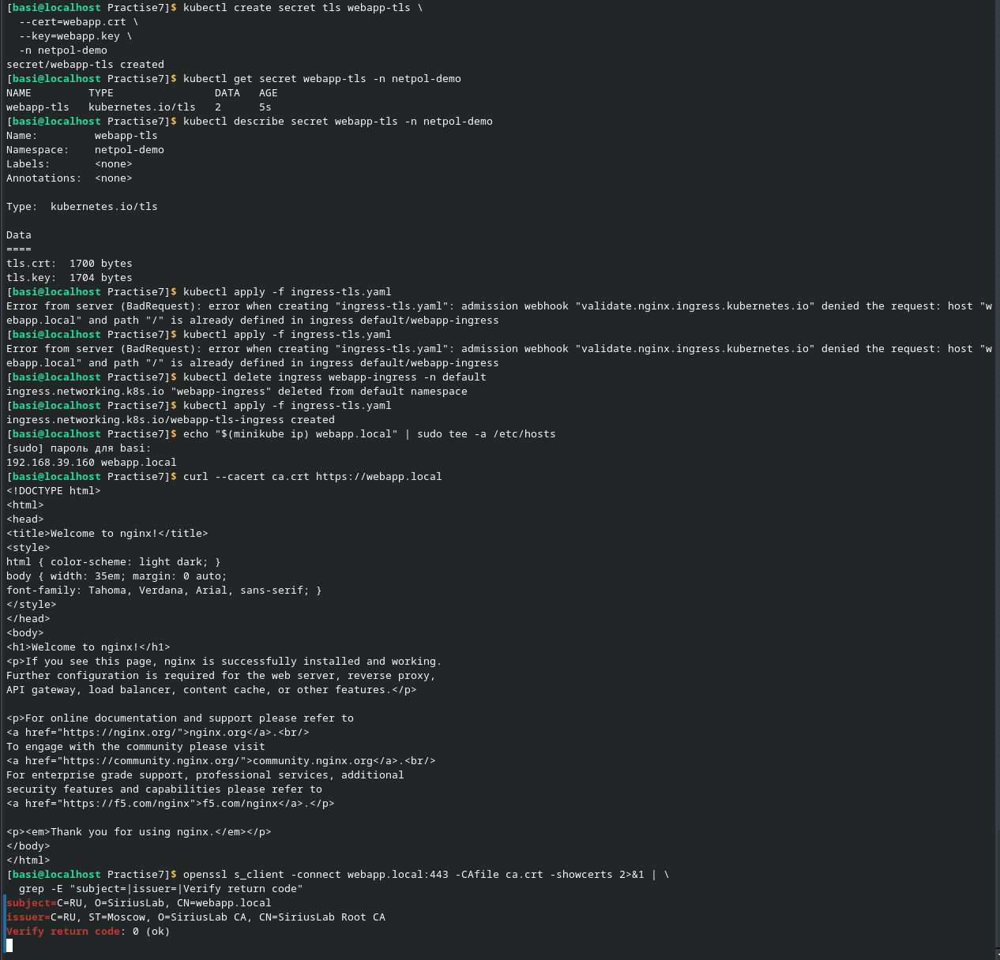
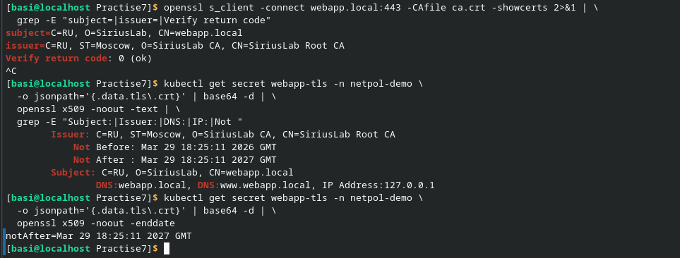
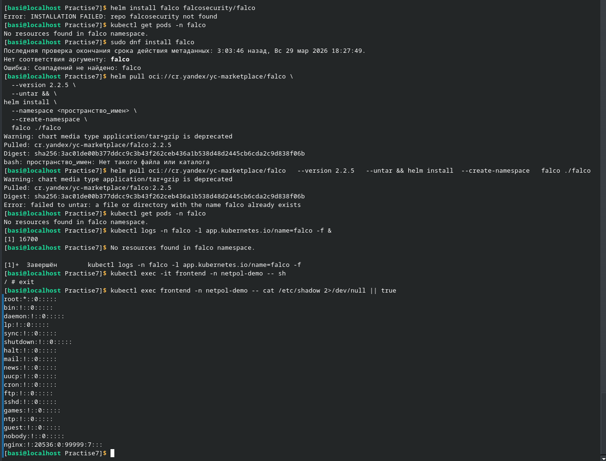

Первый блок лабораторной работы был выполнен без проблем. Был создан YAML файл и проверены рпава доступа.

На втором блоке возникла проблема, связанная с тем, что фронтед мог напрямую связыватся с бд, а так быть не должно. Одна из возможных и вероятных причин - проблем в кэшировании DNS. Из-за этого правило хоть и применяется, но с помощью кэша всё равно взаимодействует с бд. Также возможно проблема в самой политике сети. Остальные команды выполнились без проблем.

На третьем блоке лабораторной работы не возникло никаких проблем. Все команды выполнились успешно и правильно.

Последний блок лабораторной работы был выполнен почти без проблем. Проблемы были только с установкой falco, но я их как-то решил.
