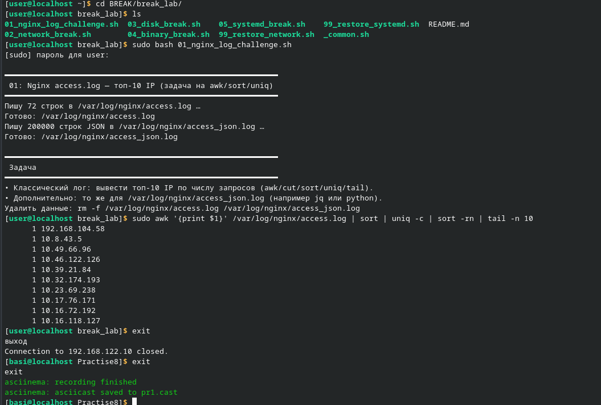
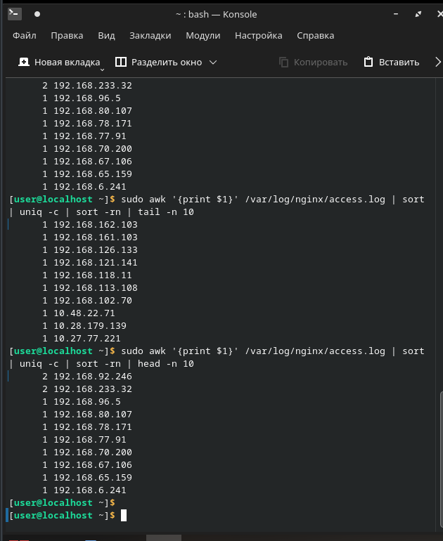

https://asciinema.org/a/WT2ANlt0fWkAFSAs

Сначала была выполена лабраторная работа 0. Задача заключалась в ознакомлении с редактором Vim и md. Задача выполнена успешно и были закоментированы несколько строчек текста разом.

https://asciinema.org/a/cz70UAECfVsyOptt

Далее была выполена первая лабораторная работа. Был создан файл со множеством IP-адресов и необходимо найти топ-10 самых часто используемых. Т.к. скрипт, который делал IP-адреса был сломан, он создавал небольшое кол-во адресов, что мешало корректному выполенению задания.