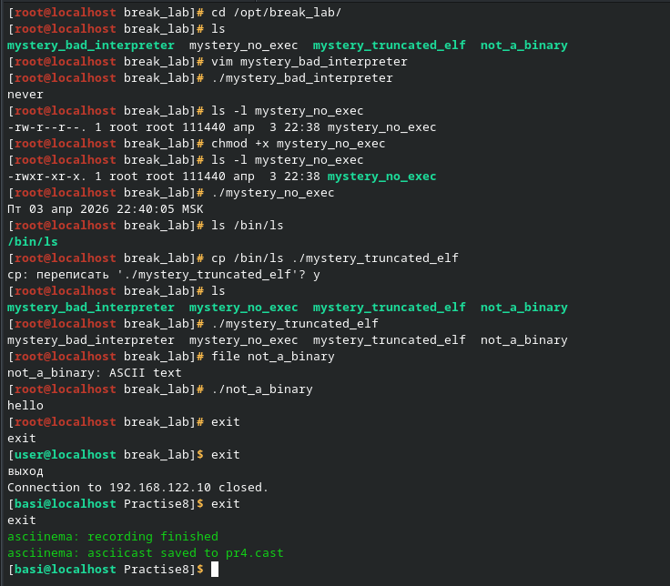

https://asciinema.org/a/xlYPZElGWbHk2yOq

В 4 лабораторной работе нужно было починить 4 файла. В первом файле нужно было починить шебанг. Второму файлу дать права на активацию скрипта. Третьего дополнить до полноценного ELF-файла. Последний файл был ASCII текстом и просто запускался. 