# 5. Kubernetes: Deployment, Service, Ingress
## 1. Deployment

в конфигурационный файл для контейнера записывается конфигурация

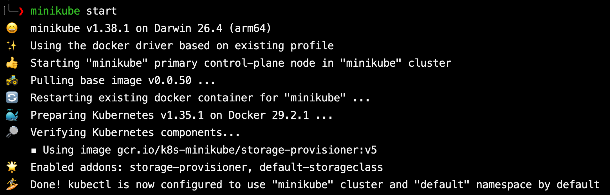
запускается служба minikube

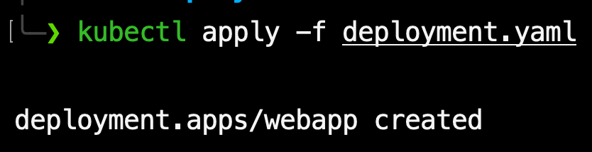
запускается контейнер с использованием созданного конфиграционного файла

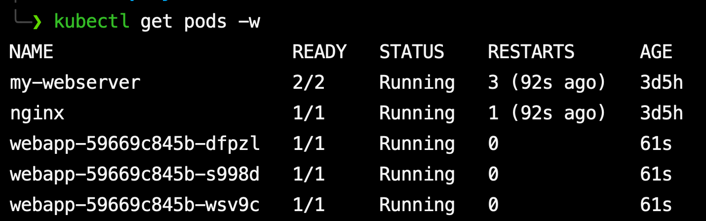
командой `kubectl get pods -w` выводится список подов, видно что созданы 3 новых

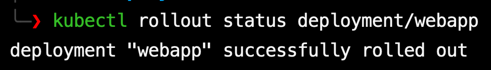
проверяется статус деплоймента. вывод в теминале показывает что приложение успешно развернуто

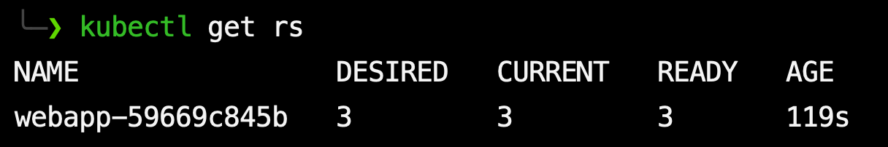
команда `kubectl get rs` выводит все реплики

## 2. Service + Rolling Update
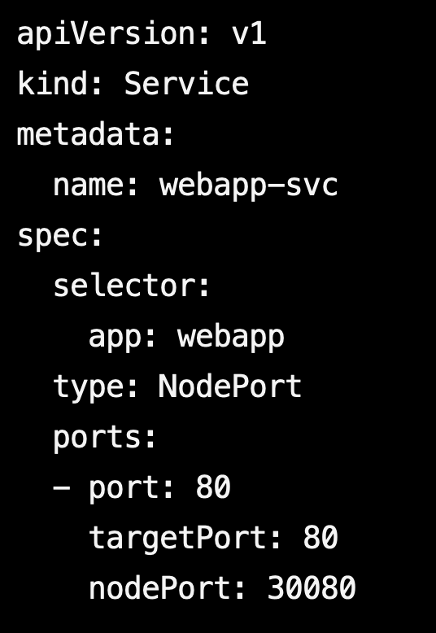
новый конфиг для контейнера

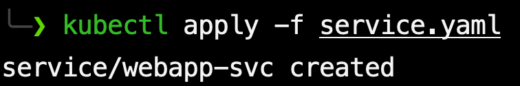
запуск контейнера

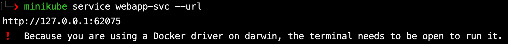
тк на макос kubernetes работает не на хосте и используя виртуализацию, то по обычному ip не получится отправлять запросы. Для того что бы это сделать выполняется команда `service webapp-svc --url`, которая выводит локалхост с портом для доступа к контейнеру

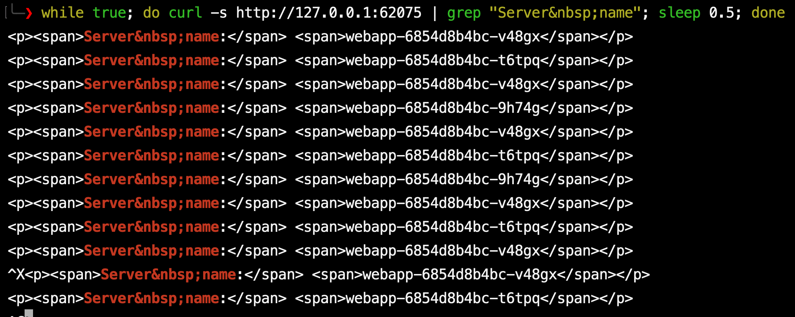
выполняется команда `while true; do curl -s 127.0.0.1:65075 | grep -i "Server&nbsp;name"; sleep 0.5; done`. В выводе видно что все ответы приходят от серверов с разными именами, значит что трафик идет через разные(все) поды

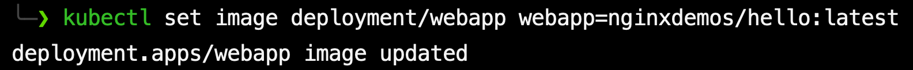
командой `kubectl set image deployment/webapp webapp=nginxdemos/hello:latest` выполняется rolling update, он проходит нормально

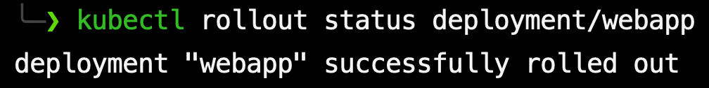
статус обновления: все нормально

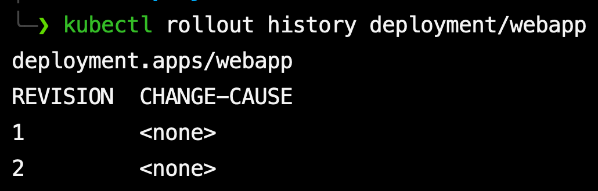
вся история контейнера, всего было 2 состояния: первоначальное и после обнолвения

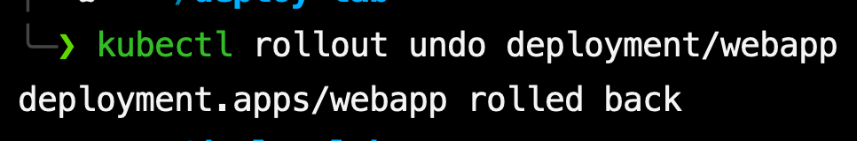
откат обнолвения

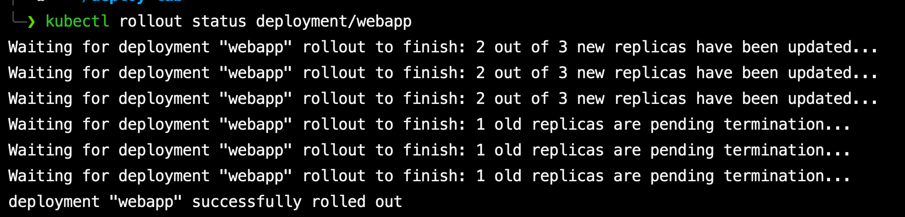
статус отката, все нормально

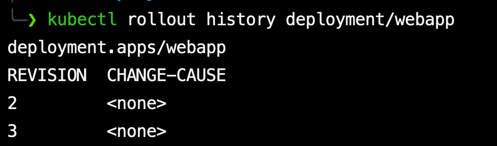
после откта первое состояние пропало, так как оно было копией третьего и не нужно

## 3. Ingress

создается новый контейнер на основе образа, которое возвращает указанный текст по api

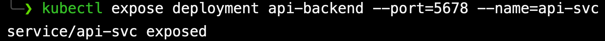
создается служба для перенаправления трафика по названию пода на его ip, так как при перезапуске пода у него меняется ip адрес, для решения этой проблемы можно использовать такой способ

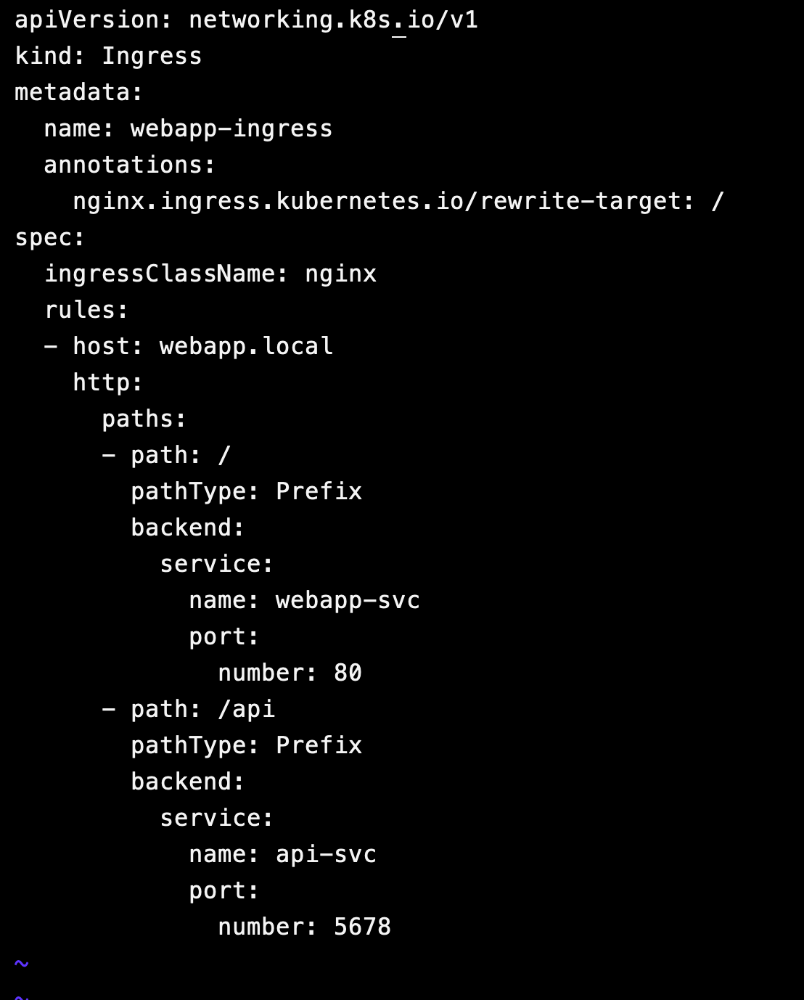
новый конфиг

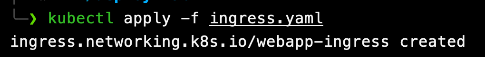
запуск контейнера с помощью конфига

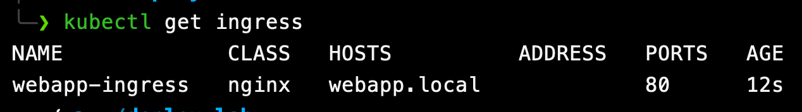
список ingress правил, описанных в конфиге

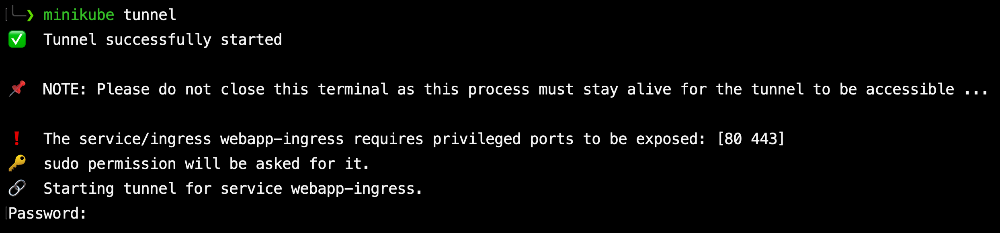
тк на макос оно работает через виртуализацию сначала создается тунель

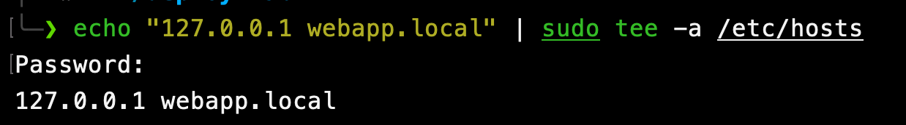
далее в `/etc/hosts` записывается 127.0.0.1 webapp.local для перенаправления трафика на контейнер

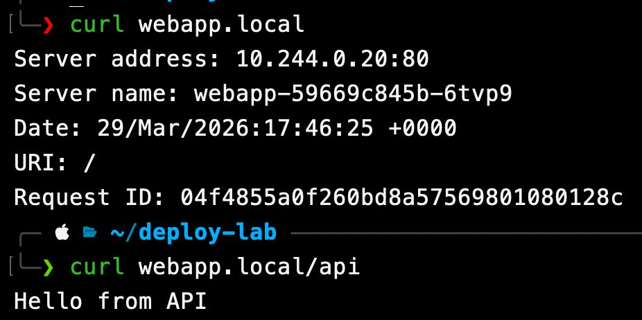
выполняются запросы к домену, обращение к просто домену возвращает информацию о сервере, обращение к апи – то что должно возвращать апи

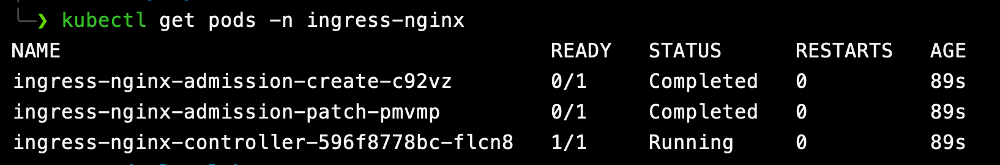
список ingress-controller подов

## 4. Сравнение типов Service

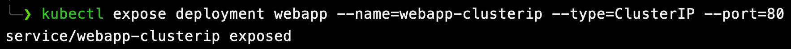
создается новый сервис, но уже с ip доступным только внутри кластера

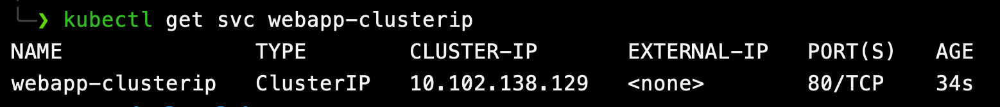
видно, что внешнего ip нет

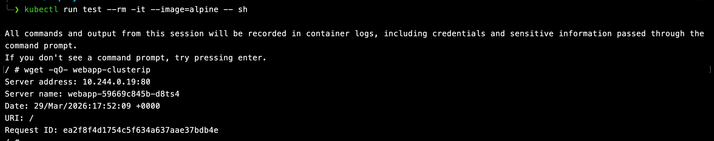
внутри кластера ip адрес есть

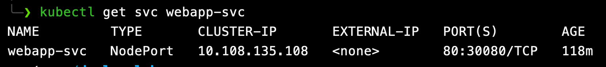
работает с nodeport и порте 30080