# Linux
## 1. Namespaces
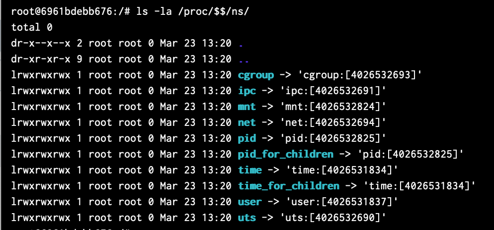
Команда ls -la /proc/$$/ns/ выводит все namespace'ы текущего процесса

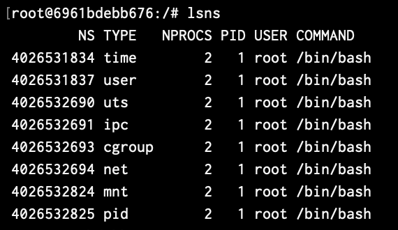
Команда lsns выводит все namespace'ы системы 

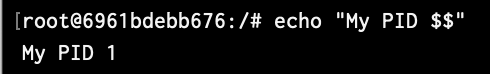
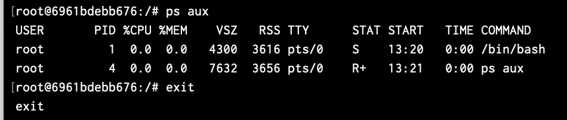
Команда unshare --pid --fork --mount-proc /bin/bash запускает терминал в изолированном пространстве, echo "My PID $$" текущего процесса, 1 подтверждает изолированность среды от хост-системы. ps aux выводит список процессов, их маленькое количестов также подтверждате изолированность среды.

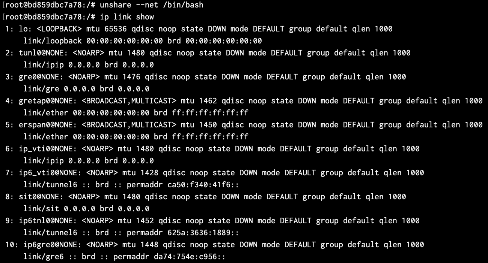
unshare --net /bin/bash запускает терминал в новом сетевом namespace. ip link show выводит список сетевых интерфейсов, выводятся только loopback и автоматически созданные интерфейсы, такие как wlan0, eth0 отсутствуют, что подтверждает изолированность.

## 2. cgroups
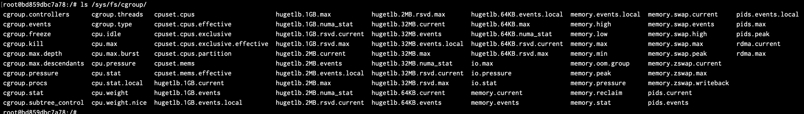
ls /sys/fs/cgroup/ выводит содержание папки cgroup, в которой содержатся файлы для управления ресурсами системы

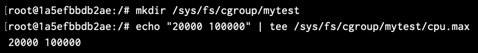
mkdir /sys/fs/cgroup/mytest создает директорию. echo "20000 100000" | tee /sys/fs/cgroup/mytest/cpu.max создает ограничение на использоваии процессора 20000 микросекунд из 100000, то есть на 20%. 

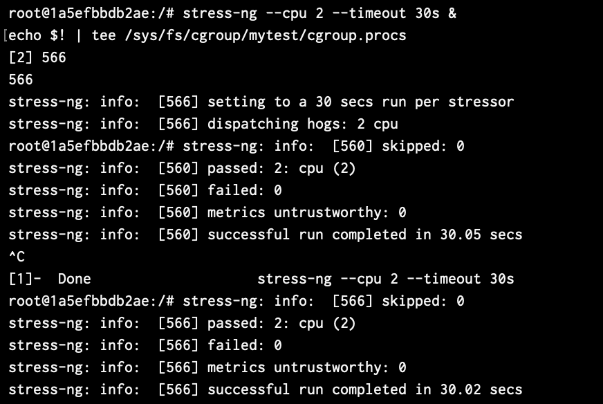
stress-ng --cpu 2 --timeout 30s &
echo $! | tee /sys/fs/cgroup/mytest/cgroup.procs делает нагрузку на процессор и добавлют процесс в созданную группу с ограничениями. 

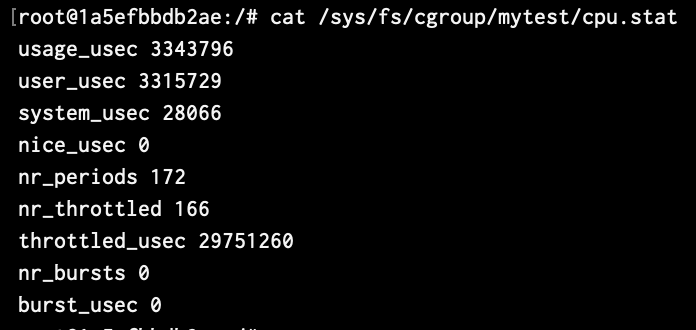
cat /sys/fs/cgroup/mytest/cpu.stat показывает статистику использования процессора процессами, параметр nr_throttled показывает сколько раз было применено созданное ограничение.

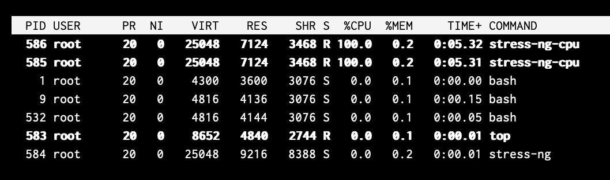
top выводит статистику процессов, у процесса с нагрузкой использование процессора 20%, что подтверждает работу ограничения

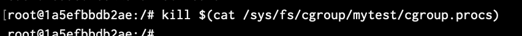
kill $(cat /sys/fs/cgroup/mytest/cgroup.procs) убивает все процессы из группы

## 3. chroot
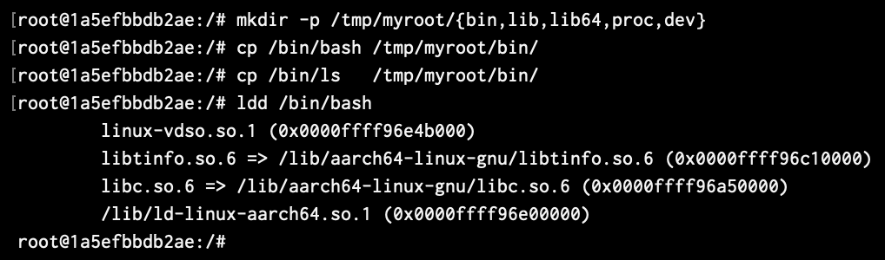
mkdir -p /tmp/myroot/{bin,lib,lib64,proc,dev} создает директории для последующего использования chroot
cp /bin/bash /tmp/myroot/bin/, cp /bin/ls   /tmp/myroot/bin/, ldd /bin/bash копируют bash, его зависимости и необходимые библиотеки

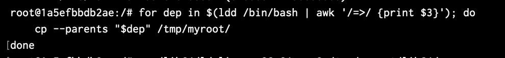
for dep in $(ldd /bin/bash | awk '/=>/ {print $3}'); do
    cp --parents "$dep" /tmp/myroot/
done с помощью цикла копирует все библиотеки необходимые для bash, сохраняя структуру директорий.

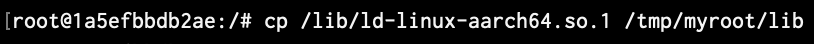
cp /lib/ld-linux-aarch64.so.1 /tmp/myroot/lib копирует библиотеку, отвечающую за запуск всех остальных библиотек

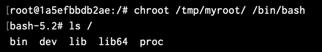
chroot /tmp/myroot /bin/bash изолированное окружение, ls / выводит содержание корневой директории