# Kub init
## 1. Состояние кластера
Для прросмотра всех нод выполняется команда `kubectl get nodes -o wide`
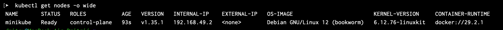

Для просмотра информации об конкретной ноде выполняется команда `kubectl describe node <имя-ноды> | head -50`
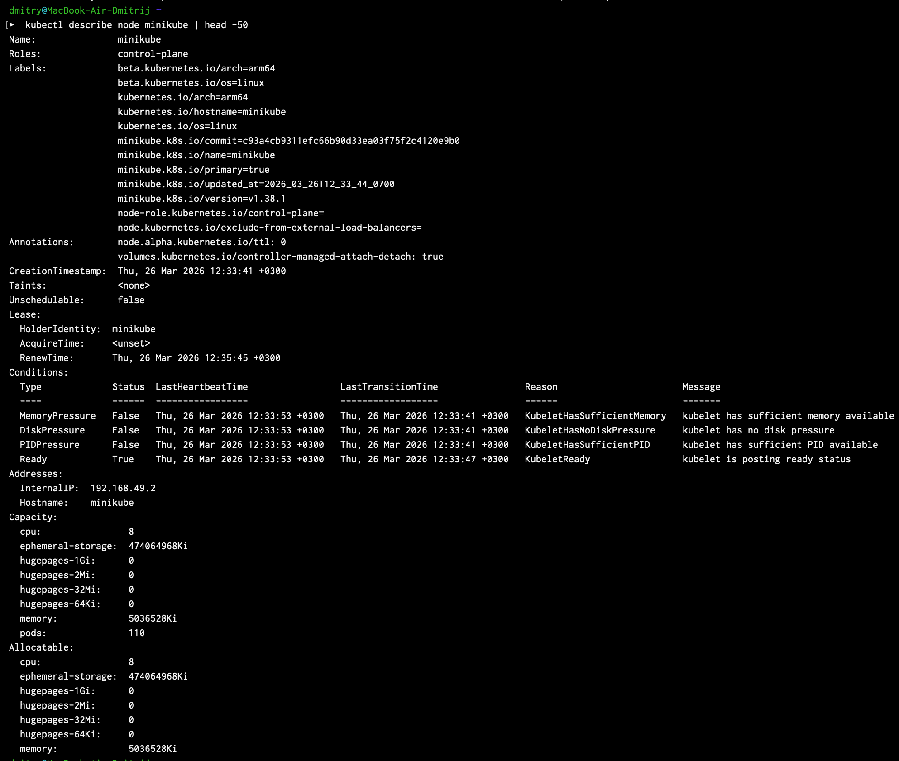

Команда `kubectl get pods -n kube-system` выводящая список и статус подов (минимальных единиц kubernetes)
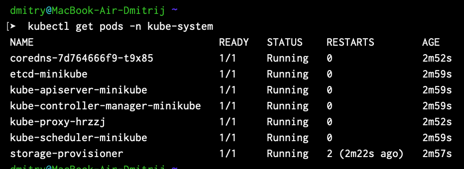

`kubectl get componentstatuses` выводит список и статус компонентов управления
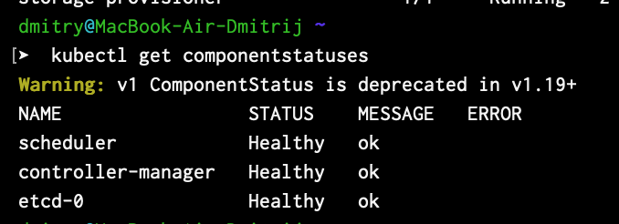

Внутри контейнера выполняется команда `ls /etc/kubernetes/manifests/`. Она выводит основные конфигурационные файлы kubernetes
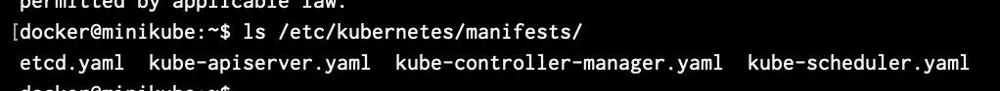

`cat /etc/kubernetes/manifests/kube-apiserver.yaml | grep -A5 -e "- --"`  выводит содержание конфигурационного файла `kube-apiserver.yaml`, в нем содержится конфигурация статического пода, используемого для запуска API сервера
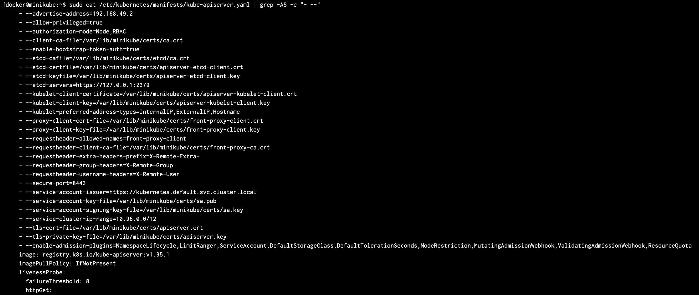

`kubectl api-resources | head -20` выводит первые 20 доступных api
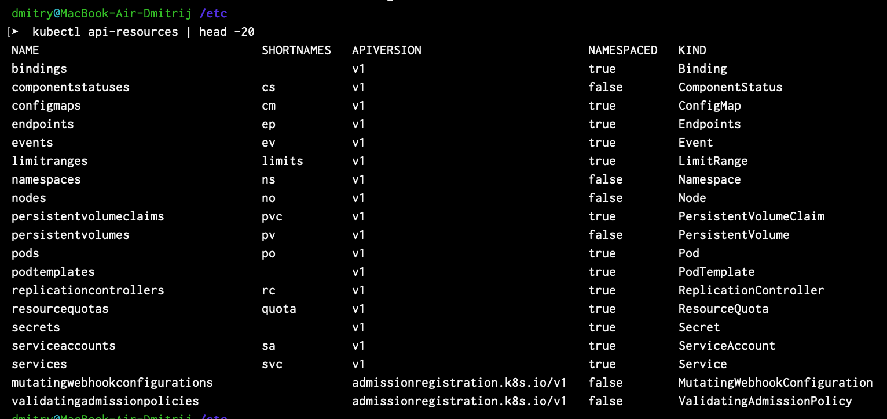

команда `kubectl version` выводит версию kubectl и сервера kubernetes
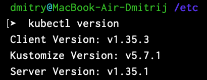

## 2. Первый Pod
Команда `kubectl run nginx --image=nginx:alpine --port=80` запускает контейнер с образом nginx:alpine и портом 80
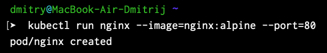

Команда `kubectl get pods -o wide` выводит список подов, запущенный под работает на ноде minikube
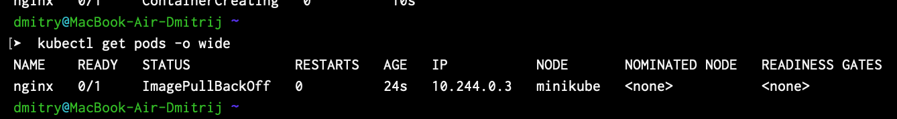

Для отслеживания в реальном времени используется команда `kubectl get pods -w`
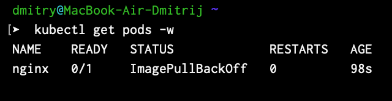

Для откртия терминла запущенного контейнера используется команда `kubectl exec -it nginx -- sh`. Внутри контейнера команда `hostname` выводит имя ноды, `cat /etc/hosts` ip пода и dns, `env | grep KUBE` выводит переменные окружения содержащие в названии KUBE, `ps aux` выводит процессы внутри контейнера
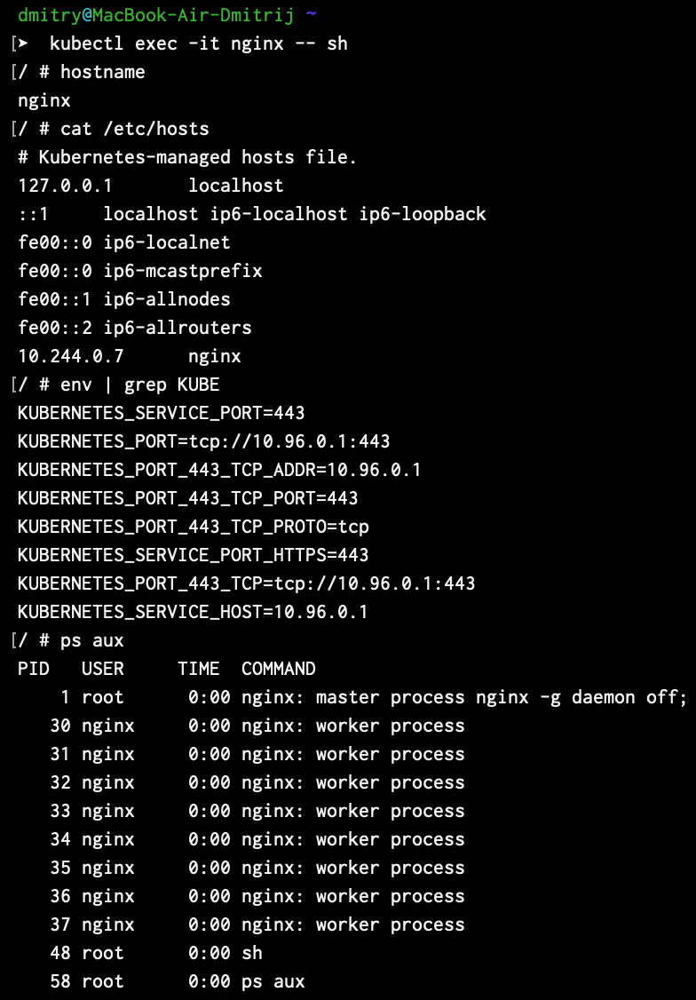

`kubectl logs nginx -f` выводит логи указанного контейнера в реальном времени
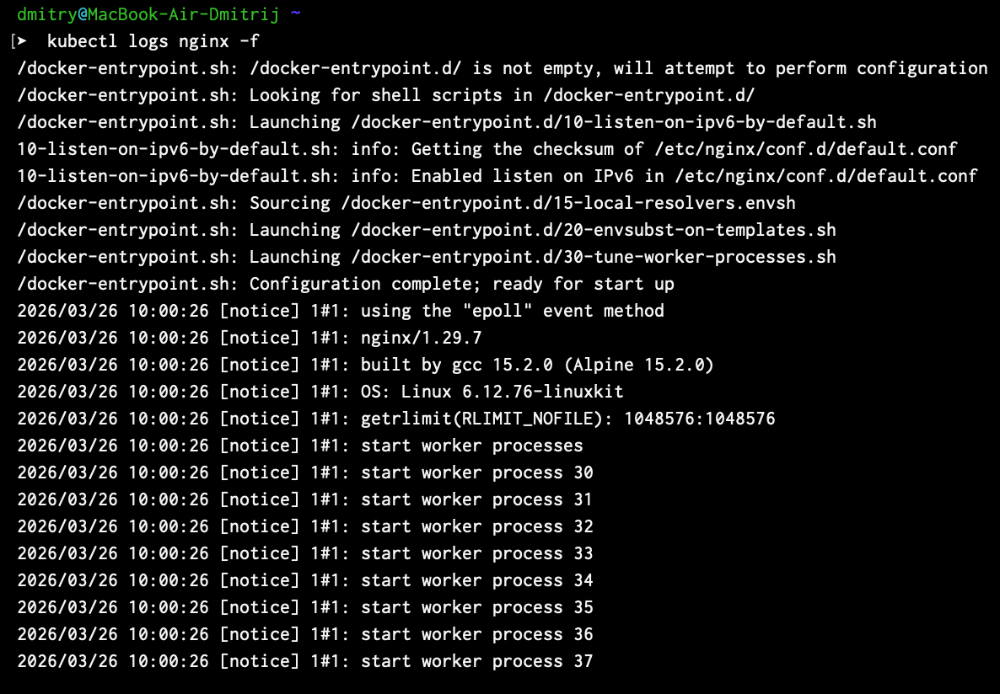

`kubectl describe pod nginx` выводит описание пода
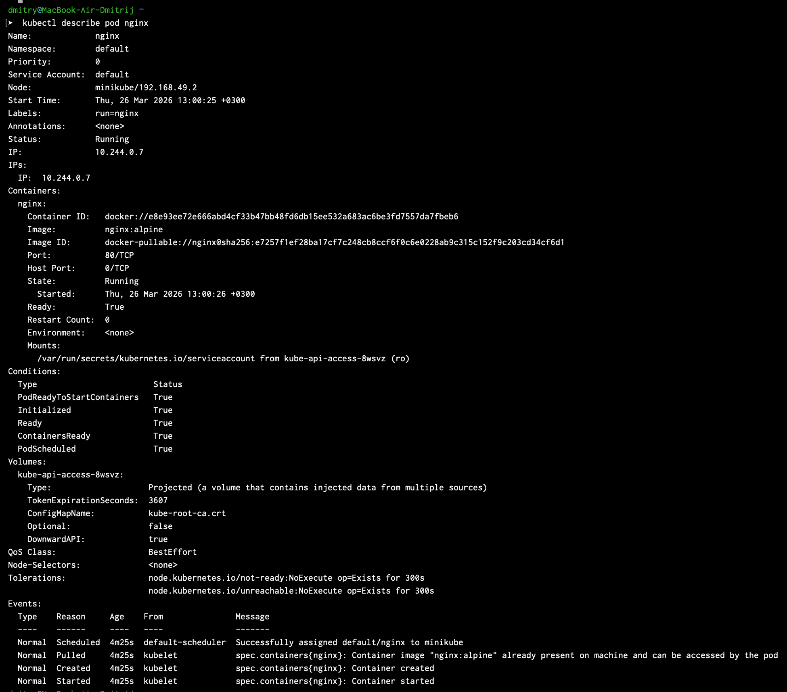

## 3. Pod через YAML

В файл `pod.yaml` записывается конфигурация
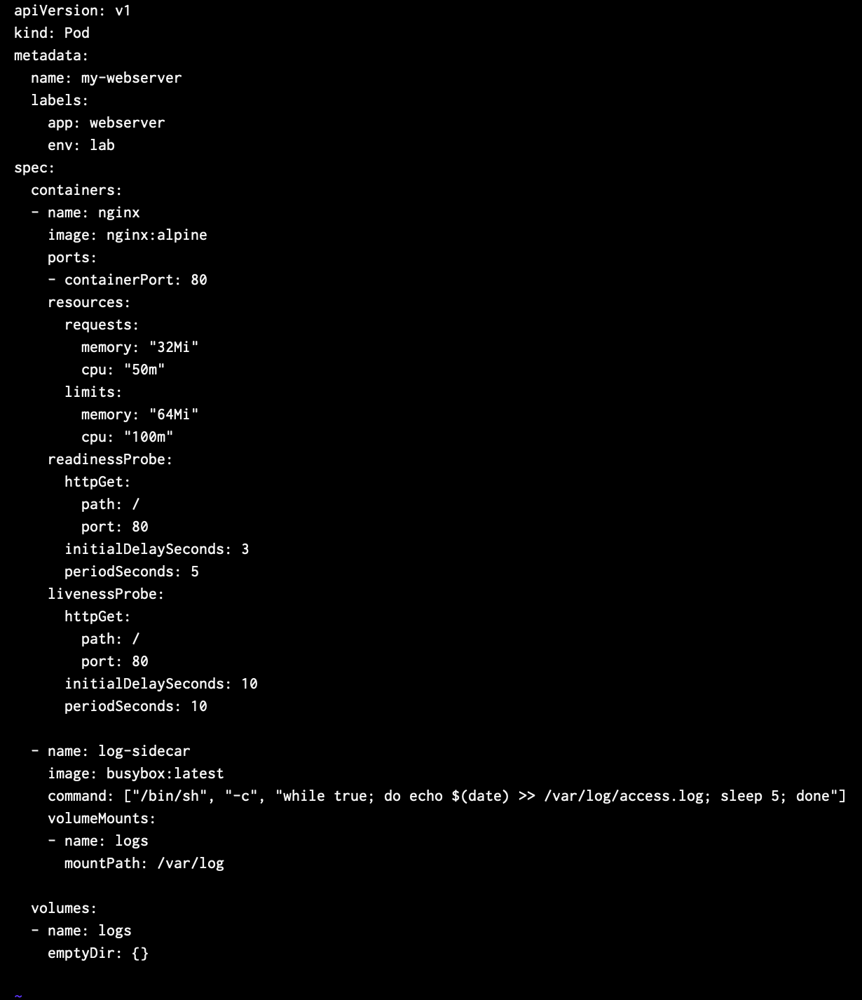

`kubectl apply -f pod.yaml` создает и запускает под используя созданную конфигурацию, команда `kubectl get pods -w` проверяет, запустился он или нет(он запустился)
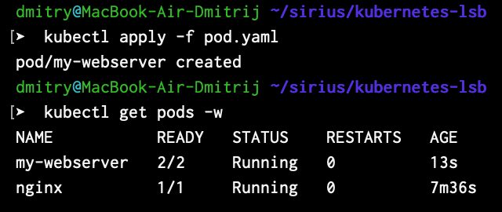

``
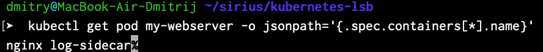

Для просмотра логов из конкретного контейнера используется команда `kubectl logs my-webserver -c log-sidecar`, для входа в конкретный контейнер используется команда `kubectl exec -it my-webserver -c nginx -- sh`
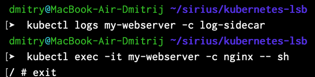

`kubectl get pod my-webserver -o yaml | head -60` используется для вывода yaml для конкретного контейнера
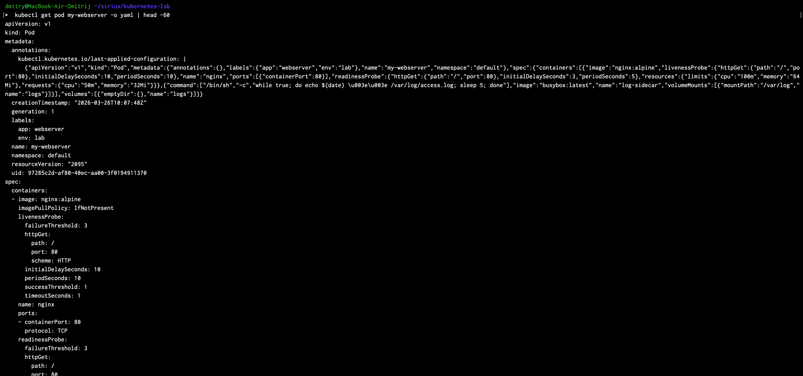

## 4. Самовосстановление
Командой `kubectl exec my-webserver -c nginx -- kill 1` убивается процесс,  kubernetes его сам перезапускает, это проверяется командами `kubectl get pods -w` и `kubectl get pod my-webserver`
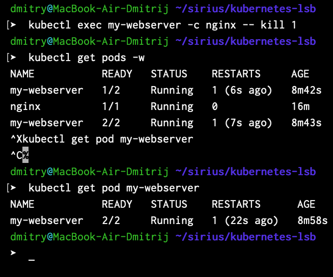
