# Docker run
## 1. Первый dockerfile
Команды mkdir docker-lab и cd docker-lab создают директорию для работы.\
Создается файл app.py, в него записывается простое flask-приложение.\
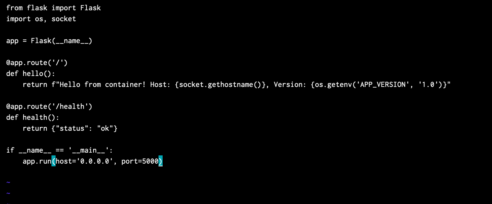
```
from flask import Flask
import os, socket

app = Flask(__name__)

@app.route('/')
def hello():
    return f"Hello from container! Host: {socket.gethostname()}, Version: {os.getenv('APP_VERSION', '1.0')}"

@app.route('/health')
def health():
    return {"status": "ok"}

if __name__ == '__main__':
    app.run(host='0.0.0.0', port=5000)
```

В файл requirements записывается `flask==3.0.0`\
Создается плохой dockerfile для последующего сравнения с хорошим. В него записывается
```
FROM python:3.12
WORKDIR /app
COPY . .
RUN pip install -r requirements.txt
CMD ["python", "app.py"]
```
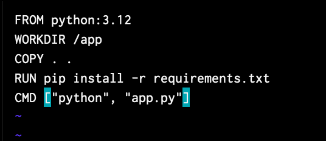\
плохой он, так как выбран слишком тяжелый базовый образ и команда `copy . .` вызывается до установки зависимостей и они будут устанавливаться при каждом изменении любого файла.

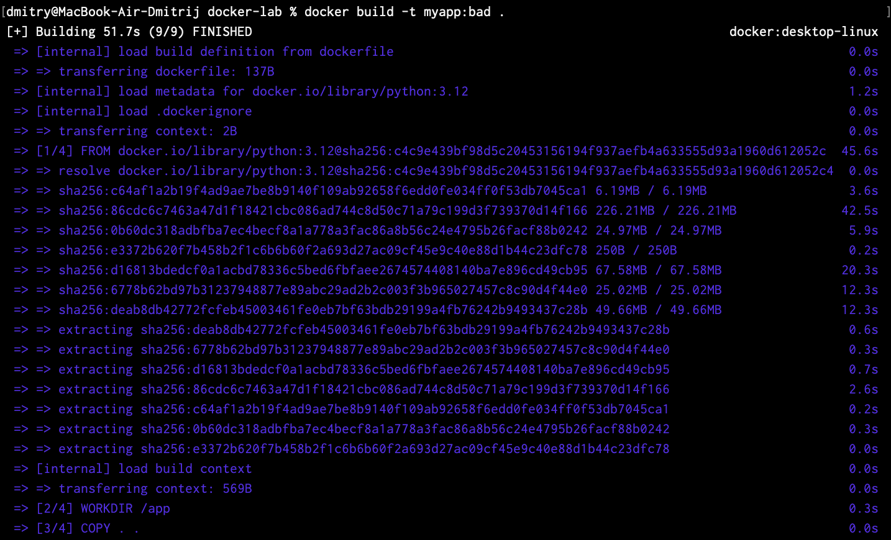\
выполняется сборка образа

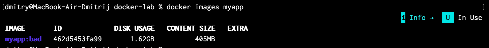\
получился образ размером 1.6гб, что много .

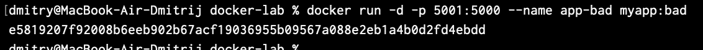\
запускается образ на порте 5001 (не 5000 как в инструкции, тк на macos он занят для airplay)

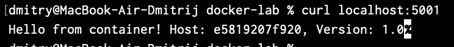\
все работает

## 2. Multistage build
создается новый нормальный dockerfile:
```
FROM python:3.12-alpine
WORKDIR /app
COPY requirements.txt .
RUN pip install --no-cache-dir -r requirements.txt
RUN adduser -D appuser
COPY --chown=appuser:appuser app.py .
USER appuser
EXPOSE 5000
CMD ["python", "app.py"]
```
тут уже перед установкой копируется только список зависимостей, соответственно, устанавливаться они будут только при изменении этого файла, используется базовый образ меньше, не кэшируется pip, добавлен обычный user вместо root
в .dockeringnore записывается:
```
__pycache__/
*.pyc
.git/
.env
*.md
Dockerfile*
```
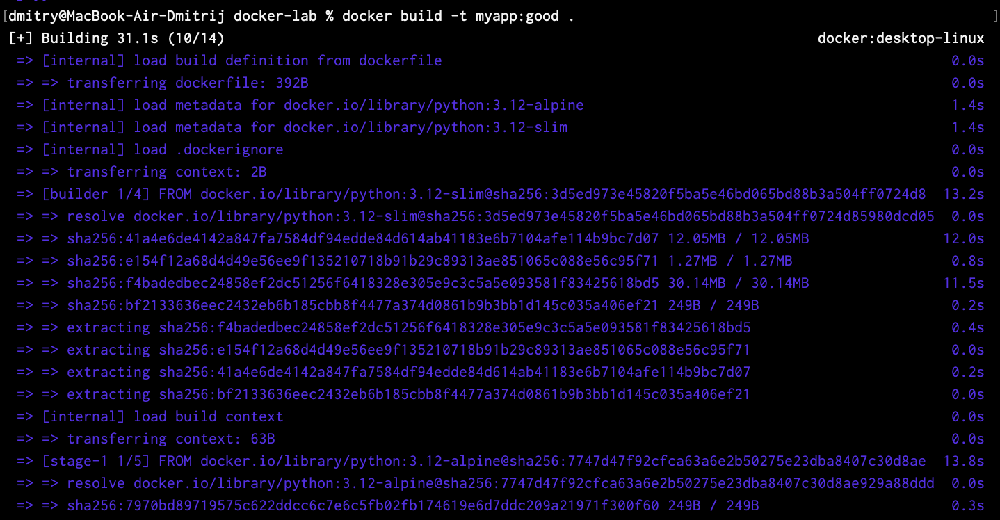\
выполняется сборка образа

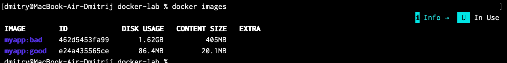\
выводится список образов. У нового размер сильно меньше.

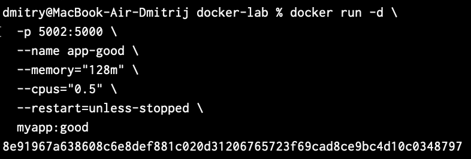\
образ запускается 

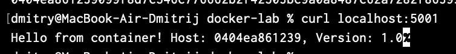\
все работает (он реально был запущен на 5001 порте, предыдущий скрин был сделан перед неудачным запуском, удачный запуск был на 5001)

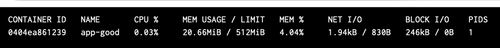
видим лимиты: 512мб озу

## 3. Исследование образа
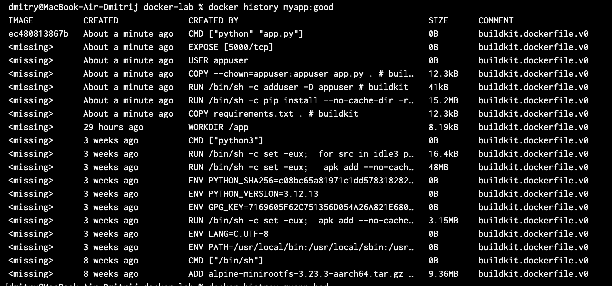
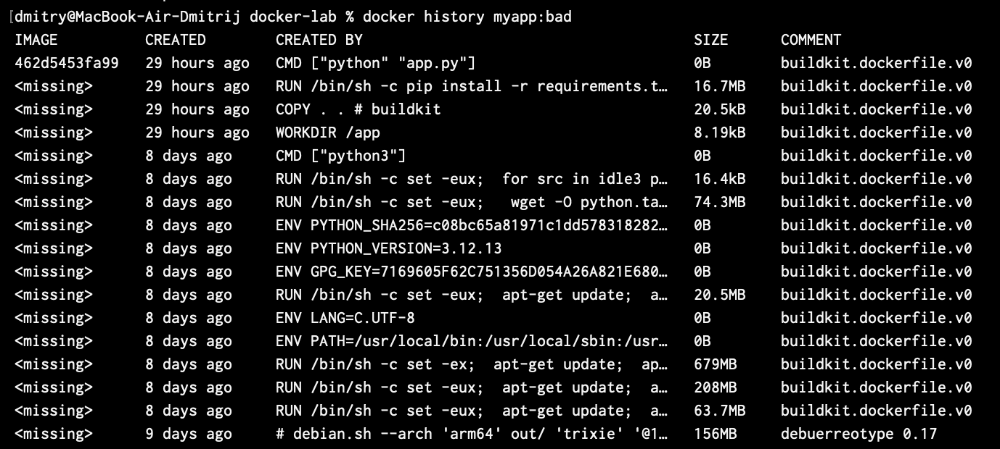
смотрим слои для обоих образов

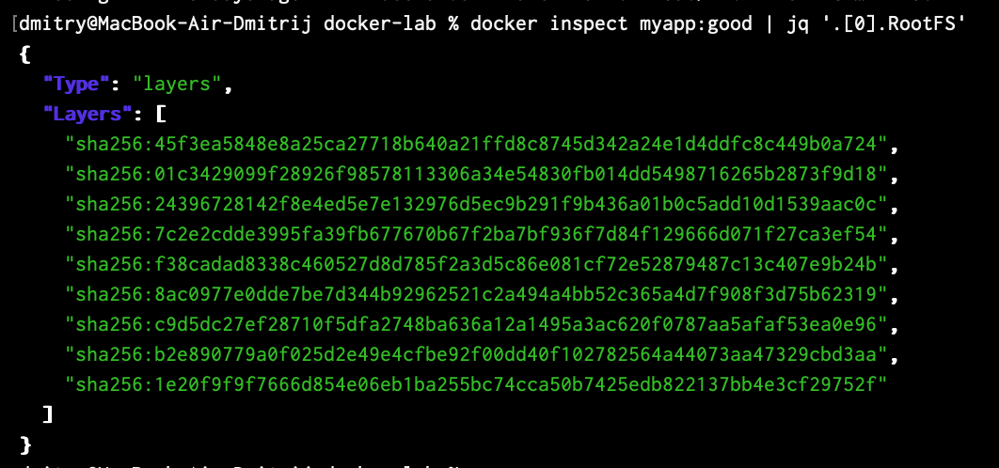\
детальная информация об образе (поместились только контрольные суммы)

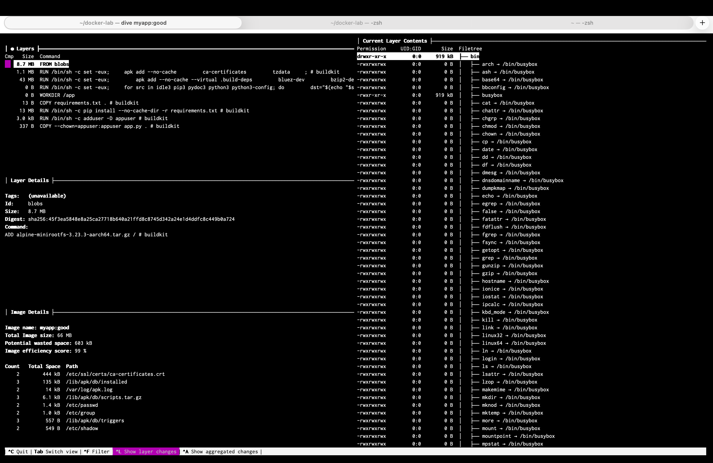
командой `brew install dive` устанавливается  dive. Комнадой `dive myapp:good` открывается подробная статистика об образе

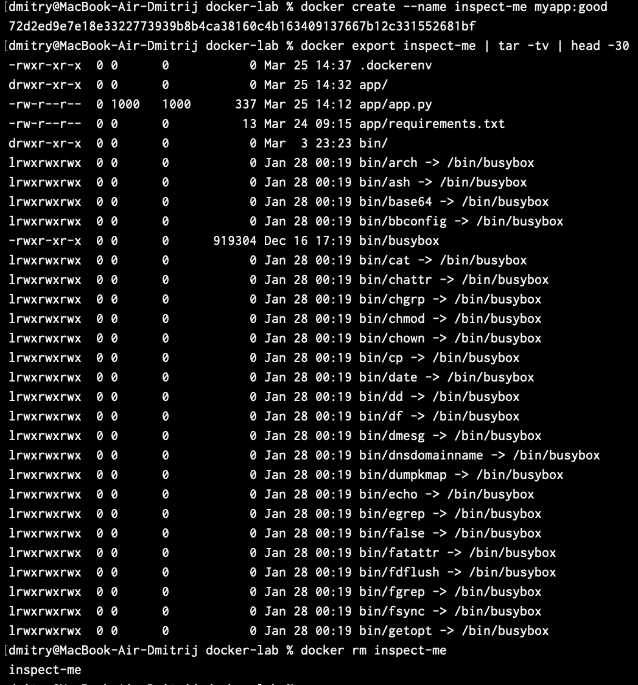\
файлы внутри образа

## 4. Docker Hub
командой `docker login` выполняется авторизация. Командой `docker tag myapp:good dmitryyyz/flask-demo:v1.0` и `docker push dmitryyyz/flask-demo:v1.0` тегируется и публикуется образ

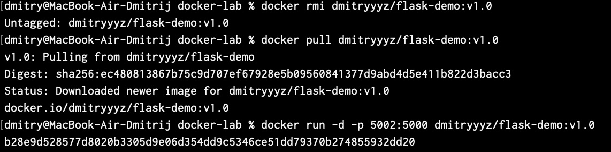\
опубликованный образ скачивается и запускается для проверки, все работает правильно