# Kubernetes: ConfigMap, Secret, PersistentVolume
## 1. ConfigMap

Созадется config-map (правила). Config-mapы нужны для того, что бы один образ можно было использовать по разному, в зависимости от примененного congig-mapa
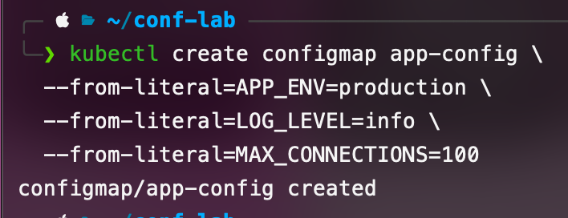

Выводит congig-map в формате yaml
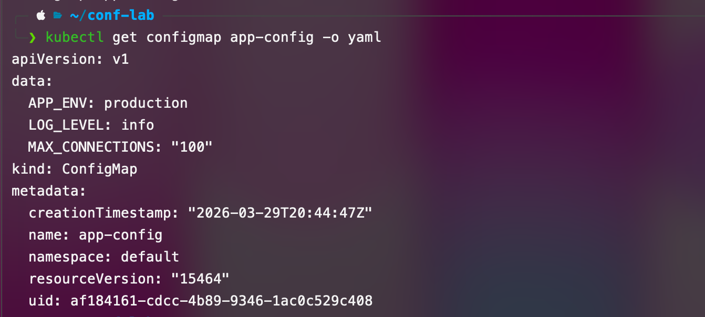

Описание config-map удобное для чтения
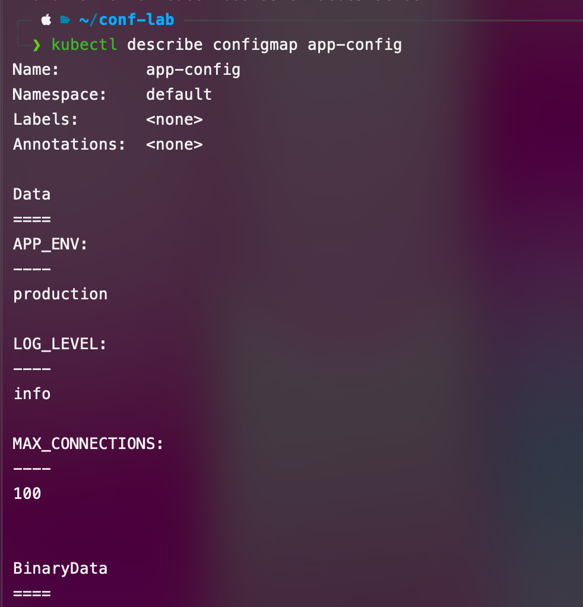

создается yaml файл с конфигурацией с 3 способами передать настройки из configmap
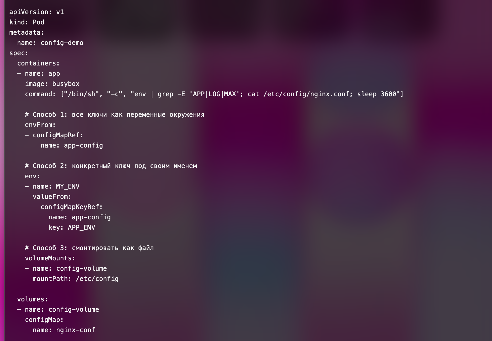

создается файл из configmap
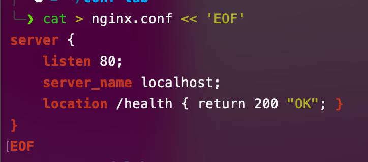

создается configmap из файла
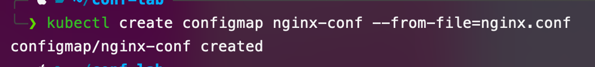

запускается под и выводится информация о нем, видно что переменные из конфигмапа передались внутрь него
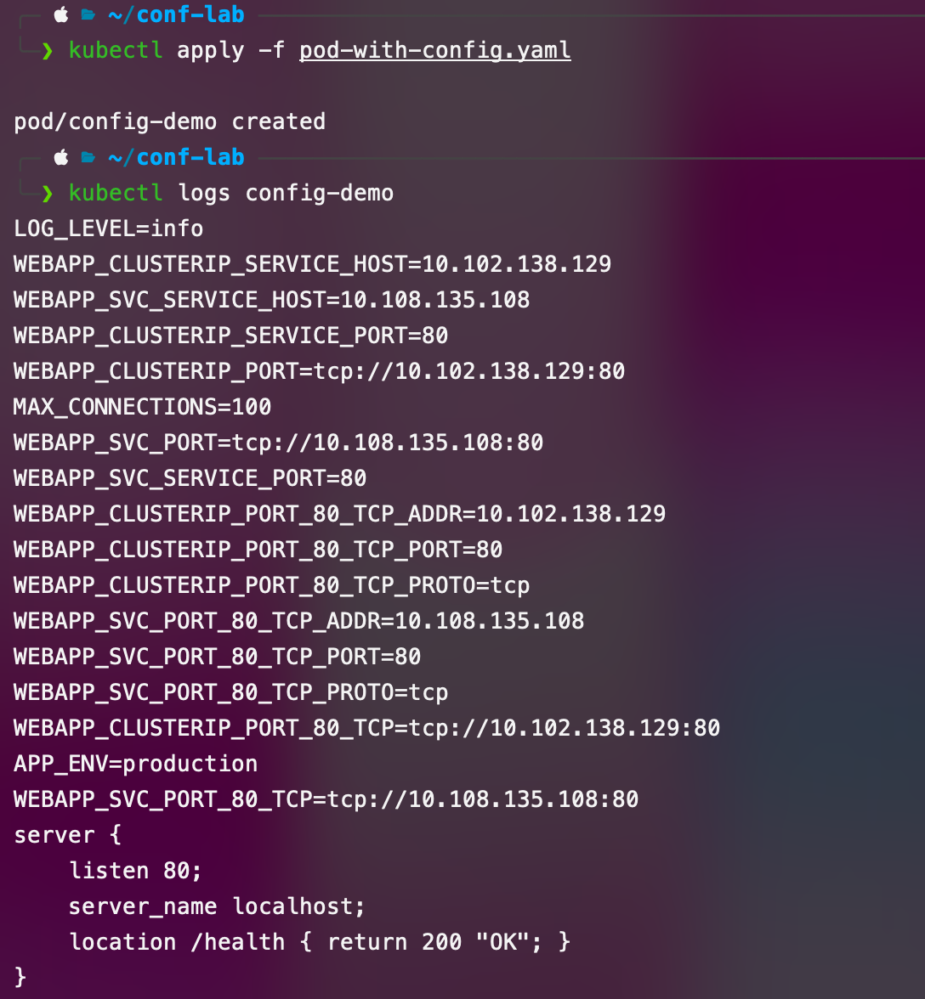

## 2. Secrets

Создается secret (почти то же самое что и congigmap, но для не общедоступных данных(данные записываются в другой кодировке, это не шифрование, но обычный человек не сможет прочитать))
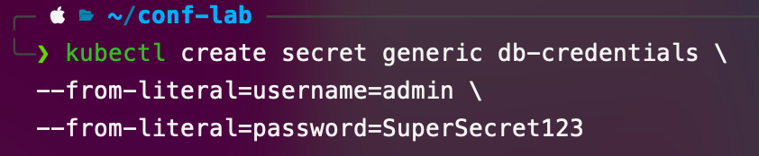

выводится информаци о нем
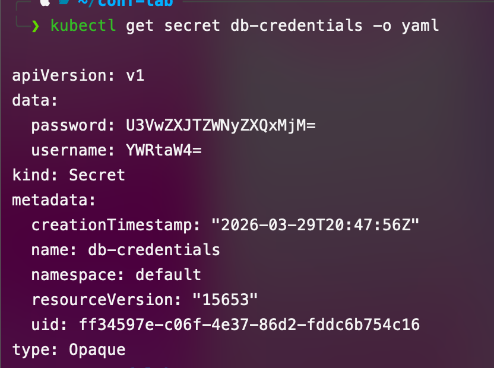

данные декодируются
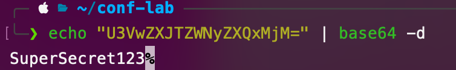

создается еще один конфиг для пода, в него берутся данные из созданного secret
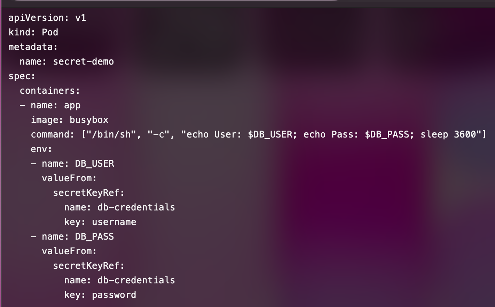

под запускатся и из него выводятся данные
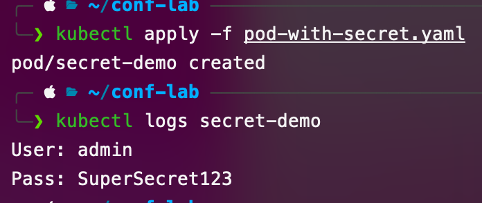

## 3. PersistentVolume

создается еще один конфиг, в нем описан под для запуска бд, с использованием volume для сохранения данных после перезапуска и данные из secret
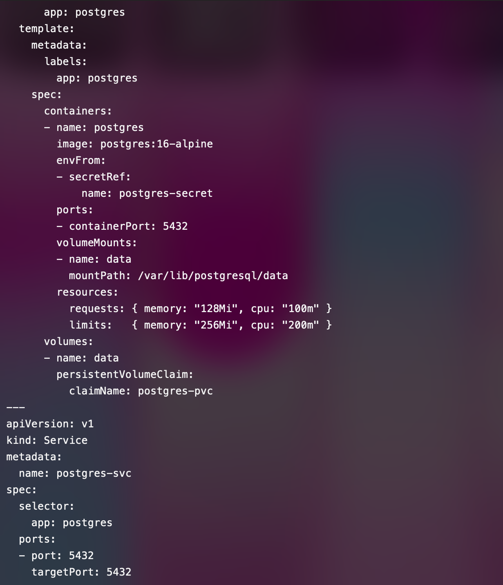

запускается
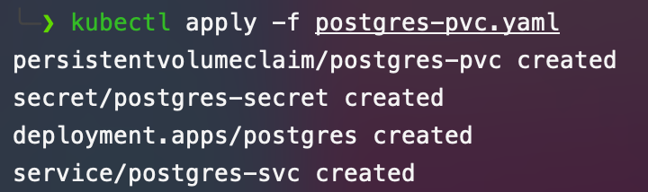

список всех запросов на создание volume, здесь только один со статусом bound, что значит что оно связано с контейнером
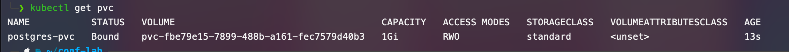

список всех volume
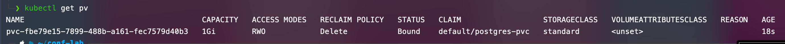

заполнение бд
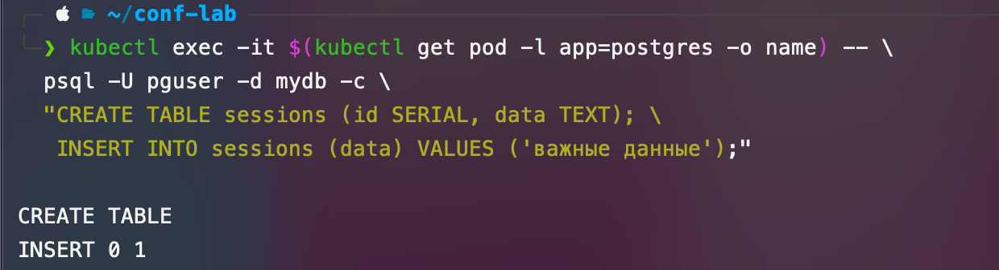

удаляется под ( без volume)
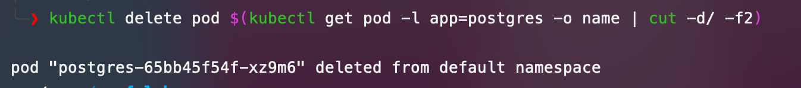

он автоматически пересоздается, но данные внутри него стираются (не volume) 
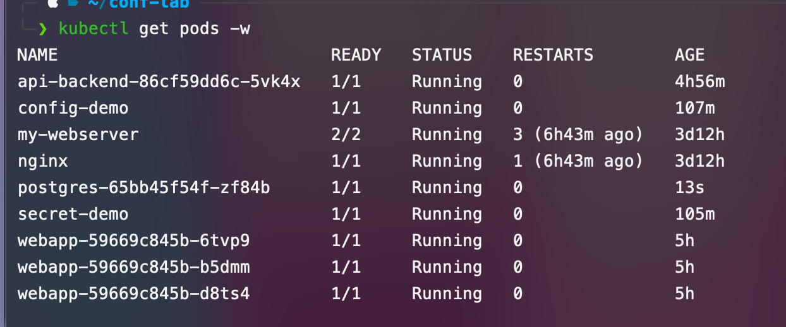

проверка что данные внутри volume сохранились и данные для авторизвации из secret используются нормально
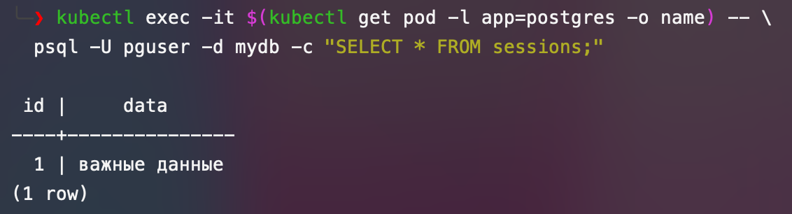
