# Docker, net, vol
## Docker networking
\
просмотр всех всех сетей 

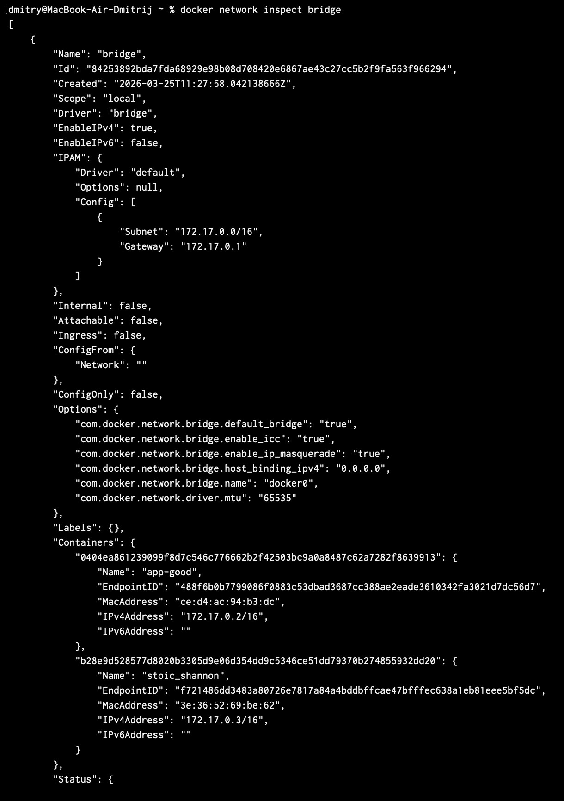\
просмотр конфигурации интерфейса bridge

командой `docker network create --driver bridge app-network` создается новая сеть
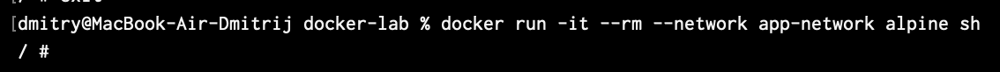\
запуск образа с подключением к созданной сети

запукается два образа (на скрине одного не видно), подключнные к одной сети
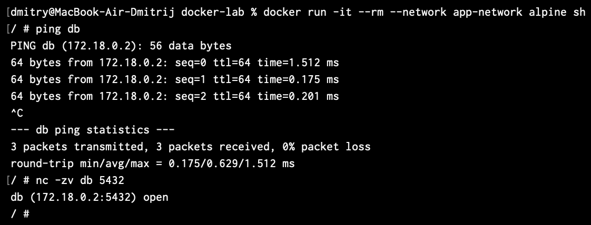\
из второго проверяем доступ к первому, она есть.

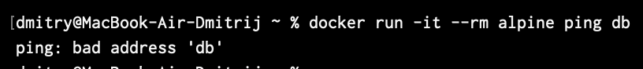
если запустить образ без подключения к сети, то он не будет иметь связи с другими образами

## 2. Volumes и persistent data
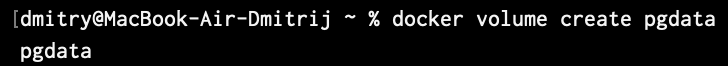\
создается volume, для того что бы после остановки образа данные не пропадли

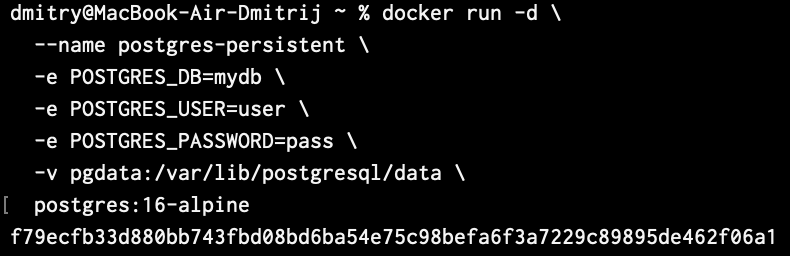\
запускается образ с подключением к базе данных и volume, куда будут записываться данные в бд.

командой `docker exec -it postgres-persistent psql -U user -d mydb -c \ "CREATE TABLE items (id SERIAL, name TEXT); INSERT INTO items VALUES (1, 'test');"` данные вставляются в бд

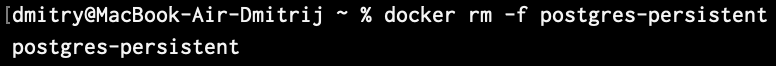\
обрза удаляется

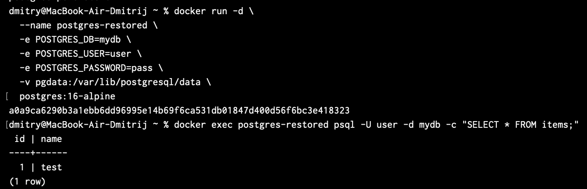\
образ запускается заново и проверяется доступность данных, они доступны.

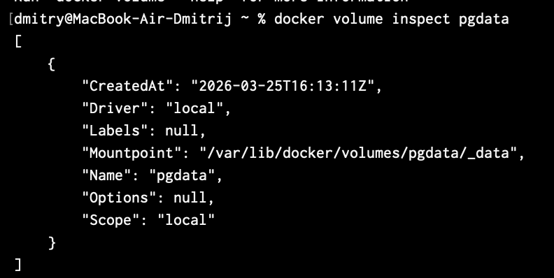\
проверка, где лежит volume

## 3. docker-compose

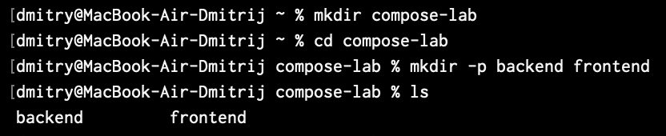\
создается директория для работы

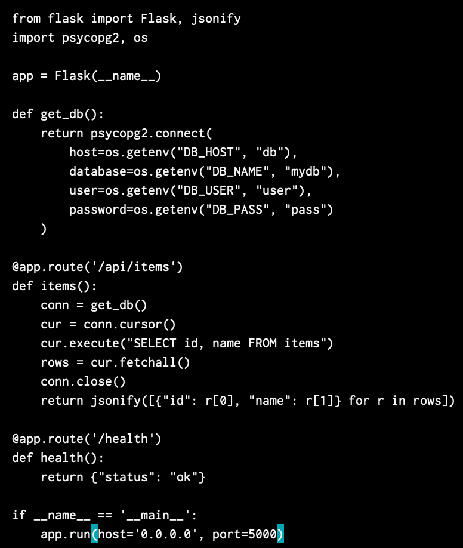\
создается прилоежние на питоне

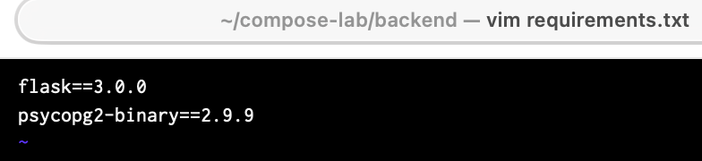\
requirements.txt

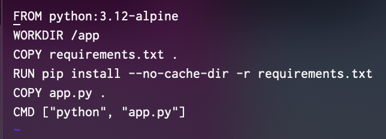\
dockerfile

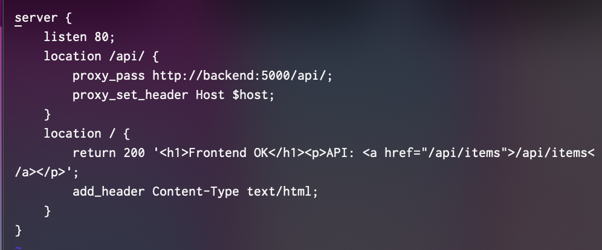\
nginx conf 

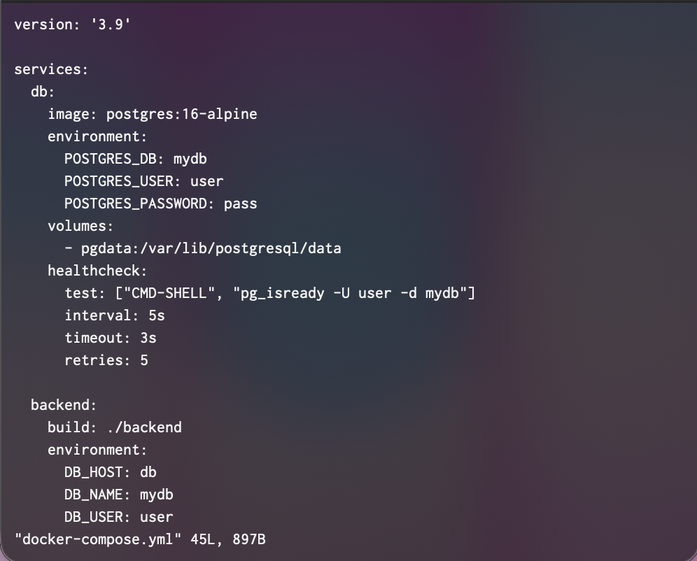\
docker-compose.yml

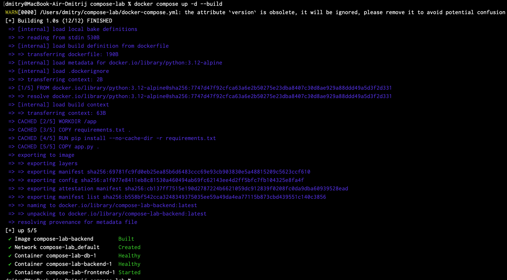\
запускается весь стек docker compose

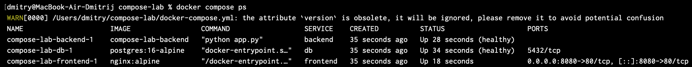\
просмотр запущенных компонентов 

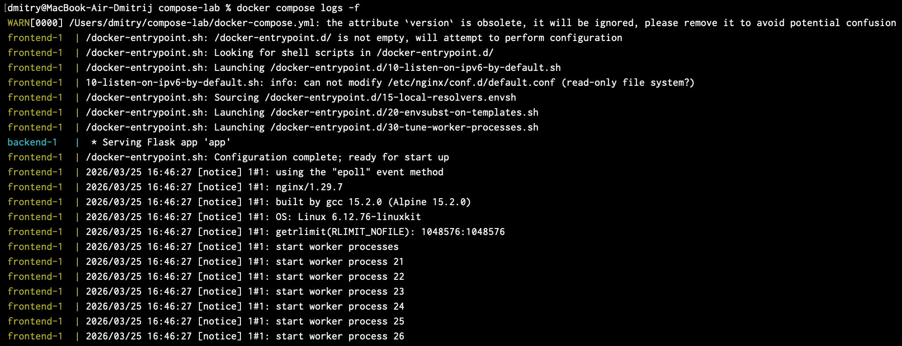\
логи

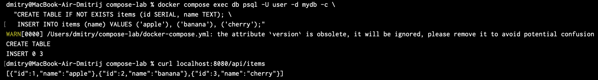\
создаются данные в бд и проверяется работа всех компонентов ( frontend > backend > db)

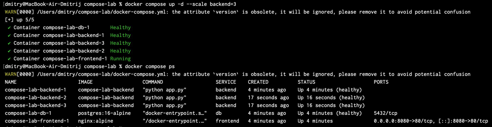\
запускается 3 бэкенда вместо одного

после этого завершаем стек комнадой `docker compose down`

## 4. Итог

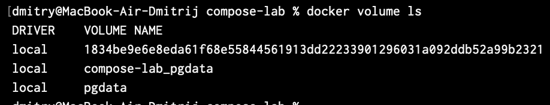\
проверка созданнх volume

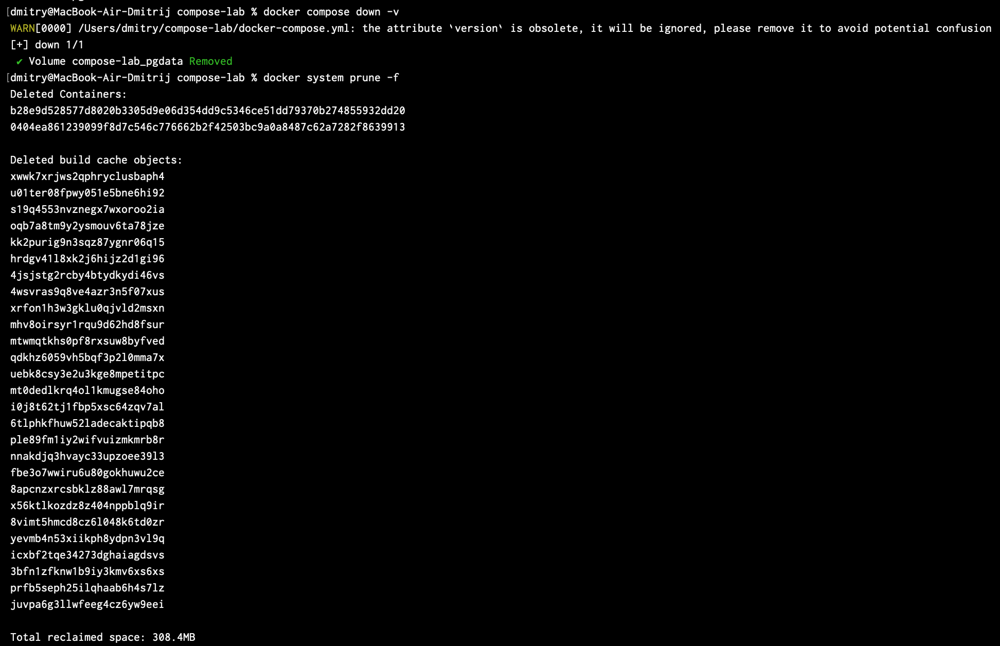\
удаление всего