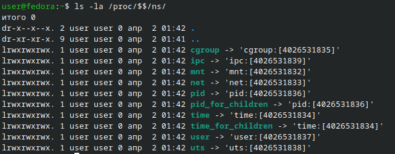
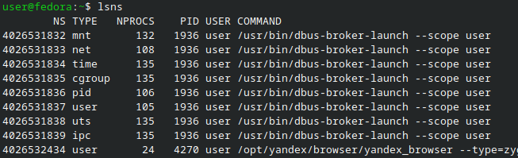
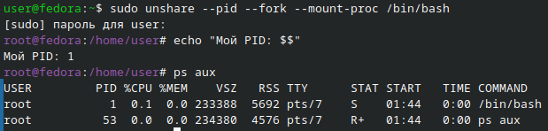
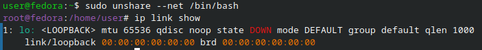
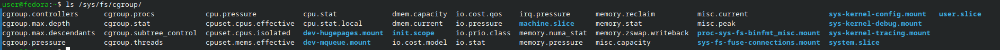
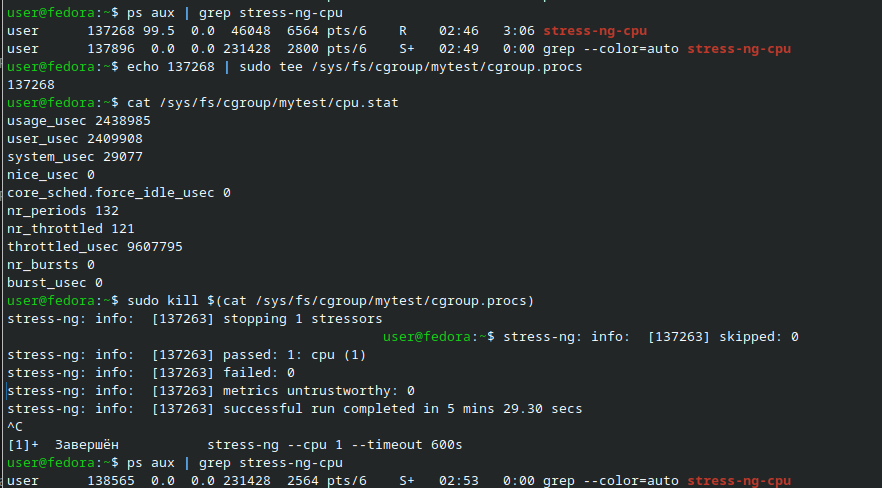
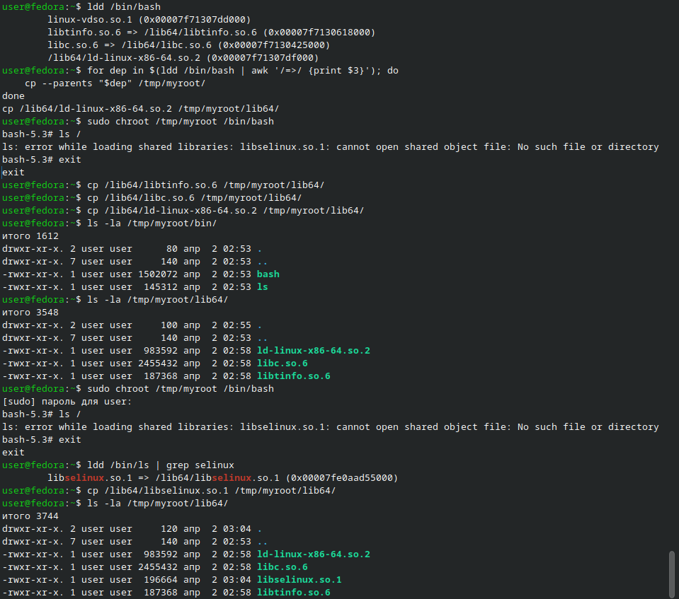
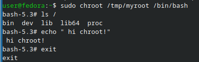

# Отчёт по лабораторной работе: namespaces, cgroups и chroot в Linux

## Цель работы

Цель работы — своими руками создать изолированное окружение **без Docker**, используя стандартные механизмы Linux: **namespaces**, **cgroups** и **chroot**, и понять, что Docker — это удобная обёртка над этими возможностями ядра Linux.

## Краткое описание

В ходе работы я посмотрел, какие namespaces уже используются в системе, создал новые PID и сетевой namespaces, ограничил процесс по CPU с помощью cgroup и собрал минимальное файловое окружение, в которое вошёл через chroot. По ходу выполнения я фиксировал вывод команд в терминале и делал скриншоты ключевых моментов.

---

## Блок 1 — Namespaces

### Просмотр namespace-ов текущего процесса

Сначала я решил посмотреть, какие namespaces уже есть у моего текущего shell-процесса. Для этого я выполнил команду:

```bash
ls -la /proc/$$/ns/
```

Эта команда показывает набор ссылок на различные типы namespaces (pid, net, mnt и другие) для моего текущего процесса. Я увидел список файлов вроде `mnt`, `pid`, `net`, `uts` и т.д., у каждого был свой идентификатор.



Дальше я посмотрел глобальный список всех namespaces в системе:

```bash
lsns
```

Команда показала таблицу с разными типами namespaces, их ID, связанными процессами и другими характеристиками. Это помогло понять, что в системе уже работает много изолированных окружений.



### Создание нового PID namespace

Дальше мне нужно было создать новый PID namespace и убедиться, что внутри него мой процесс будет иметь PID 1.

Я запустил новый bash в отдельном PID namespace:

```bash
sudo unshare --pid --fork --mount-proc /bin/bash
```

После этого я оказался внутри нового bash, который работает в отдельном PID namespace. Внутри я выполнил:

```bash
echo "Мой PID: $$"
ps aux
```

По выводу `echo "Мой PID: $$"` я увидел, что мой PID внутри новой «мини-системы» равен 1, а команда `ps aux` показала процессы только внутри этого namespace. После проверки я вышел из окружения командой:

```bash
exit
```



### Создание нового сетевого (NET) namespace

Следующим шагом я потренировался с сетевым namespace. Я запустил bash в новом сетевом окружении:

```bash
sudo unshare --net /bin/bash
```

Внутри нового bash я посмотрел сетевые интерфейсы:

```bash
ip link show
```

Я увидел, что в этом namespace доступен только интерфейс `lo` (loopback), то есть никакого доступа к обычным сетевым интерфейсам хоста нет. Это и есть изоляция сети — каждый namespace может иметь свою собственную сетевую конфигурацию.

После проверки я снова вышел из окружения:

```bash
exit
```



---

## Блок 2 — cgroups и ограничение CPU

### Поиск иерархии cgroup

Дальше я перешёл к cgroups — механизму, который позволяет ограничивать ресурсы процессов. Сначала я посмотрел, где находится иерархия cgroup v2:

```bash
ls /sys/fs/cgroup/
```

В этом каталоге находятся разные файлы и директории, через которые настраиваются ограничения ресурсов. На моей системе используется cgroup v2, поэтому путь `/sys/fs/cgroup/` был корректным.



### Создание своей cgroup и ограничение CPU

Затем я создал свою cgroup с именем `mytest` и задал лимит по CPU:

```bash
sudo mkdir /sys/fs/cgroup/mytest
echo "20000 100000" | sudo tee /sys/fs/cgroup/mytest/cpu.max
```

Параметр `"20000 100000"` означает, что процессам в этой cgroup даётся 20 мс CPU на каждый 100 мс периода, то есть примерно 20% процессорного времени.

После этого я запустил нагрузку на CPU, чтобы было что ограничивать. Я использовал `stress-ng`:

```bash
stress-ng --cpu 2 --timeout 30s &
```

Команда запустила процесс, который грузит CPU на 2 ядрах в течение 30 секунд. Я запомнил PID этого процесса (он выводится в терминал, но можно взять через `$!`). Затем я поместил этот процесс в созданную cgroup:

```bash
echo $! | sudo tee /sys/fs/cgroup/mytest/cgroup.procs
```

Чтобы убедиться, что лимит работает, я посмотрел статистику по CPU и заодно открыл `top`:

```bash
cat /sys/fs/cgroup/mytest/cpu.stat
top
```

В `top` я увидел, что процесс действительно не использует весь CPU, а ограничен примерно до заданного процента. В конце я убил нагрузочный процесс и почистил за собой:

```bash
sudo kill $(cat /sys/fs/cgroup/mytest/cgroup.procs)
```





---

## Блок 3 — chroot и минимальный rootfs

### Создание минимального rootfs

На последнем этапе я собрал минимальное окружение, куда можно «зайти» как в отдельную файловую систему с помощью chroot.

Сначала я создал структуру директорий будущего rootfs:

```bash
mkdir -p /tmp/myroot/{bin,lib,lib64,proc,dev}
```

Дальше я скопировал внутрь основной исполняемый файл — bash, а также `ls`, чтобы можно было смотреть содержимое:

```bash
cp /bin/bash /tmp/myroot/bin/
cp /bin/ls   /tmp/myroot/bin/
```

Чтобы bash запускался, ему нужны библиотеки. Я посмотрел, какие библиотеки ему требуются:

```bash
ldd /bin/bash
```

По выводу `ldd` я увидел список `.so` файлов, которые нужно скопировать. Чтобы не копировать их по одному, я использовал удобную команду:

```bash\
for dep in $(ldd /bin/bash | awk '/=>/ {print $3}'); do
    cp --parents "$dep" /tmp/myroot/
done
cp /lib64/ld-linux-x86-64.so.2 /tmp/myroot/lib64/
```

Эта конструкция автоматически копирует все нужные зависимости в нужные подкаталоги внутри `/tmp/myroot`. 
При запуске команды `ls` внутри chroot-окружения возникла ошибка отсутствия общей библиотеки `libselinux.so.1`. Для устранения проблемы я скопировал недостающую библиотеку из `/lib64/` в директорию `/tmp/myroot/lib64/`. После этого команда `ls /` успешно выполнилась, отобразив только файлы изолированной файловой системы.





### Вход в chroot-окружение

Когда минимальный rootfs был готов, я вошёл в него с помощью chroot:

```bash
sudo chroot /tmp/myroot /bin/bash
```

После этой команды я оказался «внутри» нового окружения, где корень файловой системы — это `/tmp/myroot`. Я проверил содержимое корня:

```bash
ls /
echo "Я внутри chroot!"
```

Я увидел только те каталоги, которые сам создал (`bin`, `lib`, `lib64`, `proc`, `dev` и т.п.). Это показало, что от настоящей файловой системы хоста я изолирован — вижу только то, что лежит в моём rootfs. Когда закончил проверки, я вышел из chroot:

```bash
exit
```



---

## Ответ на контрольный вопрос: namespace vs cgroup

Я для себя сформулировал разницу так:

- **Namespace** отвечает за изоляцию: создаёт «отдельный мир» для процессов (свои PID, своя сеть, свои точки монтирования и т.д.), чтобы они не видели остальную систему.
- **cgroup** отвечает за ресурсы: ограничивает, сколько процесс может использовать CPU, памяти и других ресурсов, но не прячет от него остальную систему.

Получается, контейнер обычно использует и то, и другое: namespaces дают изоляцию, а cgroups — контроль ресурсов, а такие инструменты как Docker просто автоматизируют работу с этими механизмами.

---

## Выводы

В ходе лабораторной работы я:

- Посмотрел, какие **namespaces** уже используются в системе, и создал новые PID и NET namespaces, чтобы увидеть, как процессы и сеть изолируются друг от друга.
- Настроил **cgroup** и ограничил процесс по CPU, убедившись через `cpu.max`, `cpu.stat` и `top`, что лимит действительно работает.
- Собрал минимальный **rootfs**, скопировал туда необходимые бинарники и библиотеки и вошёл в это окружение через **chroot**, где увидел только свой новый корень файловой системы.
- Осознал, что контейнер в Linux — это комбинация namespaces (изоляция) и cgroups (ресурсы), а такие инструменты как Docker просто автоматизируют работу с этими механизмами.

Эта работа помогла мне лучше понять, что происходит «под капотом» контейнеров и как Linux позволяет изолировать процессы без использования готовых контейнерных платформ.