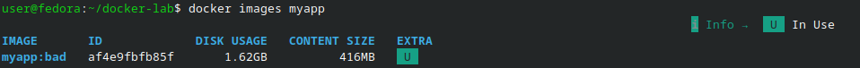
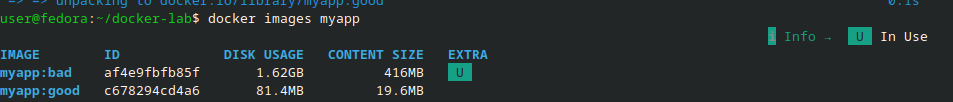
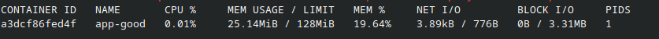
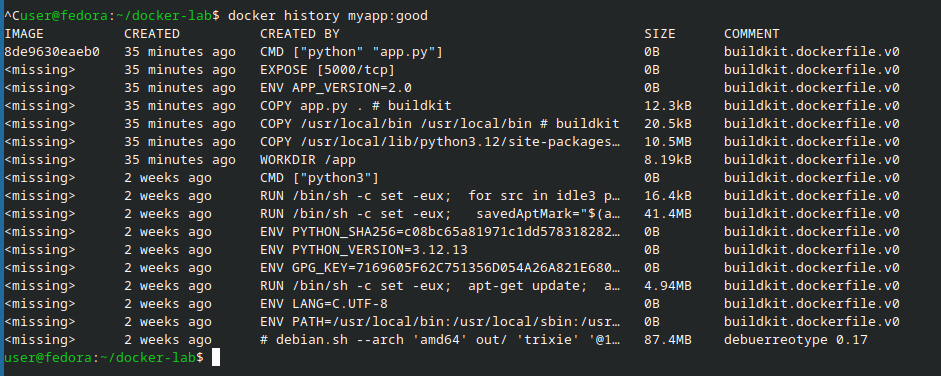

# Отчёт по лабораторной работе: Docker, образы, Dockerfile и слои

## Цель работы

Цель работы — научиться писать простой Dockerfile для Python‑приложения,
собирать образ, запускать контейнер, использовать multistage build
для уменьшения размера образа, ограничивать ресурсы контейнера (CPU/RAM),
изучать слои образа и публиковать образ на Docker Hub.  

---

## Краткое описание работы

На лабораторной работе я создал простое Flask‑приложение, написал к нему
«плохой» Dockerfile и собрал крупный образ.  
Потом сделал «хороший» multistage Dockerfile, уменьшил размер образа,
запустил контейнер с ограничениями по памяти и процессору, изучил
слои образов через `docker history` и `docker inspect`, а в конце
загрузил свой образ на Docker Hub.  

---

## Блок 1 — Подготовка и первый Dockerfile (плохой образ)

### Создание рабочей директории и приложения

Сначала я создал отдельную папку для лабораторной работы и перешёл в неё:

```bash
mkdir ~/docker-lab
cd ~/docker-lab
```

Затем я создал файл `app.py` с простым Flask‑приложением:

```python
from flask import Flask
import os, socket

app = Flask(__name__)

@app.route('/')
def hello():
    return f"Hello from container! Host: {socket.gethostname()}, Version: {os.getenv('APP_VERSION', '1.0')}"

@app.route('/health')
def health():
    return {"status": "ok"}

if __name__ == '__main__':
    app.run(host='0.0.0.0', port=5000)
```

И файл `requirements.txt` с зависимостью:

```text
flask==3.0.0
```

Я убедился, что файлы лежат в нужной директории, с помощью команды:

```bash
ls -la
```

### Написание «плохого» Dockerfile и сборка большого образа

Далее я создал простой, намеренно «плохой» Dockerfile:

```dockerfile
FROM python:3.12
WORKDIR /app
COPY . .
RUN pip install -r requirements.txt
CMD ["python", "app.py"]
```

Я сохранил этот файл под именем `Dockerfile` в каталоге `~/docker-lab`.  
После этого я собрал образ и запустил контейнер:

```bash
docker build -t myapp:bad .
docker images myapp
docker run -d -p 5000:5000 --name app-bad myapp:bad
curl localhost:5000
```

По выводу `docker images myapp` было видно, что образ `myapp:bad`
получился очень большим (порядка гигабайта и больше).  



---

## Блок 2 — Multistage build и маленький образ

### Создание «хорошего» Dockerfile с двумя стадиями

Затем я переписал Dockerfile, используя multistage build.  
В первом этапе я установил зависимости в более лёгком образе,
во втором — собрал финальный образ на базе `python:3.12-alpine`:

```dockerfile
# Stage 1: builder
FROM python:3.12-slim AS builder
WORKDIR /build
COPY requirements.txt .
RUN pip install --user --no-cache-dir -r requirements.txt

# Stage 2: final image
FROM python:3.12-alpine
WORKDIR /app
# Копируем только установленные пакеты из builder
COPY --from=builder /root/.local /root/.local
COPY app.py .
ENV PATH=/root/.local/bin:$PATH
ENV APP_VERSION=2.0
# Никогда не запускаем от root
RUN adduser -D appuser
USER appuser
EXPOSE 5000
CMD ["python", "app.py"]
```

Также я создал файл `.dockerignore`, чтобы в образ не попадали лишние файлы:

```text
__pycache__/
*.pyc
.git/
.env
*.md
Dockerfile*
```

---

### Сборка оптимизированного образа и сравнение размеров

После подготовки «хорошего» Dockerfile я собрал новый образ и сравнил размеры:

```bash
docker build -t myapp:good .
docker images myapp
```

В выводе `docker images myapp` стало видно, что образ `myapp:good`
значительно меньше по размеру, чем `myapp:bad`.  



Далее я запустил оптимизированный контейнер с ограничениями по памяти и CPU:

```bash
docker run -d \
  -p 5001:5000 \
  --name app-good \
  --memory="128m" \
  --cpus="0.5" \
  --restart=unless-stopped \
  myapp:good
```

Я проверил, что приложение отвечает:

```bash
curl localhost:5001
```

И посмотрел в `docker stats`, что контейнер действительно работает с заданными лимитами:

```bash
docker stats app-good
```



---

## Блок 3 — Исследование слоёв образа

Для того чтобы лучше понять структуру образов, я изучил их слои.  
Сначала я посмотрел историю слоёв для обоих образов:

```bash
docker history myapp:good
docker history myapp:bad
```

Затем я вывел детальную информацию о корневой файловой системе:

```bash
docker inspect myapp:good | jq '..RootFS'
```

После этого я установил утилиту `dive` для визуального анализа слоёв:

```bash
wget -q https://github.com/wagoodman/dive/releases/download/v0.12.0/dive_0.12.0_linux_amd64.deb
sudo dpkg -i dive_0.12.0_linux_amd64.deb
dive myapp:good
```

Также я посмотрел содержимое файловой системы образа без запуска контейнера:

```bash
docker create --name inspect-me myapp:good
docker export inspect-me | tar -tv | head -30
docker rm inspect-me
```



---

## Блок 4 — Публикация образа на Docker Hub

В конце работы я опубликовал свой образ в Docker Hub.  
Сначала я вошёл в свой аккаунт:

```bash
docker login
```

Затем я назначил тег для образа `myapp:good`, используя формат
`zhirny/flask-demo:v1.0`:

```bash
docker tag myapp:good zhirny/flask-demo:v1.0
docker push zhirny/flask-demo:v1.0
```

Для проверки я удалил локальный образ и скачал его снова из Docker Hub:

```bash
docker rmi zhirny/flask-demo:v1.0
docker pull zhirny/flask-demo:v1.0
docker run -d -p 5002:5000 zhirny/flask-demo:v1.0
curl localhost:5002
```
В отчёт я добавил URL своего образа на Docker Hub, например:

` https://hub.docker.com/r/zhirny/flask-demo`  

---

## Что я сдал преподавателю

1. Вывод `docker images myapp` с двумя строками (для `myapp:bad` и `myapp:good`), где видно
   разницу в размере образов.  
2. Вывод `docker history myapp:good` с описанием слоёв образа.  
3. Скрин `docker stats app-good`, где видно, что контейнер работает с ограничениями CPU/RAM.  
4. URL моего образа на Docker Hub.  

---

## Выводы

В ходе лабораторной работы я научился писать Dockerfile для простого Flask‑приложения,
собирать образ и запускать контейнер.  
Я увидел, что «прямолинейный» Dockerfile на базе полного образа Python
создаёт очень тяжёлый образ, а использование multistage build и лёгкой базы
(`python:3.12-alpine`) позволяет сильно уменьшить размер.  
Также я потренировался запускать контейнер с ограничениями по памяти и CPU
и посмотрел, как это отражается в `docker stats`.  
Отдельно я изучил структуру слоёв образа через `docker history`, `docker inspect`
и утилиту `dive`, что помогло лучше понять, из чего состоит образ.  
В конце я опубликовал свой образ на Docker Hub и убедился, что его можно
скачать и запустить на другой машине, используя только команду `docker pull`.  