# Отчёт по лабораторной работе: Docker сети, volumes и docker-compose

## Цель работы

Цель работы — научиться поднимать многоконтейнерное приложение (frontend nginx + backend Flask + база PostgreSQL) с помощью docker-compose, разобраться с типами сетей Docker и persistent volumes, а также посмотреть, как контейнеры общаются между собой.  

## Краткое описание

В ходе лабораторной я последовательно поработал с Docker-сетями, создал отдельную bridge-сеть и проверил, что контейнеры видят друг друга по имени. Затем я настроил PostgreSQL с volume так, чтобы данные не терялись при пересоздании контейнера. После этого я собрал стек из трёх сервисов через docker-compose: базу данных, backend на Flask и frontend на nginx, проверил их работу, настроил healthcheck и масштабирование backend-сервиса.  

---

## Блок 1 — Docker networking

### Просмотр существующих сетей

Сначала я посмотрел, какие сети Docker уже есть в системе, и изучил стандартную сеть `bridge`:

```bash
docker network ls
docker network inspect bridge
```

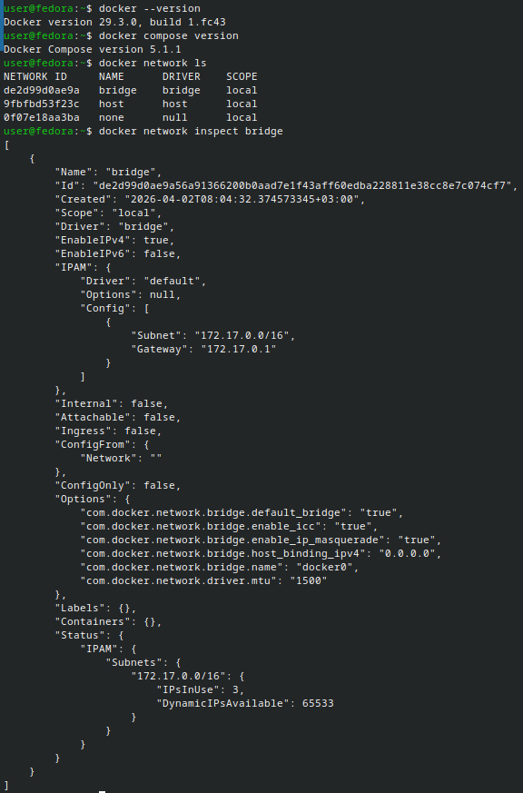

### Создание своей bridge-сети и проверка связи

Дальше я создал отдельную изолированную сеть для приложения и посмотрел список сетей:

```bash
docker network create --driver bridge app-network
docker network ls
```

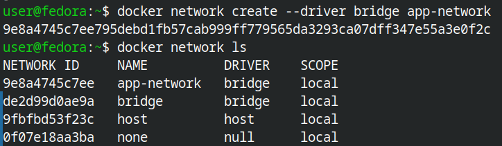

Затем я запустил контейнер с PostgreSQL в созданной сети `app-network`:

```bash
docker run -d --name db --network app-network \
  -e POSTGRES_PASSWORD=secret \
  postgres:16-alpine
```

После этого я запустил временный контейнер `alpine` в той же сети и зашёл внутрь:

```bash
docker run -it --rm --network app-network alpine sh
```

Внутри контейнера `alpine` я проверил, что имя `db` разрешается и что порт PostgreSQL доступен:

```bash
ping db
nc -zv db 5432
exit
```

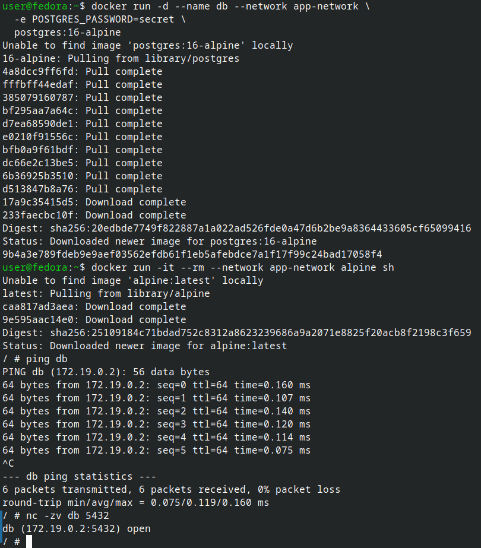

Для сравнения я запустил чистый контейнер `alpine` без указания сети и попытался достучаться до `db` по имени:

```bash
docker run -it --rm alpine ping db
```

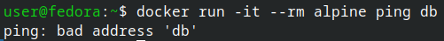

---

## Блок 2 — Volumes и persistent data

### Создание volume и запуск PostgreSQL

Для хранения данных я создал именованный volume:

```bash
docker volume create pgdata
```

После этого запустил контейнер PostgreSQL с использованием этого volume:

```bash
docker run -d \
  --name postgres-persistent \
  -e POSTGRES_DB=mydb \
  -e POSTGRES_USER=user \
  -e POSTGRES_PASSWORD=pass \
  -v pgdata:/var/lib/postgresql/data \
  postgres:16-alpine
```

И проверил, что контейнер запущен:

```bash
docker ps
```

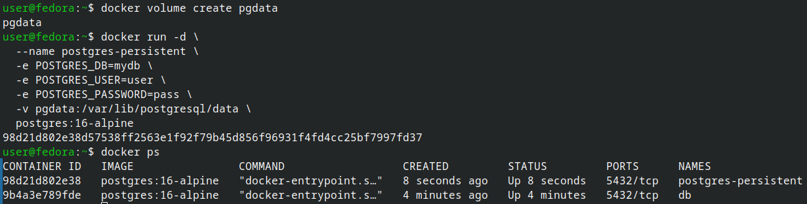

### Создание тестовых данных и проверка сохранности

Я зашёл внутрь PostgreSQL через `psql` и создал таблицу с тестовой строкой:

```bash
docker exec -it postgres-persistent psql -U user -d mydb -c \
  "CREATE TABLE items (id SERIAL, name TEXT); INSERT INTO items VALUES (1, 'test');"
```

Затем удалил контейнер, но не трогал volume:

```bash
docker rm -f postgres-persistent
```

И поднял новый контейнер с тем же volume:

```bash
docker run -d \
  --name postgres-restored \
  -e POSTGRES_DB=mydb \
  -e POSTGRES_USER=user \
  -e POSTGRES_PASSWORD=pass \
  -v pgdata:/var/lib/postgresql/data \
  postgres:16-alpine
```

После запуска я ещё раз проверил содержимое таблицы:

```bash
docker exec postgres-restored psql -U user -d mydb -c "SELECT * FROM items;"
```

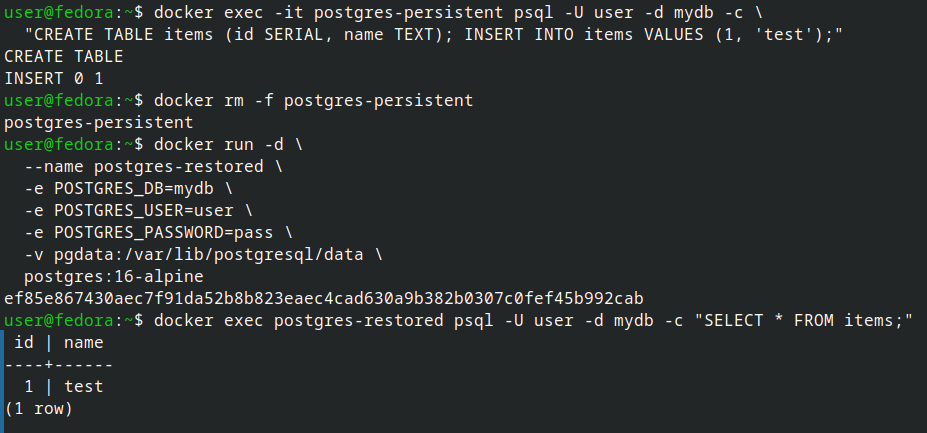

---

## Блок 3 — docker-compose: backend, frontend и база

### Подготовка структуры проекта

Для проекта я создал отдельную директорию и папки для backend и frontend:

```bash
mkdir ~/compose-lab && cd ~/compose-lab
mkdir -p backend frontend
ls -R
```

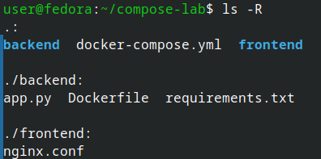

### Backend и frontend

В папке `backend` я создал файл `app.py` со простым API, который читает данные из PostgreSQL, файл `requirements.txt` с зависимостями и `Dockerfile` для сборки образа. В папке `frontend` я создал конфиг `nginx.conf`, который отдаёт простую страницу и проксирует запросы на backend.  

В корне проекта `compose-lab` я создал файл `docker-compose.yml`, в котором описал три сервиса (db, backend, frontend) и volume `pgdata`.

```bash
cat docker-compose.yml
```

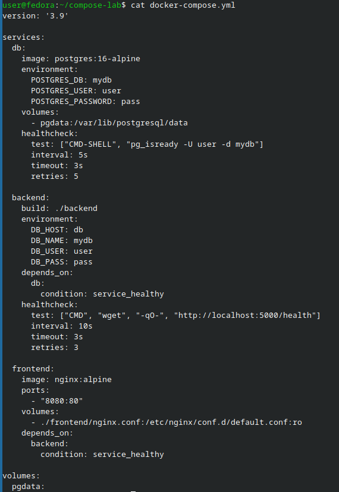

---

## Блок 4 — Поднятие стека и проверка работы

### Сборка и запуск стека

Я запустил сборку образа backend и поднял весь стек через docker-compose:

```bash
cd ~/compose-lab
docker compose up -d --build
```

После этого я проверил состояние сервисов:

```bash
docker compose ps
```

В списке сервисов я увидел три контейнера (`db`, `backend`, `frontend`) со статусом `up` и учитываемым healthcheck.

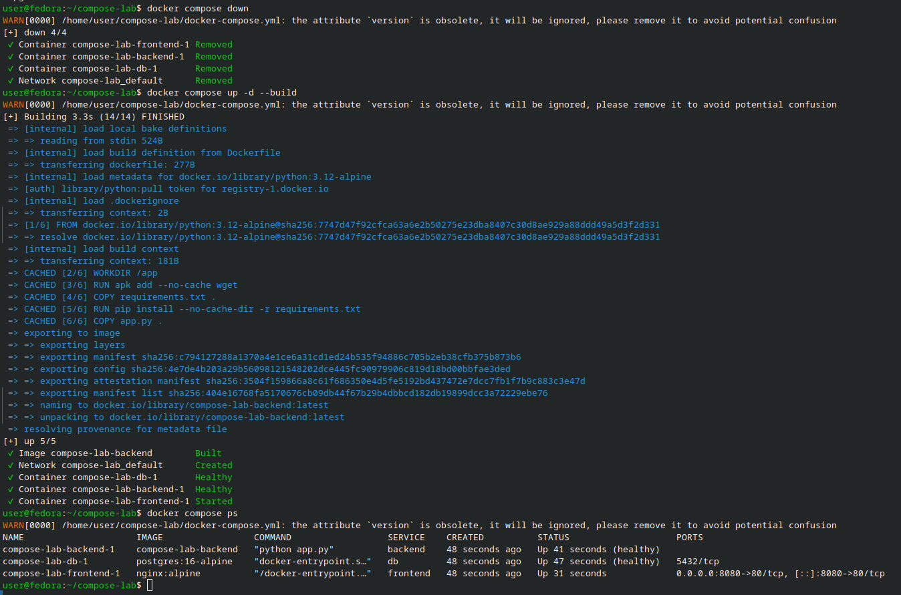

### Создание данных в базе через docker-compose

Чтобы backend мог отдавать данные, я создал таблицу и строки прямо через сервис `db`:

```bash
docker compose exec db psql -U user -d mydb -c \
  "CREATE TABLE IF NOT EXISTS items (id SERIAL, name TEXT); \
   INSERT INTO items (name) VALUES ('apple'), ('banana'), ('cherry');"
```

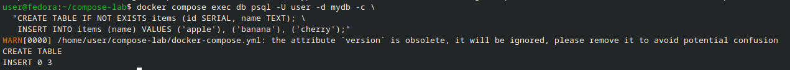

### Проверка работы API и получения данных из БД

После создания таблицы и тестовых строк я проверил, что backend действительно отдаёт данные из PostgreSQL.  
Для этого я выполнил запрос к API прямо из контейнера backend с помощью встроенного Python‑скрипта:

```bash
docker compose exec backend python -c "import requests; print(requests.get('http://localhost:5000/api/items').text)"
```

В ответ я получил JSON‑массив с элементами `apple`, `banana`, `cherry` и другими строками из таблицы `items`.

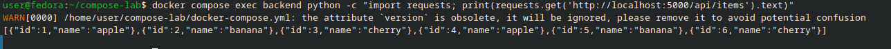

---

## Блок 5 — Масштабирование backend

### Масштабирование backend-сервиса

Я протестировал масштабирование backend-сервиса, увеличив количество экземпляров до трёх:

```bash
docker compose up -d --scale backend=3
docker compose ps
```

В списке появилось три контейнера backend с разными именами (например, `compose-lab-backend-1`, `compose-lab-backend-2`, `compose-lab-backend-3`).

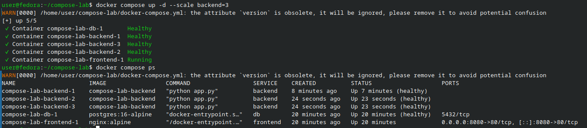

---

## Блок 6 — Завершение работы и очистка

В конце работы я остановил стек:

```bash
docker compose down
```

При необходимости я мог полностью удалить контейнеры и volume:

```bash
docker compose down -v
docker system prune -f
```

---

## Выводы

В этой лабораторной работе я разобрался с Docker-сетями и на практике посмотрел, как отдельная bridge-сеть изолирует контейнеры и позволяет им общаться по имени. Я настроил PostgreSQL с использованием volume и увидел, что данные не пропадают при пересоздании контейнера.  

Также я собрал многоконтейнерный стек из трёх сервисов с помощью docker-compose: frontend на nginx, backend на Flask и базу PostgreSQL. Я проверил работу API backend: запрос к эндпоинту `/api/items` возвращает данные из таблицы `items` в PostgreSQL, настроил healthcheck и масштабирование backend‑сервиса.