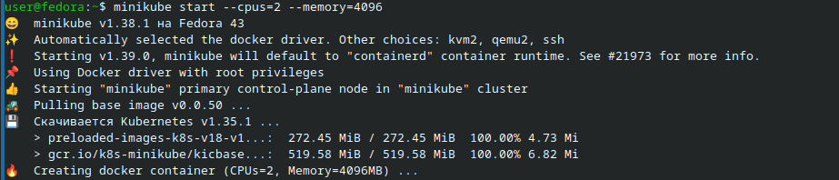
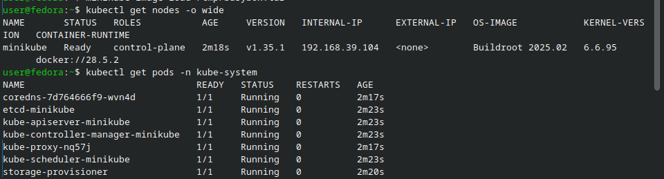
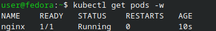
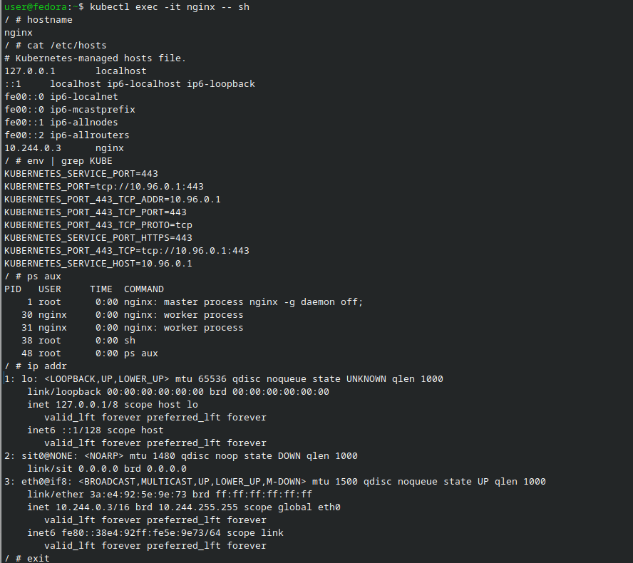
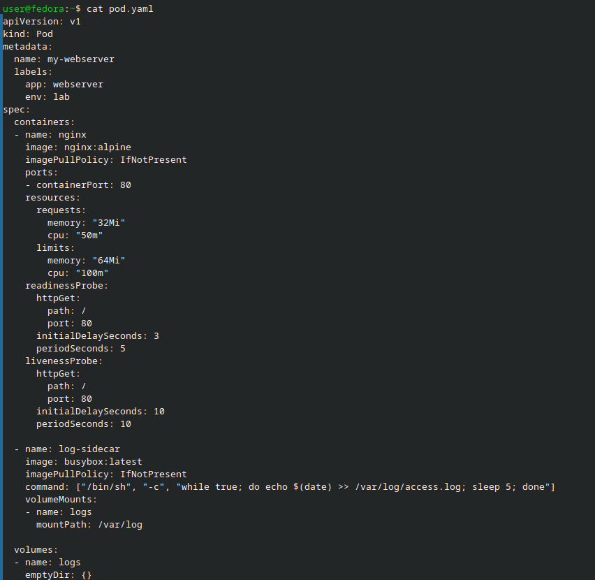
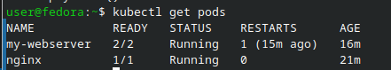
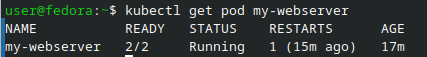
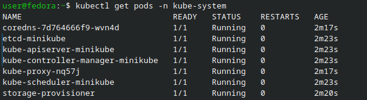

# Отчёт по лабораторной работе: Kubernetes — установка кластера и первые Pod’ы

## Цель работы

Цель работы — запустить кластер Kubernetes, понять роль основных компонентов и научиться создавать, проверять и удалять первые Pod’ы.

---

## Краткое описание

В этой работе я использовал готовый кластер Kubernetes (minikube или k3s), проверил состояние нод и системных подов, запустил первый Pod с nginx, зашёл внутрь и изучил окружение.  
Затем я создал Pod через YAML-манифест с двумя контейнерами и проверил, как Kubernetes автоматически перезапускает упавший контейнер, не удаляя весь Pod.

---

## Блок 0 — Подготовка окружения

Сначала я подготовил окружение для работы с Kubernetes.  
Я либо использовал уже настроенный кластер, либо поднимал новый.

Я проверил, доступен ли кластер командой:

```bash
kubectl version --short
```

Если кластера ещё не было, я запускал minikube:

```bash
minikube start --cpus=2 --memory=4096
```

Либо поднимал k3s:

```bash
curl -sfL https://get.k3s.io | sh -
export KUBECONFIG=/etc/rancher/k3s/k3s.yaml
```

После этого я убедился, что kubectl видит сервер и клиент.



---

## Блок 1 — Проверка состояния кластера

Далее я проверил состояние кластера и его основных компонентов.

Сначала я посмотрел список нод:

```bash
kubectl get nodes -o wide
```

Я убедился, что все ноды в статусе Ready.

Затем я подробнее изучил одну ноду:

```bash
kubectl describe node <имя-ноды> | head -50
```

После этого я посмотрел системные Pod’ы в пространстве имён kube-system:

```bash
kubectl get pods -n kube-system
```

Я также проверил состояние основных компонент Control Plane:

```bash
kubectl get componentstatuses
```

Для лучшего понимания я посмотрел статические манифесты Control Plane (если это kubeadm-кластер):

```bash
ls /etc/kubernetes/manifests/
cat /etc/kubernetes/manifests/kube-apiserver.yaml | grep -A5 "- --"
```

И изучил список доступных API‑ресурсов:

```bash
kubectl api-resources | head -20
```

В конце я ещё раз убедился в версиях:

```bash
kubectl version --short
```



---

## Блок 2 — Первый Pod nginx (императивно)

На следующем шаге я создал свой первый Pod с nginx с помощью императивной команды.

Я запустил Pod так:

```bash
kubectl run nginx --image=nginx:alpine --port=80
```

Затем посмотрел список Pod’ов:

```bash
kubectl get pods
kubectl get pods -o wide
```

Чтобы увидеть, как Pod переходит из состояния Pending в Running, я использовал “живой” вывод:

```bash
kubectl get pods -w
# Выход по Ctrl+C
```

Когда Pod стал Running, я зашёл внутрь контейнера:

```bash
kubectl exec -it nginx -- sh
```

Внутри контейнера я выполнил команды:

```bash
hostname
cat /etc/hosts
env | grep KUBE
ps aux
ip addr
exit
```

Потом я посмотрел логи Pod’а:

```bash
kubectl logs nginx
kubectl logs nginx -f  # выход Ctrl+C
```

И подробно изучил описание Pod’а:

```bash
kubectl describe pod nginx
```





---

## Блок 3 — Создание Pod через YAML (my-webserver)

Далее я создал Pod не через команду, а через YAML-манифест.

Я создал файл pod.yaml со следующим содержимым:

```yaml
apiVersion: v1
kind: Pod
metadata:
  name: my-webserver
  labels:
    app: webserver
    env: lab
spec:
  containers:
  - name: nginx
    image: nginx:alpine
    ports:
    - containerPort: 80
    resources:
      requests:
        memory: "32Mi"
        cpu: "50m"
      limits:
        memory: "64Mi"
        cpu: "100m"
    readinessProbe:
      httpGet:
        path: /
        port: 80
      initialDelaySeconds: 3
      periodSeconds: 5
    livenessProbe:
      httpGet:
        path: /
        port: 80
      initialDelaySeconds: 10
      periodSeconds: 10

  - name: log-sidecar
    image: busybox:latest
    command: ["/bin/sh", "-c", "while true; do echo $(date) >> /var/log/access.log; sleep 5; done"]
    volumeMounts:
    - name: logs
      mountPath: /var/log

  volumes:
  - name: logs
    emptyDir: {}
```

Я сохранил файл и применил его:

```bash
kubectl apply -f pod.yaml
```

После этого я дождался, когда Pod my-webserver перейдёт в статус Running:

```bash
kubectl get pods -w
```

Затем я убедился, что в Pod’е два контейнера:

```bash
kubectl get pod my-webserver -o jsonpath='{.spec.containers[*].name}'
```

Я посмотрел логи вспомогательного контейнера log-sidecar:

```bash
kubectl logs my-webserver -c log-sidecar
```

Также я зашёл в контейнер nginx внутри этого Pod’а:

```bash
kubectl exec -it my-webserver -c nginx -- sh
exit
```

И посмотрел YAML уже запущенного Pod’а (с добавленными значениями по умолчанию):

```bash
kubectl get pod my-webserver -o yaml | head -60
```





---

## Блок 4 — Самовосстановление Pod’а (restarts)

Затем я проверил, как Kubernetes сам восстанавливает контейнер внутри Pod’а.

Я намеренно “убил” основной процесс nginx внутри Pod’а my-webserver:

```bash
kubectl exec my-webserver -c nginx -- kill 1
```

После этого я включил наблюдение за Pod’ами:

```bash
kubectl get pods -w
```

На короткое время Pod поменял состояние, затем снова стал Running — это значит, что контейнер был перезапущен автоматически.  
Потом я посмотрел счётчик рестартов:

```bash
kubectl get pod my-webserver
```

В колонке RESTARTS значение стало больше 0, что подтверждает факт перезапуска контейнера kubelet’ом, при этом сам Pod не был удалён.



---

## Блок 5 — Системные Pod’ы и отличие Pod vs Container

В конце я ещё раз посмотрел список системных Pod’ов:

```bash
kubectl get pods -n kube-system
```

Я отметил, какие Pod’ы должны быть всегда Running (CoreDNS, сетевые компоненты и другие ключевые сервисы кластера).

Также я письменно сформулировал отличие Pod от контейнера:

- Pod — это минимальная единица развёртывания в Kubernetes, которая может содержать один или несколько контейнеров и общий сетевой и файловый контекст.  
- Контейнер — это отдельный процесс в изолированном окружении, а Pod объединяет несколько контейнеров, которые всегда запускаются вместе и разделяют один IP и общие тома.



---

## Что должно быть сделано к концу работы

1. `kubectl get nodes` — все ноды в статусе Ready.  
2. `kubectl get pods -n kube-system` — все системные поды Running.  
3. `kubectl get pods` — два Pod’а (nginx и my-webserver) в статусе Running.  
4. `kubectl get pod my-webserver` — значение RESTARTS больше 0 после kill 1.

---

## Выводы

В ходе работы я научился запускать и проверять кластер Kubernetes, смотреть состояние нод и системных Pod’ов и понимать, какие компоненты отвечают за работу Control Plane.

Я создал первый Pod с nginx императивной командой, зашёл внутрь контейнера, изучил hostname, окружение, сетевые настройки и логи, а также посмотрел подробное описание Pod’а.

Затем я создал Pod через YAML-манифест с двумя контейнерами (основной nginx и вспомогательный log-sidecar, записывающий события во временный том), применил его и убедился, что оба контейнера работают как единое приложение.

Я также проверил механизм самовосстановления: принудительно завершил основной процесс nginx, после чего Kubernetes автоматически перезапустил контейнер, что отразилось в увеличившемся счётчике RESTARTS.

В результате я лучше понял, чем Pod отличается от контейнера и как Kubernetes управляет жизненным циклом приложений внутри кластера.