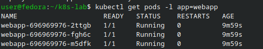
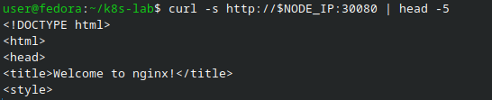
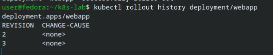

# Отчёт по лабораторной работе: Kubernetes — Deployment, Service, Ingress

## Цель работы

Цель работы — научиться разворачивать приложения в Kubernetes с помощью **Deployment**, настраивать **rolling update** без простоя, выполнять откат версий, а также организовывать доступ к приложению через **Service** и **Ingress**.

---

## Краткое описание

В этой лабораторной работе я:

- Создал Deployment с 3 репликами приложения.
- Настроил Service типа NodePort для доступа извне.
- Выполнил rolling update (обновление без даунтайма).
- Откатился на предыдущую версию Deployment’а.
- Настроил Ingress для маршрутизации трафика по путям (`/api` → backend, `/` → frontend).

---

## Краткая теория

**Deployment** — объект Kubernetes, который управляет репликами приложения. Он обеспечивает:

- Масштабирование (количество подов).
- Постепенное **rolling update** без простоя.
- Возможность отката на предыдущую версию (rollout undo).

**Service** — абстракция, которая открывает доступ к подам и даёт им стабильное имя и IP. Основные типы:

- **ClusterIP** — доступ только внутри кластера.
- **NodePort** — открывает порт на каждой ноде (диапазон 30000–32767).
- **LoadBalancer** — внешний балансировщик (в облаке).

**Ingress** — HTTP‑маршрутизатор. Позволяет по одному доменному имени (`host`) распределять трафик по разным сервисам и путям (`/`, `/api` и т.п.).

**Rolling Update** — стратегия обновления, при которой новые поды создаются постепенно, а старые удаляются после запуска новых. Так приложение остаётся доступным в процессе обновления.

---

## Блок 1 — Создание Deployment

Я создал файл `deployment.yaml` с конфигурацией Deployment на 3 реплики:

```yaml
apiVersion: apps/v1
kind: Deployment
metadata:
  name: webapp
  labels:
    app: webapp
spec:
  replicas: 3
  selector:
    matchLabels:
      app: webapp
  strategy:
    type: RollingUpdate
    rollingUpdate:
      maxSurge: 1
      maxUnavailable: 0
  template:
    metadata:
      labels:
        app: webapp
        version: v1
    spec:
      containers:
      - name: webapp
        image: nginxdemos/hello:plain-text
        imagePullPolicy: IfNotPresent
        ports:
        - containerPort: 80
        resources:
          requests:
            cpu: "50m"
            memory: "32Mi"
          limits:
            cpu: "100m"
            memory: "64Mi"
        readinessProbe:
          httpGet:
            path: /
            port: 80
          initialDelaySeconds: 3
          periodSeconds: 3
```

Затем применил конфигурацию и дождался запуска всех подов:

```bash
kubectl apply -f deployment.yaml
kubectl get pods -w
# Ждал, пока все 3 пода перейдут в статус Running, затем остановил вывод Ctrl+C
kubectl rollout status deployment/webapp
kubectl get rs
```



---

## Блок 2 — Service и проверка доступа

Далее я создал Service типа NodePort, чтобы получить доступ к приложению извне:

```yaml
# файл service.yaml
apiVersion: v1
kind: Service
metadata:
  name: webapp-svc
spec:
  selector:
    app: webapp
  type: NodePort
  ports:
  - port: 80
    targetPort: 80
    nodePort: 30080
```

Применил Service и проверил его:

```bash
kubectl apply -f service.yaml
kubectl get svc webapp-svc
NODE_IP=$(minikube ip)
echo "Доступ к приложению: http://$NODE_IP:30080"
curl $NODE_IP:30080
```



После этого в отдельном терминале я запустил цикл запросов, чтобы увидеть, как запросы распределяются между подами (round‑robin):

```bash
NODE_IP=$(minikube ip)
while true; do
  curl -s $NODE_IP:30080 | grep "Server name"
  sleep 0.5
done
```

---

## Блок 3 — Rolling Update (обновление без простоя)

Для демонстрации обновления я изменил образ в Deployment’е:

```bash
kubectl set image deployment/webapp webapp=nginxdemos/hello:latest
kubectl rollout status deployment/webapp
```

Параллельно в терминале с циклическими запросами `curl` я наблюдал, что ответы продолжали приходить без ошибок — приложение не падало и не исчезало из сети.

Во время обновления часть подов была в состоянии создания/удаления, остальные — Running.

Я также посмотрел историю ревизий Deployment’а:

```bash
kubectl rollout history deployment/webapp
```
---

## Блок 4 — Откат на предыдущую версию

После обновления я выполнил откат на предыдущую версию:

```bash
kubectl rollout undo deployment/webapp
kubectl rollout status deployment/webapp
kubectl rollout history deployment/webapp
```

В истории стало видно несколько ревизий, и активной снова стала исходная версия.



---

## Блок 5 — Ingress: маршрутизация трафика

Сначала я убедился, что в minikube включён Ingress‑контроллер:

```bash
minikube addons enable ingress
kubectl get pods -n ingress-nginx
```

Затем создал второй deployment — простой backend API:

```bash
kubectl create deployment api-backend --image=hashicorp/http-echo -- /http-echo -text="Hello from API"
kubectl expose deployment api-backend --port=5678 --name=api-svc
kubectl get pods -w
# Ждал, пока api-backend станет Running, затем остановил Ctrl+C
```

Далее я описал правила Ingress в файле `ingress.yaml`:

```yaml
apiVersion: networking.k8s.io/v1
kind: Ingress
metadata:
  name: webapp-ingress
  annotations:
    nginx.ingress.kubernetes.io/rewrite-target: /
spec:
  ingressClassName: nginx
  rules:
  - host: webapp.local
    http:
      paths:
      - path: /
        pathType: Prefix
        backend:
          service:
            name: webapp-svc
            port:
              number: 80
      - path: /api
        pathType: Prefix
        backend:
          service:
            name: api-svc
            port:
              number: 5678
```

Применил Ingress и добавил локальную DNS‑запись:

```bash
kubectl apply -f ingress.yaml
kubectl get ingress webapp-ingress

echo "$(minikube ip) webapp.local" | sudo tee -a /etc/hosts
```

После этого я протестировал маршрутизацию:

```bash
curl webapp.local
curl webapp.local/api
```

Первый запрос вернул страницу из `nginxdemos/hello`, второй — строку `Hello from API`.


---

## Блок 6 — Сравнение типов Service

Чтобы на практике увидеть разницу между ClusterIP и NodePort, я создал отдельный сервис типа ClusterIP:

```bash
kubectl expose deployment webapp --name=webapp-clusterip --type=ClusterIP --port=80
kubectl get svc
```

Далее я проверил доступность ClusterIP изнутри кластера:

```bash
kubectl run test --rm -it --image=alpine -- sh
# внутри pod'a:
wget -qO- webapp-clusterip
exit
```

Снаружи кластера этот сервис недоступен, что подтверждает его внутренний тип.

---

## Выводы

В ходе лабораторной работы я:

1. **Освоил создание Deployment’а** с несколькими репликами и стратегией RollingUpdate (`maxSurge: 1`, `maxUnavailable: 0`), что позволяет обновлять приложение без полной остановки.

2. **Провёл rolling update** приложения и убедился, что при такой стратегии трафик продолжает обслуживаться, а новые версии подов постепенно заменяют старые.

3. **Научился откатывать версии** Deployment’а с помощью `kubectl rollout undo` и работать с историей развёртываний через `kubectl rollout history`.

4. **Создал Service типа NodePort** и настроил доступ к приложению по IP ноды и фиксированному порту 30080, а также увидел, как запросы распределяются между подами.

5. **Настроил Ingress** для домена `webapp.local`, организовав маршрутизацию: путь `/` — к фронтенд‑сервису, путь `/api` — к backend API.

6. **Разобрался в разнице между типами Service**: `ClusterIP` используется для внутреннего взаимодействия сервисов, а `NodePort` даёт внешний доступ к кластеру в тестовом окружении.

В результате я лучше понимаю, как Kubernetes управляет развертыванием и обновлениями приложений и как организовать доступ к ним через Service и Ingress в реальном кластере.