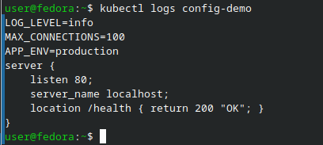
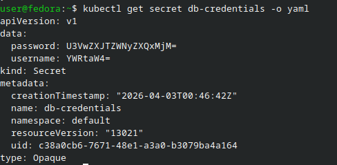
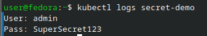
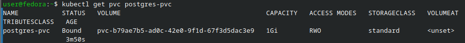

# Отчёт по лабораторной работе: Kubernetes — ConfigMap, Secret, PersistentVolume

## Цель работы

Научиться управлять конфигурацией приложения через ConfigMap и Secret, подключить постоянное хранилище через PersistentVolumeClaim и понять, почему конфигурацию нельзя жёстко зашивать внутрь образа контейнера.

---

## Краткое описание

В ходе лабораторной работы я:

- Создал ConfigMap и подключил его в pod тремя способами: как переменные окружения (через `envFrom`), как отдельную переменную и как файл через volume.
- Создал Secret, убедился, что данные в нём хранятся в base64 (а не зашифрованы), и подключил его к pod’у.
- Развернул PostgreSQL с PersistentVolumeClaim, записал тестовые данные, удалил pod и проверил, что данные сохранились.
- Сформулировал выводы, почему Secret по умолчанию небезопасен и как это можно исправить в продакшене.

---

## Краткая теория

**ConfigMap** — объект Kubernetes для хранения некритичных конфигурационных данных в формате ключ‑значение. Позволяет отделять конфигурацию от кода и менять её без пересборки образов.

**Secret** — объект для хранения чувствительных данных (пароли, токены). По умолчанию Kubernetes кодирует значения в base64, но не шифрует их в etcd, поэтому Secret нужно дополнительно защищать.

**PersistentVolume (PV) и PersistentVolumeClaim (PVC)** — механизм подключения постоянного хранилища к pod’ам. PVC описывает запрос на ресурс, PV — реализацию хранилища. При удалении pod’а данные на PV остаются.

**12‑factor app** — набор принципов для современных приложений. Один из принципов — конфигурация должна храниться вне кода (например, в переменных окружения или внешних сервисах).

---

## Блок 1 — Работа с ConfigMap

### Создание ConfigMap из литералов и файла

Сначала я создал ConfigMap с набором простых параметров приложения:

```bash
kubectl create configmap app-config \
  --from-literal=APP_ENV=production \
  --from-literal=LOG_LEVEL=info \
  --from-literal=MAX_CONNECTIONS=100

kubectl get configmap app-config -o yaml
```

Затем подготовил конфигурационный файл для nginx и создал ConfigMap из файла:

```bash
cat > nginx.conf << 'EOF'
server {
    listen 80;
    server_name localhost;
    location /health { return 200 "OK"; }
}
EOF

kubectl create configmap nginx-conf --from-file=nginx.conf
```
---

### Подключение ConfigMap в pod тремя способами

Далее я описал pod в файле `pod-with-config.yaml`, где подключил ConfigMap сразу несколькими способами:

1. Через `envFrom` — все ключи из ConfigMap автоматически появились как переменные окружения.
2. Через `configMapKeyRef` — подключил отдельный ключ в конкретную переменную.
3. Через volume — смонтировал ConfigMap как файл в директорию `/etc/config`.

После этого применил манифест и посмотрел логи:

```bash
kubectl apply -f pod-with-config.yaml
kubectl logs config-demo
```

В логах контейнера отобразились:

- значения переменных окружения `APP_ENV`, `LOG_LEVEL`, `MAX_CONNECTIONS`;
- содержимое файла `nginx.conf`, смонтированного из ConfigMap.



**Итог блока:** я увидел на практике три разных способа подключения ConfigMap и убедился, что конфигурацию можно гибко подменять без пересборки образов.

---

## Блок 2 — Работа с Secret

### Создание и просмотр Secret

Для начала я создал Secret с учётными данными для базы данных:

```bash
kubectl create secret generic db-credentials \
  --from-literal=username=admin \
  --from-literal=password=SuperSecret123

kubectl get secret db-credentials -o yaml
```

В YAML‑выводе значения оказались в base64. Чтобы показать, что это не шифрование, я декодировал значение пароля:

```bash
echo "U3VwZXJTZWNyZXQxMjM=" | base64 -d
# SuperSecret123
```



---

### Подключение Secret в pod

Далее я настроил pod в файле `pod-with-secret.yaml`, чтобы передать значения из Secret в окружение:

```yaml
env:
- name: DB_USER
  valueFrom:
    secretKeyRef:
      name: db-credentials
      key: username
- name: DB_PASS
  valueFrom:
    secretKeyRef:
      name: db-credentials
      key: password
```

Применил манифест и посмотрел логи pod’а:

```bash
kubectl apply -f pod-with-secret.yaml
kubectl logs secret-demo
```

В логах были выведены значения `DB_USER` и `DB_PASS`, подтверждая, что pod корректно прочитал данные из Secret.



---

### Почему Secret небезопасен по умолчанию

В процессе работы я отметил несколько важных моментов:

- Secret хранится в etcd в виде base64‑строки, то есть речь идёт о кодировании, а не о шифровании.
- Любой пользователь с правом `get secret` в namespace фактически может прочитать все секреты.
- Для реальной защиты нужно либо включать шифрование Secret в конфигурации Kubernetes (`EncryptionConfiguration`), либо использовать внешний хранилище секретов (Vault и т.п.).

---

## Блок 3 — PersistentVolume + PostgreSQL

### Создание PVC и развёртывание PostgreSQL

Сначала я проверил доступные StorageClass в кластере:

```bash
kubectl get sc
```

С учётом своей среды (minikube или k3s) я указал подходящий `storageClassName` в манифесте `postgres-pvc.yaml`. Этот файл включал:

- `PersistentVolumeClaim` на 1Gi;
- `Secret` с настройками PostgreSQL;
- `Deployment` с контейнером `postgres:16-alpine`;
- `Service` для доступа к базе.

Я применил манифест:

```bash
kubectl apply -f postgres-pvc.yaml
```

Затем убедился, что PVC успешно привязан к PV:

```bash
kubectl get pvc
```



---

### Запись тестовых данных

Далее я подключился к запущенной базе и создал тестовую таблицу:

```bash
POD_NAME=$(kubectl get pod -l app=postgres -o name | cut -d/ -f2)

kubectl exec -it $POD_NAME -- \
  psql -U pguser -d mydb -c \
  "CREATE TABLE sessions (id SERIAL, data TEXT);
   INSERT INTO sessions (data) VALUES ('важные данные');"
```

Команды выполнились успешно — таблица была создана, строка добавлена.

---

### Удаление pod’а и проверка сохранения данных

Чтобы убедиться в работе постоянного хранилища, я удалил pod PostgreSQL, не трогая PVC:

```bash
kubectl delete pod $POD_NAME
```

Deployment автоматически создал новый pod. Я дождался статуса Running:

```bash
kubectl get pods -w
# затем Ctrl+C
```

После этого снова подключился к базе и проверил содержимое таблицы:

```bash
NEW_POD=$(kubectl get pod -l app=postgres -o name | cut -d/ -f2)

kubectl exec -it $NEW_POD -- \
  psql -U pguser -d mydb -c "SELECT * FROM sessions;"
```

В результате запрос вернул строку с ранее записанным текстом «важные данные».


**Итог блока:** данные остались в хранилище даже после пересоздания pod’а, то есть PVC корректно обеспечивает постоянство данных.

---

## Выводы

В ходе лабораторной работы я:

- На практике освоил работу с **ConfigMap** и увидел три разных способа его подключения: через `envFrom`, через `configMapKeyRef` и как файл в volume.
- Разобрался, как работать с **Secret** в Kubernetes, и понял, что base64 — это только кодирование, а не шифрование. Сделал вывод, что для продакшена нужна дополнительная защита (шифрование в etcd и ограничение доступа через RBAC).
- Развернул **PostgreSQL** с PersistentVolumeClaim, записал туда данные и подтвердил, что при удалении pod’а данные не теряются, так как лежат в постоянном томе.
- Ещё раз убедился в важности принципа 12‑factor app: конфигурация и секреты не должны быть «зашиты» в образ, а должны храниться отдельно и управляться средствами платформы.

Эта работа помогла лучше понять, как правильно хранить конфигурацию и данные в Kubernetes, чтобы приложения оставались гибкими, переносимыми и устойчивыми к сбоям.