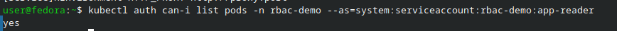
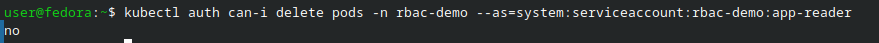

# Отчёт по лабораторной работе: Безопасность Kubernetes — RBAC, NetworkPolicy, Falco

## Цель работы

Цель работы — настроить контроль доступа в Kubernetes через RBAC так, чтобы приложение имело только необходимые права, изолировать сетевой трафик между подами с помощью NetworkPolicy и увидеть в реальном времени подозрительную активность через Falco.

---

## Краткая теория

**RBAC (Role-Based Access Control)** — механизм контроля доступа в Kubernetes. Позволяет назначать права пользователям и сервисным аккаунтам через роли (Role/ClusterRole) и привязки (RoleBinding/ClusterRoleBinding). Основной принцип — **минимальные привилегии**: давать только те права, которые действительно необходимы.

**NetworkPolicy** — объект Kubernetes для управления сетевым трафиком между подами. Работает на уровне L3/L4. По умолчанию в Kubernetes весь трафик разрешён; NetworkPolicy позволяет явно разрешать или запрещать соединения по меткам, портам и namespace.

**TLS‑сертификаты** — используются для шифрования трафика. В Kubernetes сертификаты хранятся в Secret’ах типа `kubernetes.io/tls` и подключаются к Ingress для HTTPS.

**Falco** — система runtime‑безопасности. Анализирует системные вызовы в контейнерах и генерирует алерты при подозрительной активности (например, запуск shell в контейнере или чтение чувствительных файлов).

---

## Блок 1 — Настройка RBAC: ServiceAccount с ограниченными правами

### Создание namespace и объектов RBAC

Сначала я создал отдельный namespace для демонстрации RBAC:

```bash
kubectl create namespace rbac-demo
```

Затем подготовил файл `rbac.yaml` с тремя объектами:

- `ServiceAccount` — отдельный идентификатор для приложения.
- `Role` — разрешает только `get`, `list`, `watch` подов и их логов в namespace.
- `RoleBinding` — привязывает этот аккаунт к роли.

Применил конфигурацию:

```bash
kubectl apply -f rbac.yaml
```

---

### Проверка прав через `kubectl auth can-i`

Дальше я проверил, какие действия разрешены и запрещены для сервисного аккаунта `app-reader`.

Проверил, что аккаунт может читать поды в своём namespace:

```bash
kubectl auth can-i list pods \
  --namespace rbac-demo \
  --as=system:serviceaccount:rbac-demo:app-reader
# yes
```

Проверил, что удалять поды он не может:

```bash
kubectl auth can-i delete pods \
  --namespace rbac-demo \
  --as=system:serviceaccount:rbac-demo:app-reader
# no
```

И убедился, что в namespace `default` у него тоже нет прав:

```bash
kubectl auth can-i list pods \
  --namespace default \
  --as=system:serviceaccount:rbac-demo:app-reader
# no
```



---

### Запуск пода от имени ServiceAccount

Чтобы проверить поведение «вживую», я запустил под `rbac-test`, который использует этот сервисный аккаунт:

```bash
kubectl apply -f pod-rbac-demo.yaml
kubectl exec -it rbac-test -n rbac-demo -- sh
```

Внутри контейнера выполнил:

```bash
kubectl get pods -n rbac-demo
# команда отработала успешно — поды видны

kubectl delete pod rbac-test -n rbac-demo
# Forbidden — нет прав на удаление
```



**Итог блока:** я убедился, что ServiceAccount видит только своё пространство имён и может выполнять только операции чтения, а попытки удаления и работы в других namespace блокируются.

---

## Блок 2 — Изоляция трафика через NetworkPolicy

### Подготовка: запуск тестовых подов и сервисов

Для демонстрации сетевой изоляции я создал новый namespace и три пода с разными ролями:

```bash
kubectl create namespace netpol-demo

kubectl run frontend -n netpol-demo --image=nginx:alpine --labels=role=frontend
kubectl expose pod frontend -n netpol-demo --port=80 --name=frontend-svc

kubectl run backend -n netpol-demo --image=nginx:alpine --labels=role=backend
kubectl expose pod backend -n netpol-demo --port=80 --name=backend-svc

kubectl run database -n netpol-demo --image=nginx:alpine --labels=role=database
kubectl expose pod database -n netpol-demo --port=80 --name=database-svc
```

До применения политик я проверил связь между сервисами:

```bash
kubectl exec frontend -n netpol-demo -- wget -qO- backend-svc
kubectl exec frontend -n netpol-demo -- wget -qO- database-svc
```

Обе команды успешно вернули HTML от nginx — то есть по умолчанию весь трафик разрешён.


---

### Применение NetworkPolicy

Далее я описал сетевые политики в файле `networkpolicies.yaml`. В нём было четыре объекта:

1. `default-deny-ingress` — запрещает весь входящий трафик ко всем подам в namespace.
2. `allow-frontend-ingress` — разрешает входящий трафик к frontend (извне кластера).
3. `allow-backend-from-frontend` — разрешает backend принимать запросы только от frontend.
4. `allow-database-from-backend` — разрешает database принимать запросы только от backend.

Применил файл:

```bash
kubectl apply -f networkpolicies.yaml
kubectl get networkpolicies -n netpol-demo
```

---

### Проверка изоляции после политик

После применения политик я снова проверил соединения:

```bash
# frontend → backend: должно работать
kubectl exec frontend -n netpol-demo -- wget -qO- --timeout=3 backend-svc

# frontend → database: должно блокироваться
kubectl exec frontend -n netpol-demo -- wget -qO- --timeout=3 database-svc

# backend → database: должно работать
kubectl exec backend -n netpol-demo -- wget -qO- --timeout=3 database-svc
```

В результате:

- запросы frontend → backend продолжили успешно проходить;
- запрос frontend → database стал зависать по тайм‑ауту;
- запрос backend → database по‑прежнему работал.


**Итог блока:** я реализовал цепочку доступа frontend → backend → database, при этом прямой доступ frontend → database был заблокирован.

---

## Блок 3 — TLS‑сертификаты и HTTPS через Ingress

### Создание собственного CA

Для настройки HTTPS я сначала сгенерировал свой корневой сертификат (CA):

```bash
mkdir -p ~/ssl-lab && cd ~/ssl-lab

openssl genrsa -out ca.key 4096

openssl req -x509 -new -nodes \
  -key ca.key \
  -sha256 \
  -days 3650 \
  -out ca.crt \
  -subj "/C=RU/ST=Moscow/O=SiriusLab CA/CN=SiriusLab Root CA"

openssl x509 -in ca.crt -noout -text | grep -E "Issuer:|Subject:|Not (Before|After)"
```
---

### Генерация CSR для веб‑приложения

Затем я создал конфигурационный файл `webapp.ext` для SAN:

```bash
cat > webapp.ext << 'EOF'
authorityKeyIdentifier=keyid,issuer
basicConstraints=CA:FALSE
keyUsage = digitalSignature, keyEncipherment
extendedKeyUsage = serverAuth
subjectAltName = @alt_names

[alt_names]
DNS.1 = webapp.local
DNS.2 = www.webapp.local
IP.1 = 127.0.0.1
EOF
```

Сгенерировал ключ и запрос на сертификат:

```bash
openssl genrsa -out webapp.key 2048

openssl req -new \
  -key webapp.key \
  -out webapp.csr \
  -subj "/C=RU/O=SiriusLab/CN=webapp.local"
```

---

### Подпись сертификата нашим CA

Подписал сертификат собственным корневым сертификатом:

```bash
openssl x509 -req \
  -in webapp.csr \
  -CA ca.crt \
  -CAkey ca.key \
  -CAcreateserial \
  -out webapp.crt \
  -days 365 \
  -sha256 \
  -extfile webapp.ext

openssl verify -CAfile ca.crt webapp.crt
# webapp.crt: OK
```


---

### Подключение сертификата к Ingress

Я создал TLS‑секрет в Kubernetes:

```bash
kubectl create secret tls webapp-tls \
  --cert=webapp.crt \
  --key=webapp.key \
  -n netpol-demo
```

Применил Ingress с HTTPS:

```bash
kubectl apply -f ingress-tls.yaml
kubectl get ingress -n netpol-demo
```

Добавил запись в `/etc/hosts`:

```bash
echo "$(minikube ip) webapp.local" | sudo tee -a /etc/hosts
```

Проверил HTTPS‑соединение, указав свой CA:

```bash
curl --cacert ca.crt https://webapp.local
```

Ответом пришла страница nginx — значит, TLS настроен корректно.

---

### Просмотр сертификата из Secret

В конце я проверил, что сертификат в Secret’е действительно тот, что я создавал:

```bash
kubectl get secret webapp-tls -n netpol-demo \
  -o jsonpath='{.data.tls\.crt}' | base64 -d | \
  openssl x509 -noout -text | \
  grep -E "Subject:|Issuer:|DNS:|IP:|Not "
```

---

## Блок 4 — (Дополнительно) Мониторинг подозрительной активности через Falco

### Проверка работы Falco

Я убедился, что Falco установлен и запущен как DaemonSet:

```bash
kubectl get pods -n falco
```

Затем включил просмотр логов:

```bash
kubectl logs -n falco -l app.kubernetes.io/name=falco -f
```

---

### Генерация подозрительных действий

Чтобы спровоцировать алерты, я сделал несколько действий в подах:

```bash
# запуск интерактивного shell в pod'e
kubectl exec -it frontend -n netpol-demo -- sh
exit

# попытка прочитать чувствительный файл
kubectl exec frontend -n netpol-demo -- cat /etc/shadow 2>/dev/null || true
```

В логах Falco появились предупреждения:

- о запуске shell внутри контейнера;
- о попытке прочитать чувствительный файл.

---

## Результаты проверки

| Проверка                           | Команда                                                                                          | Ожидаемый результат          |
|-----------------------------------|---------------------------------------------------------------------------------------------------|------------------------------|
| RBAC: чтение подов               | `kubectl auth can-i list pods -n rbac-demo --as=system:serviceaccount:rbac-demo:app-reader`      | `yes`                        |
| RBAC: нет удаления               | `kubectl auth can-i delete pods -n rbac-demo --as=system:serviceaccount:rbac-demo:app-reader`    | `no`                         |
| NetworkPolicy: frontend → db нет | `kubectl exec frontend -n netpol-demo -- wget -qO- --timeout=3 database-svc`                     | тайм‑аут, без ответа         |
| NetworkPolicy: backend → db есть | `kubectl exec backend -n netpol-demo -- wget -qO- --timeout=3 database-svc`                      | успешный ответ nginx         |
| TLS: проверка цепочки            | `openssl verify -CAfile ca.crt webapp.crt`                                                       | `webapp.crt: OK`             |
| TLS: HTTPS через Ingress         | `curl --cacert ca.crt https://webapp.local`                                                      | HTML‑ответ от nginx          |

---

## Выводы

В ходе лабораторной работы я:

- Настроил **RBAC**: создал ServiceAccount с минимальными правами, описал роль только на чтение подов и логов и привязал её к аккаунту. Проверил через `kubectl auth can-i`, что этот аккаунт не может удалять ресурсы и не имеет доступа к другим namespace.

- Реализовал **сетевую изоляцию** с помощью NetworkPolicy: по умолчанию запретил весь входящий трафик и затем явно разрешил только нужные связи (frontend → backend → database). Убедился, что прямой доступ frontend → database блокируется.

- Сгенерировал свой **корневой сертификат** и серверный сертификат через OpenSSL, подписал его, подключил к Ingress и настроил HTTPS, проверив цепочку доверия через `openssl verify` и `curl --cacert`.

- Дополнительно протестировал **Falco**: увидел, как система безопасности в реальном времени реагирует на запуск shell в контейнере и попытку прочитать конфиденциальный файл.

В результате я на практике применил принцип минимальных привилегий сразу на нескольких уровнях — доступ к API, сетевой трафик и поведение контейнеров во время работы, что даёт базовое понимание многоуровневой защиты кластера Kubernetes.