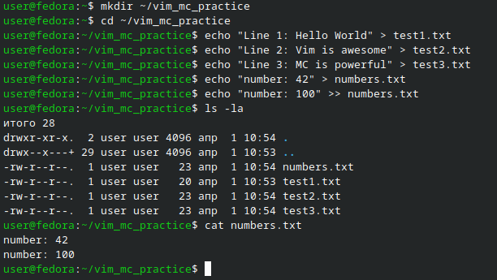
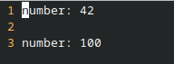
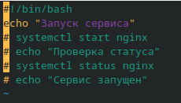
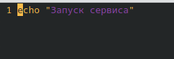
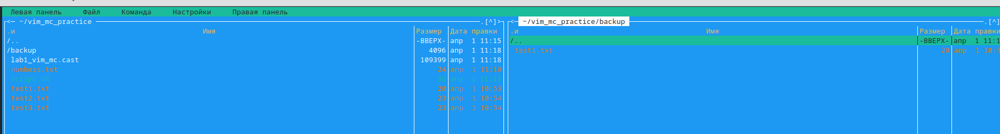
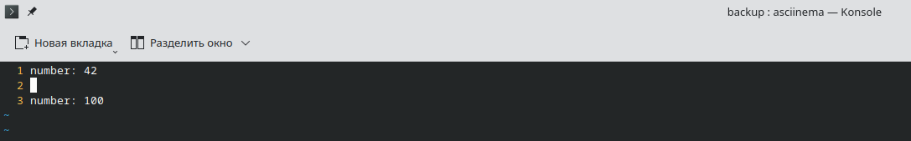
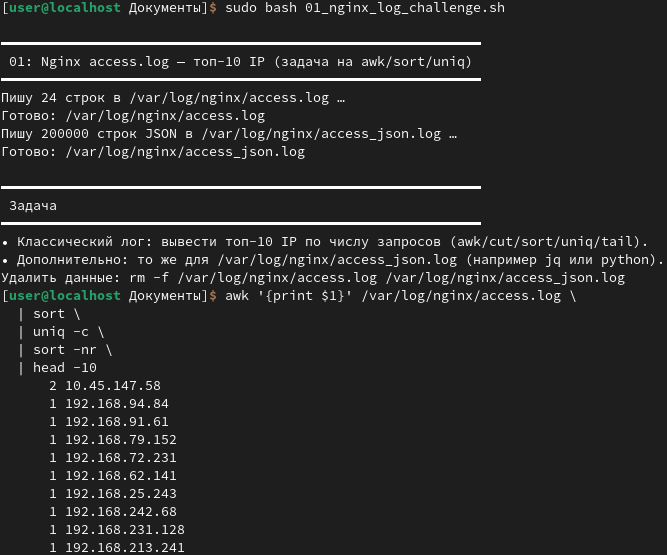
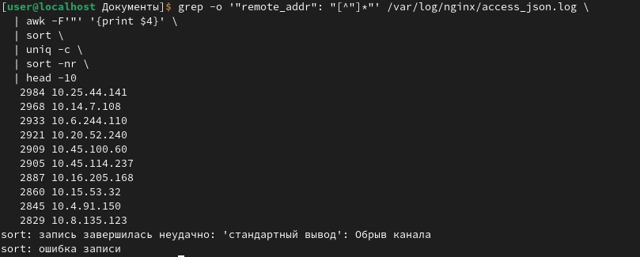

# Отчёт по лабораторной работе: vim, mc, asciinema и анализ nginx-логов

## Цель работы

Научиться работать с редактором **vim** и файловым менеджером **mc**,
записывать действия в терминале через **asciinema**, а также решить
практическую задачу — найти топ-10 IP-адресов по количеству запросов
в большом файле лога nginx (~1 млн строк).

---

## Краткая теория

**vim** — консольный текстовый редактор. Работает в нескольких режимах:
нормальный, вставка (`i`), визуальный (`V`), командный (`:`).
Используется системными администраторами для редактирования файлов прямо
на серверах без графического интерфейса.

**mc (Midnight Commander)** — двухпанельный файловый менеджер для терминала.
Позволяет копировать, перемещать, просматривать и редактировать файлы
с помощью горячих клавиш (F3–F10).

**asciinema** — утилита для записи сессий терминала. Фиксирует все команды
и вывод, после чего можно получить ссылку на воспроизведение записи
в браузере.

**nginx access.log** — журнал веб-сервера. Каждая строка — это один
HTTP-запрос. В начале строки стоит IP-адрес клиента, затем дата, метод,
URL и код ответа.

---

## Блок 1 — Подготовка: создание файлов для работы

Для начала я создал рабочую директорию и несколько тестовых файлов,
с которыми потом работал в vim и mc.

```bash
mkdir ~/vim_mc_practice
cd ~/vim_mc_practice

echo "Line 1: Hello World" > test1.txt
echo "Line 2: Vim is awesome" > test2.txt
echo "Line 3: MC is powerful" > test3.txt
echo "number: 42" > numbers.txt
echo "number: 100" >> numbers.txt

ls -la
cat numbers.txt
```



---

## Блок 2 — Работа с vim

Открыл файл `numbers.txt` в vim:

```bash
vim numbers.txt
```

Внутри я включил нумерацию строк (`:set nu`), потренировался
перемещаться по файлу (`gg`, `G`, `0`, `$`, поиск через `/слово`)
и редактировать содержимое (`dd`, `yy`, `p`, `u`, `Ctrl+r`).
Затем сохранил и вышел: `:wq`.



### Продвинутый приём: блочное комментирование и удаление строк

Для демонстрации возможностей vim я создал скрипт и показал работу
с режимом визуального выделения строк `V`.

Создал файл:

```bash
cat > script.sh << 'EOF'
#!/bin/bash
echo "Запуск сервиса"
systemctl start nginx
echo "Проверка статуса"
systemctl status nginx
echo "Сервис запущен"
EOF
```

Открыл в vim:

```bash
vim script.sh
```

Порядок действий внутри vim:

1. `:set nu` — включил нумерацию строк.
2. Перешёл на нужную строку командой `3gg`.
3. Нажал `V` — включился режим выделения строк.
4. Нажал `j` несколько раз — выделил блок строк вниз.
5. Нажал `:`, ввёл `s/^/# /` и нажал Enter — строки получили `#` в начале.



6. Ввёл `:g/^#/d` и нажал Enter — все строки с `#` удалились разом.



Вышел из vim: `:wq`.

---

## Блок 3 — Работа с mc (Midnight Commander)

Запустил файловый менеджер:

```bash
mc
```

Что я сделал в mc:

- Переключался между панелями с помощью `Tab`.
- Просматривал файлы через `F3`.
- Открывал файл во встроенном редакторе через `F4`.
- Создал папку `backup` с помощью `F7`.
- Скопировал `test1.txt` в `backup` через `F5`.
- Включил отображение скрытых файлов через `Alt+.`.

Выход из mc: `F10`.



---

## Блок 4 — Запись сессии через asciinema

Установил asciinema и начал запись перед выполнением заданий:

```bash
sudo apt install asciinema
asciinema auth
asciinema rec --idle-time-limit 3 lab1_vim_mc.cast
```

Флаг `--idle-time-limit 3` сокращает паузы длиннее 3 секунд,
чтобы запись не растягивалась на пустые паузы.

После выполнения всех заданий завершил запись командой `exit`,
просмотрел её локально и загрузил на сайт:

```bash
asciinema play lab1_vim_mc.cast
asciinema upload lab1_vim_mc.cast
```

Ссылка на запись сессии:
[https://asciinema.org/a/hZXwjYQMnOWQDe9f](https://asciinema.org/a/hZXwjYQMnOWQDe9f)



---

## Блок 5 — Анализ nginx access.log: топ-10 IP

Запустил скрипт для генерации тестового лога (~1 млн строк):

```bash
sudo bash 01_nginx_log_challenge.sh
```

Затем нашёл 10 IP-адресов с наибольшим количеством запросов:

```bash
awk '{print $1}' /var/log/nginx/access.log \
  | sort \
  | uniq -c \
  | sort -nr \
  | head -10
```

Как работает эта команда:

| Часть | Что делает |
|-------|-----------|
| `awk '{print $1}'` | Берёт первый столбец (IP-адрес) из каждой строки |
| `sort` | Сортирует IP-адреса, чтобы одинаковые шли рядом |
| `uniq -c` | Считает количество повторений каждого IP |
| `sort -nr` | Сортирует по числу запросов от большего к меньшему |
| `head -10` | Показывает только первые 10 строк |



Дополнительно я решил задачу для JSON-лога:

```bash
grep -o '"remote_addr": "[^"]*"' /var/log/nginx/access_json.log \
  | awk -F'"' '{print $4}' \
  | sort \
  | uniq -c \
  | sort -nr \
  | head -10
```


Ссылка на запись сессии:
[https://asciinema.org/a/WFZIpUlavlGmUZPy](https://asciinema.org/a/WFZIpUlavlGmUZPy)

---

## Выводы

В ходе работы я:

- Освоил основные режимы и команды **vim**, включая продвинутый приём
  с режимом `V` — выделение блока строк, массовое комментирование
  и удаление строк по шаблону командой `:g/^#/d`.
- Научился пользоваться **mc**: перемещаться по файловой системе,
  копировать, создавать директории и редактировать файлы
  через горячие клавиши.
- Записал свою терминальную сессию с помощью **asciinema**
  и получил ссылку для отчёта.
- Решил практическую задачу: нашёл топ-10 IP-адресов из
  nginx access.log (~1 млн строк) с помощью цепочки команд
  `awk | sort | uniq -c | sort -nr | head -10`.

Работа показала, как комбинировать базовые инструменты Linux
для решения реальных задач администрирования.
