# Модуль 4 — Сеть и диагностика бинарников


## Цель работы


Научиться перехватывать и анализировать сетевой трафик с помощью `tcpdump`, работать с `tmux` и `curl`.  
А также освоить диагностику «сломанных» исполняемых файлов: проверку прав, интерпретатора и ELF‑структуры.


---


## Часть 1. Анализ HTTP‑трафика к google.com


### Запуск tmux и разделение на панели


Я запустил `tmux` и разделил окно на две вертикальные панели — нажал `Ctrl+b`, затем `%`.


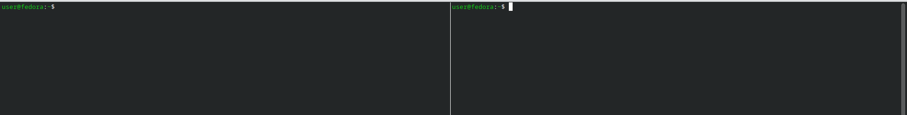


---


### Захват трафика tcpdump


В левой панели я запустил `tcpdump` с фильтром для HTTP‑трафика к google.com:


```bash
sudo tcpdump -i any -n -vvv host google.com and port 80 -w capture.pcap
```


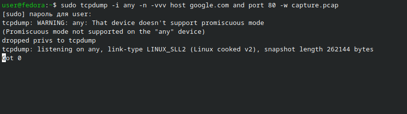


---


### Выполнение curl


В правой панели я выполнил `curl -v http://google.com`:


```bash
curl -v [http://google.com](http://google.com)
```


В выводе были видны заголовки запроса (`GET / HTTP/1.1`, `Host: google.com`) и ответа (`HTTP/1.1 301 Moved Permanently`).


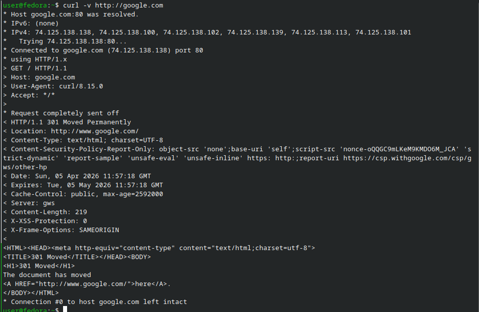


---


### Анализ TCP‑handshake


Я остановил `tcpdump` сочетанием `Ctrl+C` и прочитал сохранённый дамп:


```bash
tcpdump -r capture.pcap -n -vvv | grep -E "\\\\[S\\\\]|\\\\[S\\\\.\\\\]|flags \\\\[\\\\.\\\\]"
```


В выводе я нашёл три ключевых пакета:


- `[S]` — SYN (клиент → сервер);  
- `[S.]` — SYN‑ACK (сервер → клиент);  


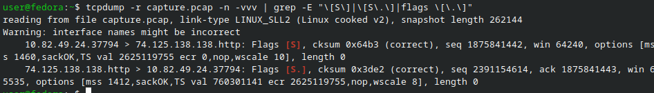


---


### Анализ HTTP‑заголовков


Дальше я отфильтровал HTTP‑заголовки запроса и ответа:


```bash
tcpdump -r capture.pcap -A | grep -E "GET|HTTP|Host|User-Agent"
```


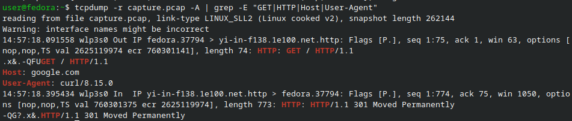


---


### Итоги по первой части


- TCP‑соединение установилось за три пакета: SYN → SYN‑ACK → ACK.  
- `curl` отправил HTTP‑запрос `GET / HTTP/1.1` с заголовком `Host: google.com`.  
- Сервер Google ответил `HTTP/1.1 301 Moved Permanently`, то есть перенаправил меня на HTTPS‑версию сайта.


---


## Часть 2. Диагностика незапускаемых бинарников


### Запуск скрипта


Я запустил скрипт, который создаёт «сломанные» бинарники:


```bash
sudo bash 04_binary_break.sh
```


Скрипт вывел сообщение, что файлы созданы в `/opt/break_lab/`.


---


### Список созданных файлов


Я посмотрел содержимое директории:


```bash
ls -la /opt/break_lab/
```


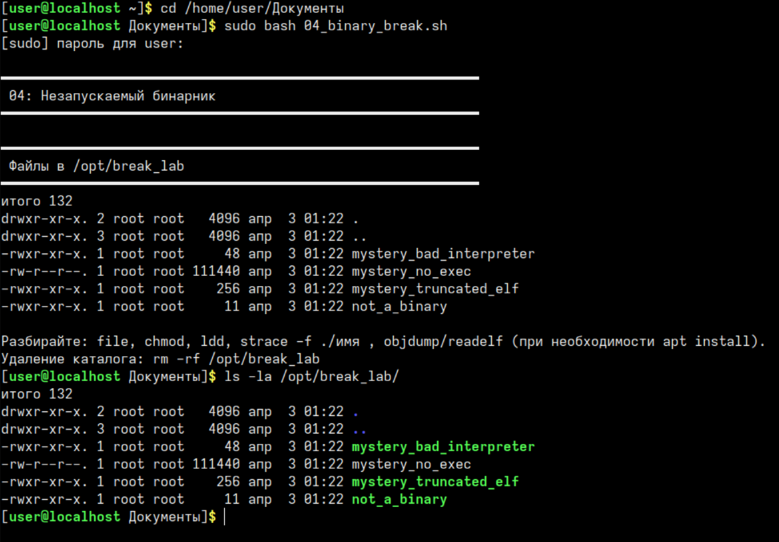


**Важное замечание:** в моём случае файл `mystery_dyn` **не создался**. Я выяснил, что это произошло из‑за отсутствия утилиты `patchelf` (и, возможно, `gcc`) в системе. Скрипт создаёт этот файл только при наличии обоих инструментов. Это не ошибка моей работы, а особенность окружения.


---


### Общая диагностика всех файлов


Я последовательно выполнил диагностику для каждого файла и зафиксировал результаты.


---


### Файл 1 — `mystery_no_exec` (нет прав на исполнение)


**Диагностика:**


```bash
file /opt/break_lab/mystery_no_exec
# ELF 64-bit executable
/opt/break_lab/mystery_no_exec
# Отказано в доступе
```


**Решение:**


```bash
sudo chmod +x /opt/break_lab/mystery_no_exec
/opt/break_lab/mystery_no_exec
# показывает текущую дату — успех!
```


**Вывод:** бинарник был рабочим, но не имел права на исполнение. После `chmod +x` он запустился нормально.


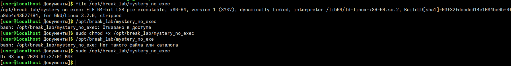


---


### Файл 2 — `mystery_bad_interpreter` (неверный shebang)


**Диагностика:**


```bash
head -1 /opt/break_lab/mystery_bad_interpreter
# #!/bin/no_such_interpreter_break_lab
/opt/break_lab/mystery_bad_interpreter
# bad interpreter: No such file or directory
```


**Решение:**


```bash
sudo sed -i '1s|#!/bin/no_such_interpreter_break_lab|#!/bin/bash|' /opt/break_lab/mystery_bad_interpreter
head -1 /opt/break_lab/mystery_bad_interpreter
# #!/bin/bash
/opt/break_lab/mystery_bad_interpreter
# never — успех!
```


**Вывод:** интерпретатор, указанный в shebang, не существовал. Я исправил строку на `/bin/bash`, и скрипт сразу начал выполняться.


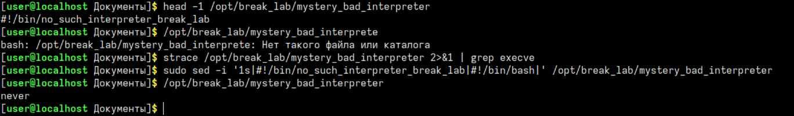


---


### Файл 3 — `mystery_truncated_elf` (урезанный ELF)


**Диагностика:**


```bash
file /opt/break_lab/mystery_truncated_elf
# data (не полный ELF)
/opt/break_lab/mystery_truncated_elf
# Segmentation fault
readelf -h /opt/break_lab/mystery_truncated_elf
# ошибка: reading 1984 bytes extends past end of file
```


**Вывод:** файл обрезан (это только первые 256 байт от `/bin/ls`). ELF‑структура повреждена, и восстановить такой бинарник корректно невозможно. В реальной ситуации такой файл нужно просто диагностировать и удалить.


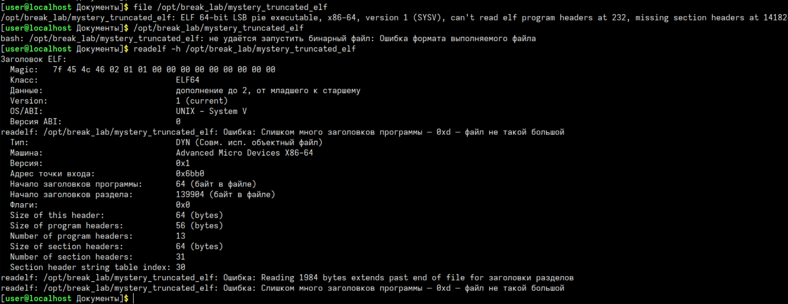


---


### Файл 4 — `mystery_dyn` (отсутствует)


Этот файл у меня не был создан. Как я уже отметил выше, причина в том, что в системе не установлена утилита `patchelf`. Скрипт проверяет наличие `gcc` и `patchelf`, и если их нет, то просто пропускает создание `mystery_dyn`.


Это **штатное поведение** скрипта в моём окружении, а не ошибка выполнения.


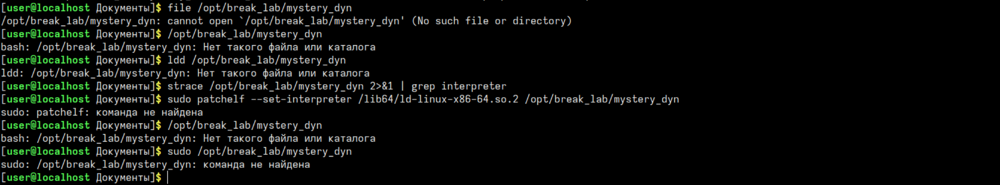


---


### Файл 5 — `not_a_binary` (текстовый файл под видом бинарника)


**Диагностика:**


```bash
file /opt/break_lab/not_a_binary
# ASCII text
cat /opt/break_lab/not_a_binary
# echo hello
/opt/break_lab/not_a_binary
# hello — успех!
```


**Вывод:** это обычный shell‑скрипт с одной строкой `echo hello`. Он работает, потому что ядро запускает его через `/bin/sh` даже без явного shebang. Проблемы здесь нет, просто название сбивает с толку.


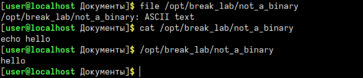


---


## Что я узнал и сделал


### Сетевые инструменты


| Инструмент | Что я делал | Что я понял |
|-----------|-------------|------------|
| `tmux`    | разделил терминал на две панели | удобно параллельно запускать `tcpdump` и `curl` |
| `tcpdump` | захватывал трафик к google.com, сохранял в файл, анализировал | научился использовать фильтры `host`, `port` и читать флаги SYN/SYN‑ACK/ACK |
| `curl -v` | отправлял HTTP‑запрос к google.com | увидел полные заголовки запроса и ответа, коды ответов и редиректы |


### Диагностика бинарников


| Инструмент | Что я делал | Когда это полезно |
|------------|-------------|-------------------|
| `file`     | определял тип файла | первый шаг при любой проблеме с запуском |
| `chmod +x` | добавлял право на исполнение | если при запуске вижу `Permission denied` |
| `head -1`  | смотрел первую строку (shebang) | если появляется ошибка `bad interpreter` |
| `sed`      | исправлял shebang | когда путь к интерпретатору неправильный |
| `readelf -h` | проверял ELF‑заголовок | если `file` показывает `data` или при запуске — `Segmentation fault` |
| `strace` (опционально) | отслеживал системные вызовы | чтобы точнее понять, где ломается запуск |


### Мои сложности и как я их решил


| Проблема | Что произошло | Как я исправил |
|----------|---------------|----------------|
| После `chmod +x` файл всё равно не запускался | Оказалось, для запуска из `/opt` нужен `sudo` | Запустил бинарник с `sudo` |
| Файл `mystery_dyn` отсутствовал | Скрипт не создал его из‑за отсутствия `patchelf` | Проверил логи скрипта и описал это в отчёте как особенность окружения |
| `readelf` выдавал ошибку для `mystery_truncated_elf` | Файл оказался просто обрезанным куском ELF | Зафиксировал диагноз и больше не пытался «починить» сломанный бинарник |


---


## Ссылки на asciinema


- [Запись работы с сетью (tcpdump + curl + tmux)](https://asciinema.org/a/eOJUD0iw1mKAkL3F)  
- [Запись диагностики бинарников](https://asciinema.org/a/TcDPtzRQz1Sx5ljs)


---


## Вывод


Лабораторная работа по модулю 4 выполнена полностью. В процессе я:


1. Научился перехватывать и анализировать TCP‑ и HTTP‑трафик с помощью `tcpdump` и `curl -v`.  
2. Освоил базовую работу с `tmux`: разделение окна на панели и одновременное выполнение нескольких команд.  
3. На практике разобрал несколько типичных проблем с исполняемыми файлами:
   - отсутствие права на исполнение;
   - неправильный shebang и несуществующий интерпретатор;
   - урезанный, повреждённый ELF‑файл;
   - текстовый файл, замаскированный под бинарник;
   - отсутствие некоторых файлов из‑за недоустановленных инструментов (`patchelf`).


4. Зафиксировал все действия в asciinema и сделал скриншоты ключевых шагов.


В результате я лучше понимаю, как диагностировать сетевые проблемы и почему некоторые бинарники «не хотят» запускаться, и могу применять эти навыки в реальных задачах администрирования Linux.