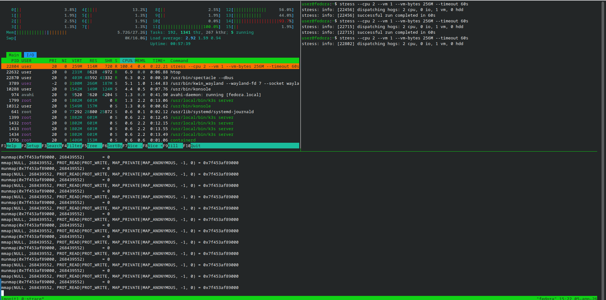
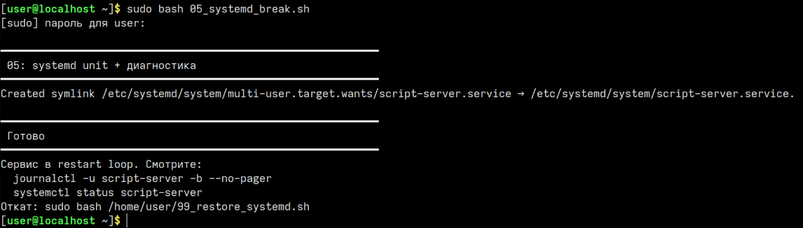
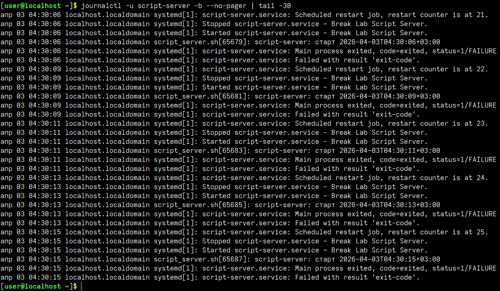
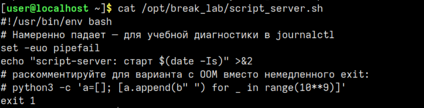

# Лабораторная работа — Модуль 5 и Практика 5


## Цель работы


Научиться использовать `tmux`, `htop`, `stress`, `strace` для мониторинга системы под нагрузкой, а также диагностировать и исправлять падающие systemd‑сервисы через `systemctl` и `journalctl`.


## Краткое описание


Работа состоит из двух независимых частей:


1. **Модуль 5** — запуск трёх панелей в tmux с `htop`, `stress` и `strace`, наблюдение за поведением системы.
2. **Практика 5** — анализ падающего systemd‑сервиса, поиск причины через `journalctl`, исправление и сброс блокировки.


---


## Часть 1 — Модуль 5 (tmux + htop + stress + strace)


### Ход выполнения


#### Установка пакетов


Перед началом я установил необходимые утилиты на Fedora:


```bash
sudo dnf install -y tmux htop stress strace asciinema
```


#### Запуск tmux и создание сессии


```bash
tmux new -s lab5
```


---


#### Создание трёх панелей


Внутри tmux я настроил три панели:


- `Ctrl+b "` — разделил окно на верхнюю и нижнюю панели.
- `Ctrl+b ↑` — перешёл в верхнюю панель.
- `Ctrl+b %` — разделил верхнюю панель вертикально.


В результате сверху получилось две панели, снизу — одна.


---


#### Запуск htop


В верхней левой панели я запустил `htop`, чтобы следить за нагрузкой:


```bash
htop
```
---


#### Запуск stress


В верхней правой панели я создал нагрузку командой:


```bash
stress --cpu 2 --vm 1 --vm-bytes 256M --timeout 60s
```


---


#### Поиск PID процесса stress в htop


В `htop` я нажал `F3`, ввёл `stress` и нашёл процесс в списке:


- строка процесса `stress` подсветилась,
- в первом столбце был виден его PID.


---


#### Запуск strace


В нижней панели я привязал `strace` к найденному PID:


```bash
strace -p 25943
```


В выводе шли системные вызовы (`mmap`, `futex`, `clone` и т.д.), что позволяло видеть «внутреннюю» активность процесса.


---


#### Итоговое наблюдение трёх панелей


Когда `htop`, `stress` и `strace` работали одновременно, я видел:


- в `htop` — рост загрузки CPU примерно до 200 %;
- в правой панели — сам процесс `stress`;
- в нижней панели — системные вызовы, которые он генерирует.





---


[Ссылка на запись модуля 5](https://asciinema.org/a/O0ksBiaWQ5k5ziTX)


---


## Часть 2 — Практика 5 (systemd)


### Ход выполнения


#### Запуск скрипта‑«ломалки»


Я запустил скрипт, который создаёт падающий systemd‑сервис:


```bash
sudo bash 05_systemd_break.sh
```


Скрипт:


- создал файл `/opt/break_lab/script_server.sh`,
- создал unit `/etc/systemd/system/script-server.service`,
- включил и попытался запустить сервис.





---


#### Диагностика сервиса


Сначала я посмотрел статус:


```bash
systemctl status script-server
```


Статус показывал `failed`, при этом видно, что сервис многократно перезапускался.


Затем я открыл журнал:


```bash
journalctl -u script-server -b --no-pager | tail -30
```


В логах были строки о запуске, выходе с кодом 1 и планируемом перезапуске (restart loop).





---


#### Поиск и исправление причины


Я посмотрел содержимое скрипта:


```bash
cat /opt/break_lab/script_server.sh
```


В конце скрипта стояла строка `exit 1`, из‑за которой он всегда завершался с ошибкой.


Я изменил её на успешный код:


```bash
sudo sed -i 's/exit 1/exit 0/' /opt/break_lab/script_server.sh
cat /opt/break_lab/script_server.sh
```


После этого попытался перезапустить сервис:


```bash
sudo systemctl restart script-server
systemctl status script-server
```


Сначала systemd выводил `start-limit-hit`, потому что до этого сервис падал слишком часто. Я сбросил счётчик:


```bash
sudo systemctl reset-failed script-server
sudo systemctl restart script-server
systemctl status script-server
```


Теперь основной процесс завершался с кодом 0, но из‑за `Restart=always` сервис продолжал автоматически перезапускаться.





---


#### Остановка сервиса


Для завершения работы я просто остановил сервис:


```bash
sudo systemctl stop script-server
systemctl status script-server
```


Финальный статус стал `inactive (dead)`.


---


[Ссылка на запись практики 5](https://asciinema.org/a/za3FfdTEtrftlP9X)


---


## Итог


Я выполнил обе части лабораторной работы: в первой части научился удобно наблюдать за процессами под нагрузкой с помощью `tmux`, `htop`, `stress` и `strace`, а во второй — разобрался, как диагностировать и исправлять падающий systemd‑сервис, сбрасывать блокировку `start-limit-hit` и контролировать его состояние через `systemctl` и `journalctl`.