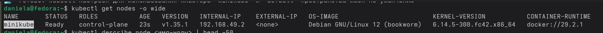
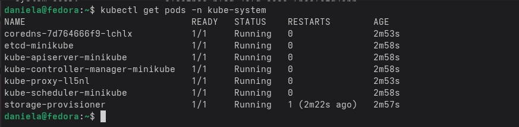
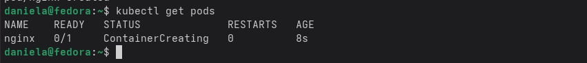
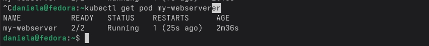

    Kubernetes — это система, которая нужна чтобы управлять контейнерами. Физическое устройство (сервер) которое входит в кластер (группа нодов), называется нод. Есть мастер ноды, которые управляют кластером. А на рабочих нодах запускаются приложения. Один или больше контейнеров, которыми управляет один нод и они имеют общий адрес - это под. За работу кластера отвечают службы: протокол API, etcd, scheduler, controller-manager, kubelet и kube-proxy.
    
                     БЛОК №1    
    В первом блоке мы провери корректность работы кластера Kubernetes. Команда kubectl get nodes -o wide вывела список всех нодов. А именно она вывела их имя, статус, роль, версию Kubernetes и IP-адреса. 

    

    Чтобы узнать больше о конкретном ноде можно использовать команду kubectl describe node. Команда kubectl get pods -n kube-system показала все служебные поды, которые обеспечивают работу самого Kubernetes. 
    
    
    
    Команда kubectl get componentstatuses проверила состояние ключевых компонентов. Если все компоненты в статусе Healthy, а ноды Ready, значит кластер готов к работе. 
    
    Контрольный вопрос 1: Для быстрой диагностики кластера можно использовать команды kubectl get nodes для проверки нодов и kubectl get pods -n kube-system для проверки систтемных сервисов.

                      БЛОК №2
    Во втором блоке мы изучали под. Команда kubectl run nginx --image=nginx:alpine --port=80 запустила  под с nginx. Командой kubectl get pods -o wide мы проверили, что под запустился и на каком он ноде. Команда kubectl get pods -o wide позволяет в реальном времени отследить изменения состояния пода. 
    
    Потом мы зашли внутрь работающего пода командой kubectl exec -it nginx -- sh. Внутри мы посморели имя хоста, его IP адрес и DNS, переменные окружения, список запущенных процесслв, сетевые настройки. Каждый под изолирован , поэтому видит только свои процессы и сеть.

    Командой kubectl logs nginx можно посмотреть логи в реальном времени. А команда kubectl describe pod nginx вывела описание пода. Его статус, события, какую ноду он занял, какие переменные окружения установлены, и не было ли ошибок при запуске.

                    БЛОК №3
    В третьем блоке мы запускали поды через файл pod.yaml. В этом файле он описан с двумя контейнерами: nginx и log-sidecar. Команда kubectl apply -f pod.yaml запустила под.

                    БЛОК №4
    Kubernetes может сам восстанаваливать приложения. Мы сломали под командой kill 1. С помощью kubectl get pods -w можно наблюдать реальном времени, как статус под менялся на Error или а затем снова становился Running. После этого проверили счетчик рестартов командой kubectl get pod и увидели. 

    
    

    