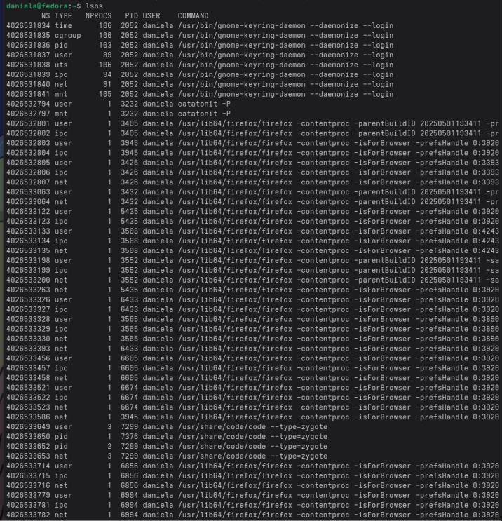
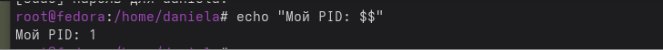
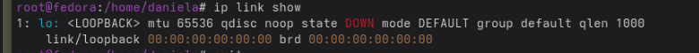
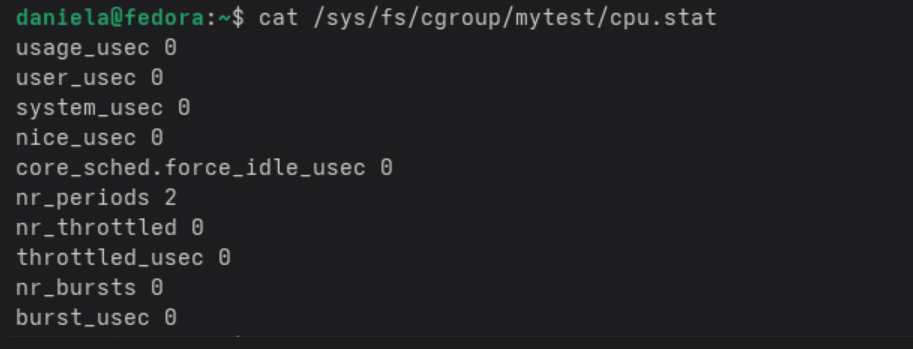
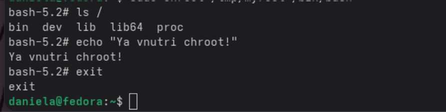

В первой части мы работали с Namespaces, с помощью которого можно изолировать процессы. Этот изолированный процесс будет думать, что он единственный и имеет PID=1 (как у systemd или init), и он не будет видеть другие процессы. Мы создали процесс с pid=1 и внутри этого процесса запустили оболочку bash. По итогу запустился новый изолированный процесс оболочки bash.
Команда lsns выводит все неймспейсы и показывает какие процессы в каких неймспейсах. Например в одном неймспесе может быть много процессов, а может быть только один.

Чтобы проверить, что изолированный процесс bash  дейтсвительно изолирован была введена команда, которая выводит PID текущего процесса оболочки. И в выводе был pid 1, что означает что процесс изолирован. Потому что если бы он не был изолирован,  то pid было бы число точно отлчное от 1.

Команда ip link show вывела все сетевые интерфейсы которые видит процесс. Так как пространство изоилровано, ssпроцесс видит только лупбэк адрес.

Контрольный вопрос 1: после exit процессы хоста остались нетронутыми потому что когда мы завершаем работу командой exit завершается только сам этот процесс и все что с ним связано, а процессы хоста никак с ним не связаны потому что он просто их не видит (потому что он изолирован).

Во второй части мы мы ограничивали ресурсы для процессов с помощью cgroups. Он контролирует сколько может ресурсов использовать процесс. Была создана группа процессов для которой было сделано ограничение (можно использовать только 20% времени процессора). Потом в этой группе запустили stress-ng. И это ограничение замедляло эту программу.
Команда cat /sys/fs/cgroup/mytest/cpu.stat выводит статистику того как использует процессор созданная группа. Строка nr_throttled  показывает, сколько раз процессы из это группы пытались работать, но были остановлены потому что превысили предел ресурсов который им разрешен.

Контрольный вопрос 2: Если процесс превысит предел памяти, то сработает OOM-killer и убьет этот процесс.

В третьей части мы работает с chroot. С помощью него можно поменять корневую директорию для процессов. Сначала мы создали папку /tmp/myroot которая как раз и будет корневой и добавиои в нее стандартные директории (типа bin, lib). Потом туда скопировали утилиты и нужные им библиотеки. После мы запустили bash с помощью chroot. и корнево директорие для bash стала папка котору мы создали (/tmp/myroot).
Команда ls / вывела только стандартные директории, которые мы добавили в /tmp/myroot. Это подтверждает что она стала новым корнем и что файлы хоста отсутствуют.

