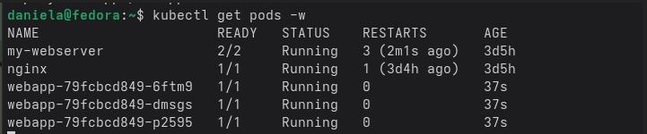
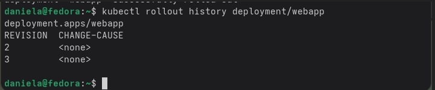
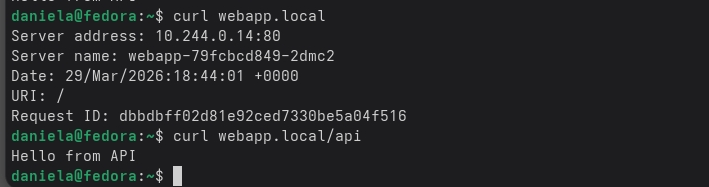

                                        БЛОК №1
В первом блоке мы делаем Deployment. Deployment нужен чтобы не создавать самому поды, а просто в него написать 
что надо сделать Kubernetes(у) и он сам сделает нужное количество подов и будет следить за ними. Мы создали Deployment 
для приложения webapp. Мы сделали так чтобы Kubernetes запускал три одинаковых пода и в каждом из них nginxdemos/hello:plain-text.
Надо было обновить версию nginxdemos/hello:plain-text чтобы сайт не выдавал ошибок. Для этого мы сделали RollingUpdate. Это работает 
так: Kubernetes сначала поднимает новый под с новым nginxdemos/hello:plain-text, пока сработает readinessProbe, которое проверяет 
готово ли приложение внутри принимать запросы. После запуска файла командой kubectl apply -f deployment.yaml  можно следить за подами 
командой kubectl get pods -w (она должна показать, что все три пода Running).

                                        БЛОК №2
Суть в том, что внутри кластера поды с приложениями работают на порту 80, но это доступно только локально в самом Kubernetes. 
Чтобы это приложение доступным извне мы создали Service. Тоесть порт 80 теперь связан с портом 30080 и по этому порту можно отправить запрос на ноду и S
ervice отправит этот трафик на какой-то из подов с приложением. В отдельном окне терминала я запустила бесконечный curl и параллельно с этим с помощью 
команды kubectl set image запустила обновление приложения. По итоге запросы curl были без ошибок. Это значит что приложения не упали во время обновления. 
Команда kubectl rollout history deployment/webapp вывела в терминаал таблицу, в которой написан номер версии прилоожение и что именно изменилось. 
Ревизии в этой команде это номера каждого успешного запуска или обновленияя приложения. Их должно быть минимум две 
потому что одна это успешный запуск, а вторая обновление.

                                        БЛОК №3
В третьем блоке мы настроили Ingress. Надо было сделать так чтобы одно приложение могло принимать запросы на разные адреса и понимать куда именно их отправлять. 
Например если пользователь заходит на сайт по обычному адресу, его запрос попадает на фронтенд, а если в адресе добавляется путь /api, то запрос идет на бэкенд. 
Сначала я включила программу Ingress. Потом я сделала другой Service для бэкенда потому что Ingress направляет запросы именно на сервисы, а не на поды. 
В ingress.yaml написала, что весь трафик идёт на сервис приложения, а всё, что начинается с /api идет на сервис бэкенда. И чтобы мой компьютер понимал, что адрес 
webapp.local это кластер на моём ноутбуке, я написала в файле hosts webapp.local = IP-адрес minikube. 

Для проверки работы я сделала curl запрос на webapp.local и ответ был от фронтэнда. А после запроса на webapp.local/api был ответ от бэкенда. 

                                        БЛОК №4
В конце я сранвила 3 доступа к сервисам чтобы понять в чем разница. ClusterIP это адрес, который работает внутри класте, снаружи к нему вообще не подключиться. 
Потом NodePort. И последнее LoadBalancer, но он не работает без облака. Суть в том что в реальном облаке LoadBalancer делает так , чтобы на приложение можно было 
зайти из интернета.

