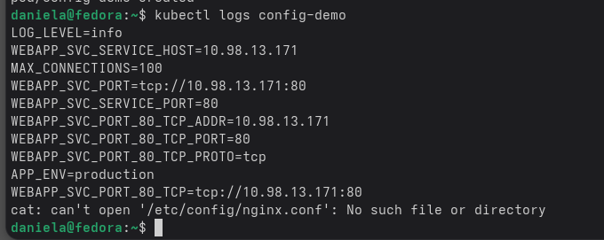
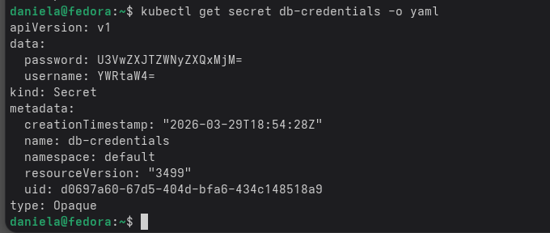
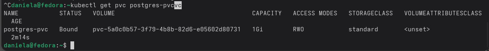
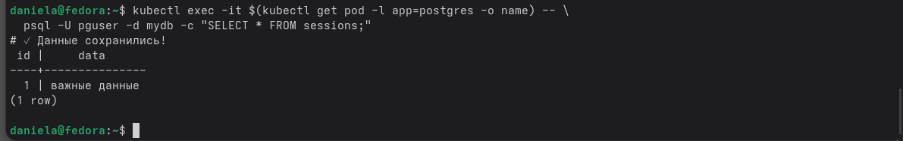

                                        БЛОК №1
В первоом блоке я разбиралась с ConfigMap. Суть в том чтобы не хранить настройки, например адрес базы данных внутри кода программы. Чтобы  это не делать можно создать ConfigMap командой kubectl create configmap. Дальше я запустила тестовый под с простым приложением busybox. Потом мы делали проверку. Первый способ это когда все переменные из ConfigMap становятся доступны внутри контейнера как переменные окружения. Второй способ это когда я беру только одну настройку и присваиваю ей своё имя внутри пода. Третий способ это когда ConfigMap подключается как обычный файл, чтобы программа могла читать его как конфигурационный файл. В итоге я посмотрела логи запущенного пода и все сработало. Переменные окружения отобразились правильно, и содержимое файла тоже было на месте, значит приложение сможет читать настройки.

                                        БЛОК №2
Во втором блоке мы делали то же самое, но для паролей и ключей. Я создала Secret командой kubectl create secret generic. Данные в Secret хранятся не в открытом виде, они закодированы. Это можно проверить так: взять значение из файла Secret (Secret - это контейнер для паролей, ключей.) и декодировать его командой base64 -d и увидела свой пароль в обычном текстовом виде. То есть любой, у кого есть доступ к кластеру, может так же легко его прочитать. В сам под я подключила Secret через secretKeyRef, чтобы пароль попал в переменную окружения и приложение могло им воспользоваться. 

                                        БЛОК №3
В третьем блоке я настроила постоянное хранилище для базы данных Постгрес. В Kubernetes если удалить под, то все данные внутри него исчезнут. Чтобы это исправить, я создала PersistentVolumeClaim. В деплойменте Постгрес я подключила этот PersistentVolumeClaim как том к папке /var/lib/postgresql/data, где база хранит свои файлы. Потом я зашла внутрь пода через exec, создала таблицу и записала туда тестовую строку. После этого я удалила под командой delete pod. Deployment автоматически включил новый под с тем же именем. Я снова зашла в базу и сделала селект и данные оказались на месте. Получается что данные не зависят от пода, потому что они лежат на томе.

