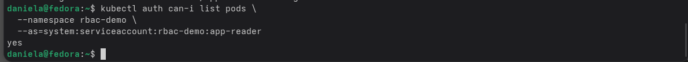
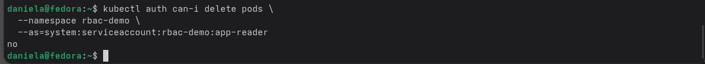
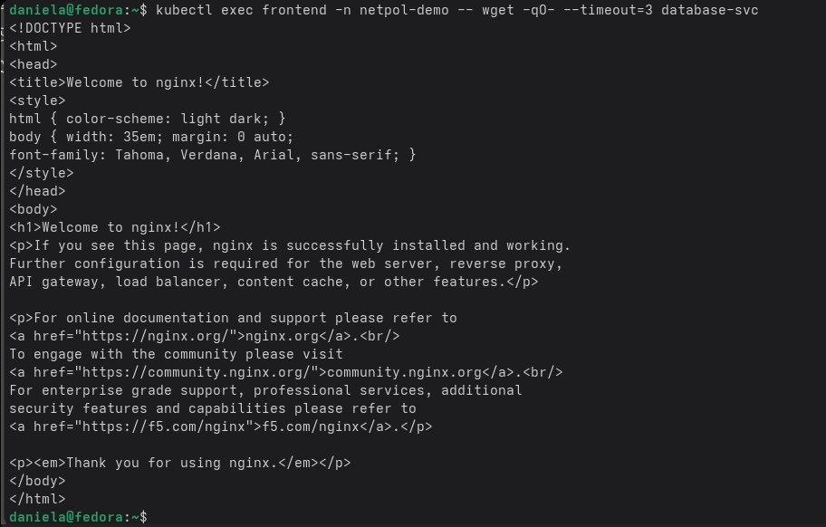
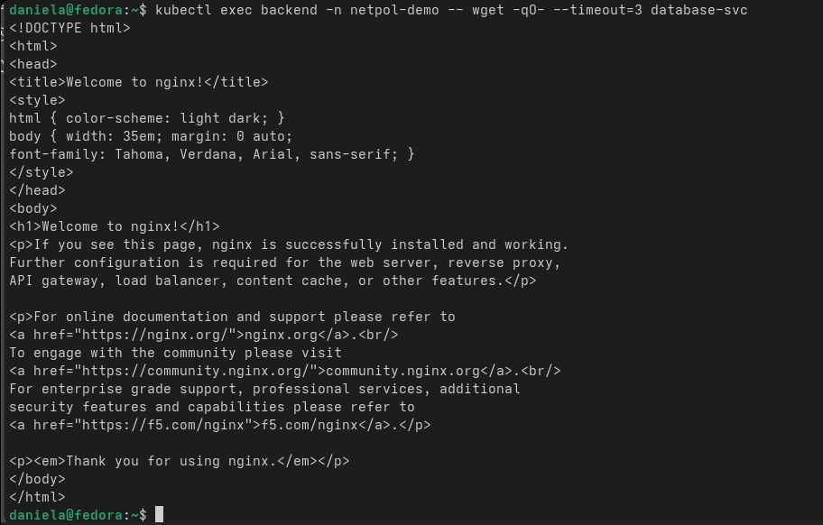
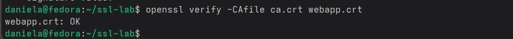
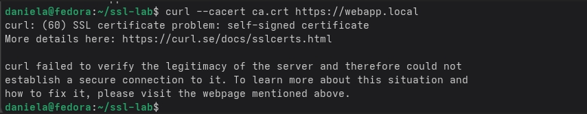

                                    БЛОК №1
В первом блоке было про RBAC (права доступа). Суть в том, чтобы приложение или пользователь не могли сделать в кластере больше, чем им разрешено. Я создала отдельный ServiceAccount (это как учётная запись для приложения). Потом написала Role, где написала что этому аккаунту можно только читать информацию о подах и их логах, а удалять, создавать или менять нельзя. Чтобы эти правила заработали, я связала аккаунт и роль через RoleBinding. После применения конфигурации я проверила права командой kubectl auth can-i delete pods -n rbac-demo --as=system:serviceaccount:rbac-demo:app-reader. Тоесть спросила у системы может ли этот аккаунт удалять поды и система ответила что нет. А команда kubectl auth can-i list pods -n rbac-demo --as=system:serviceaccount:rbac-demo:app-reader спрашивает у системы модет ли этот аккаунт просматривать поды. Ответ был да.

                                    БЛОК №2

Во втором блоке настраивалась сетевая безопаностью По умолчанию в Kubernetes все поды могут общаться друг с другом без ограничений, но это не всегда нужно. Я создала отдельный namespace для тестов и запустила там три пода: фронтенд, бэкенд и база данных Сначала проверила, что они действительно видят друг друга командой wget из frontend в database и получила ответ. Потом применила NetworkPolicy (правила, которые контролируют, кто кому может отправлять запросы). Я настроила политику «запретить всё», а потом разрешила фротненду принимать принимать трафик извне, бэкенд может принимать только от фротенд, а база данных только от бэкенд. После применения политик я снова проверила соединения. Запрос от фронтенда на бэкенд был успешным. А попасть из фронтенда сразу на бэкенд не получилось (был таймаут). 

                                    БЛОК №2
В третьем блоке я пыталась научиться настраивать безопасное соединение по https. Для этого нужно было выпустить собственный сертификат, потому что в локально нет настоящего центра сертификации. Я сгенерировала приватный ключ и корневой сертификат через OpenSSL. Потом создала запрос на подпись сертификата для домена webapp.local.  Подписала этот запрос своим корневым сертификатом. Дальше я загрузила сертификат и ключ в Kubernetes как Secret и подключила его к Ingress. Чтобы браузер или curl доверяли моему сертификату, я указала путь к корневому сертификату через опцию --cacert. После настройки команда curl https://webapp.local вернула ответ от nginx, а openssl s_client показал, что соединение установлено.

                                    БЛОК №3

