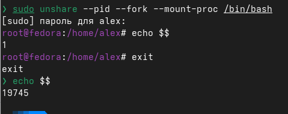
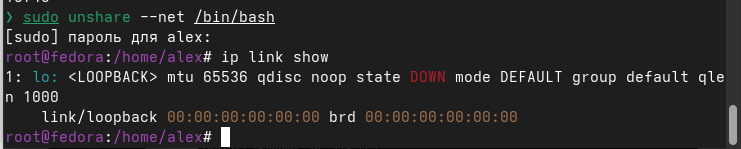
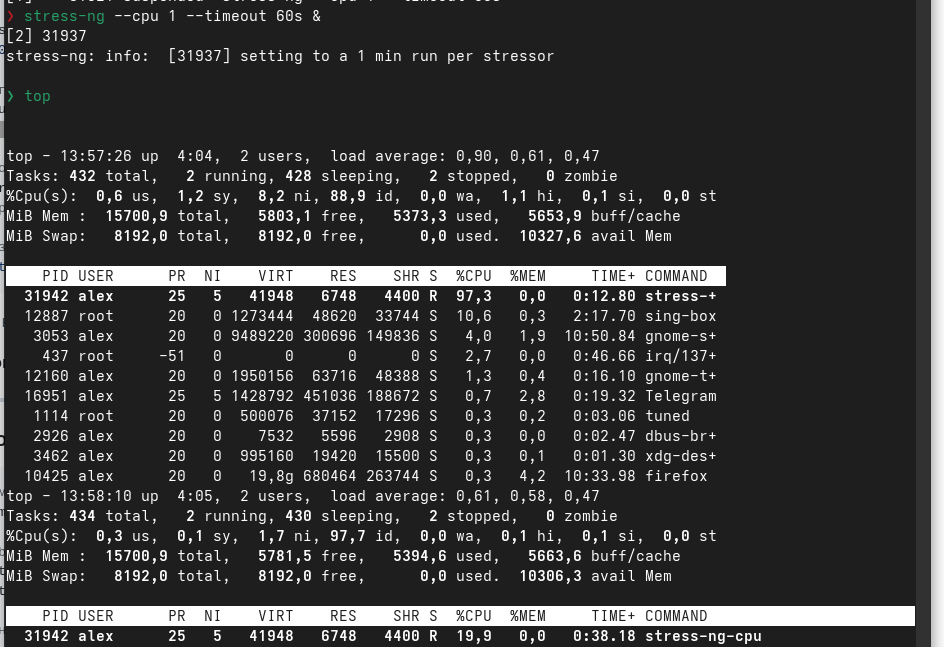
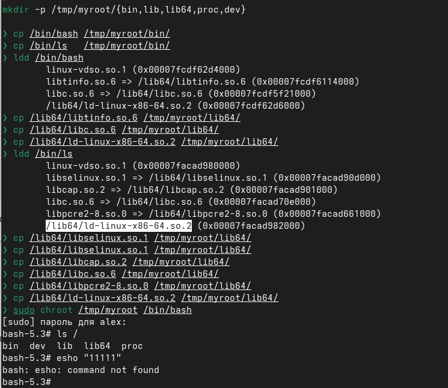

1. ---------------------

Здесь я смотрю свои неймспейсы

2. ---------------------

Этой командой делайю свой неймспейс с изолированными пидами

3. ----------------------

а здесь с отдельным сетевым интерфейсом

4. ----------------------

Тут создал првило в сигрупс с ограничением 20% на процессор и сначала загрузил процессор а потом его добавил в ограничение и загруженность упала до 20%

5. ----------------------

С помощью чрута создал изолированную директорию в которую добавил баш и лс, а остальные команды не будут работать потому что не добавил. Ну тут я ошибся, но команда echo тоже работать не будет