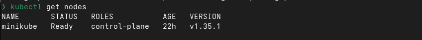
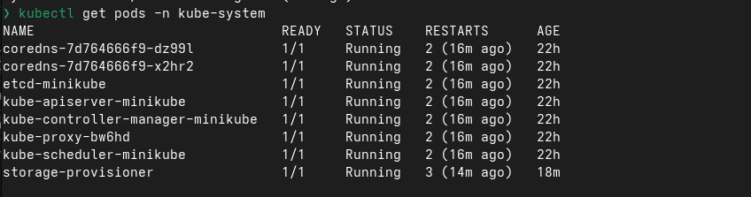

Вначале не работал миникуб, скачал k3s и он не хотел работать, снес и поставил миникуб и все норм стало

1. --------------------------------------

Ну это базовая нода миникуба

2. --------------------------------------

Тут все ситемные поды работают

3. ---------------------------------------

Под нджинкс создали из готового образа, а веб сервер с помощбю йамл файлика

4. ---------------------------------------

*После kill через 15 секунд под перезапустился, за это отвечает куберенетес*