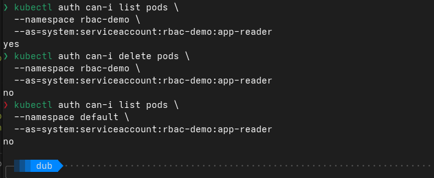
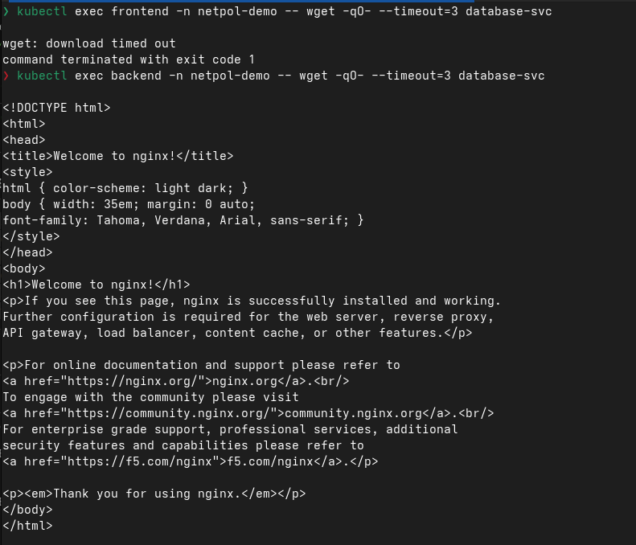
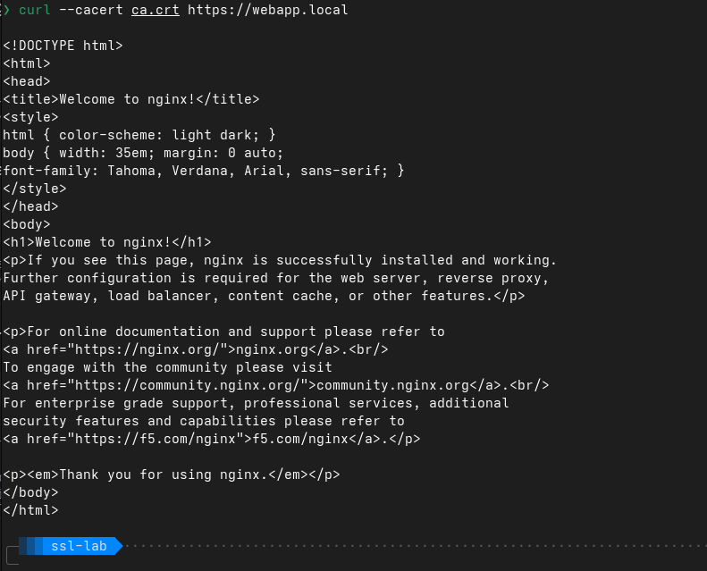

1, 2
---

RBAC это система разграничения прав, чтобы можно было говорить сервисам что им можно а что нельзя, а то че то им изначально дофига возможностей дается, а это не круто ваще для норм компаний

Ну тут настроили права и проверяем от разных сервисов могут они поды чекать и менять или нет

3, 4
---

НетворкПолиси это штука которая делает так чтобы поды видели только те поды которые мы им рахрешили, а по дефолту они все видят, а это плохо т.к. если в один попасть в остальные доступ получить проще гораздо

Тут мы настроили так, что фроненд бд не видит, а бек видит

5
---

Я так понял что сертификаты это документы подтверждающие надежность сайта, и в зависимости от того кто их подписал мы понимаем надежный сайт или нет

Тут мы сами сертификат выдали и проверяем работает или нет

6
---

Тут сертификат сайта проверяем с помощью корневого, и если соответствует то все кайф