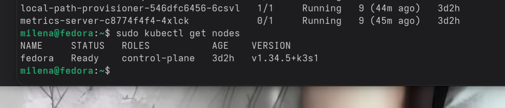
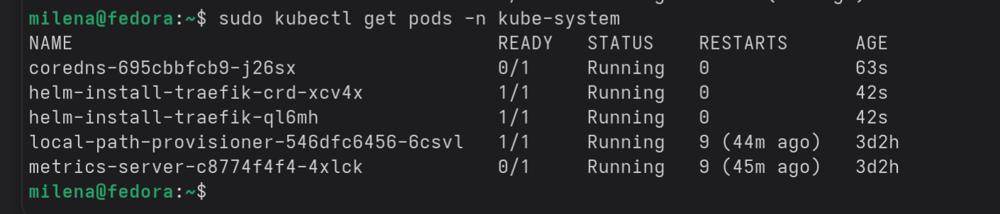
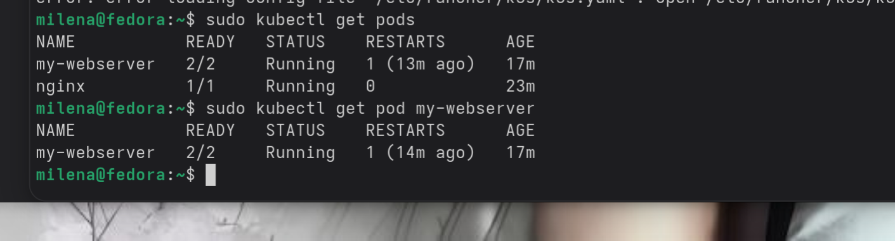

Установка кластера Kubernetes и управление подами

Цель работы: Получение навыков развертывания кластера и управления базовыми объектами Kubernetes.

Ход работы:

    Проверка состояния кластера. 
    Были выполнены команды просмотра узлов и системных подов в пространстве kube-system. 
    Проверена конфигурация статических подов control plane. 
    Установлено, что все узлы находятся в состоянии Ready, а критические компоненты (apiserver, etcd, scheduler, controller-manager) работают штатно.

    Императивный запуск первого пода. 
    Создан под с веб-сервером, выполнена проверка его статуса и местоположения на узле. 
    Осуществлен вход внутрь контейнера для изучения имени пода, сетевых настроек и переменных окружения. 
    Просмотрены логи работы приложения.

    Создание пода через YAML-манифест. 
    Разработан файл конфигурации с двумя контейнерами: основным веб-сервером и вспомогательным sidecar для записи логов. 
    Настроены пробы готовности и жизнеспособности, ограничения по ресурсам. Манифест применен к кластеру. 
    Проверена работа обоих контейнеров и изолированность логов.

    Тестирование самовосстановления. 
    В основном контейнере принудительно завершен процесс. 
    Выполнено наблюдение за изменением статуса пода. Зафиксировано увеличение счетчика рестартов. 
    Под не удалился, а перезапустился автоматически.

Основные выводы:

Pod является минимальной единицей Kubernetes и может содержать несколько контейнеров, разделяющих сетевое пространство и хранилище. 
В отличие от одиночного контейнера, pod обеспечивает изоляцию пространств имен и управляется kubelet'ом. 
Механизм самовосстановления гарантирует, что при падении процесса внутри контейнера kubelet перезапустит его, сохраняя работоспособность приложения без ручного вмешательства. 
Декларативный подход через YAML-манифесты позволяет точно задавать желаемое состояние объектов и их поведение.

