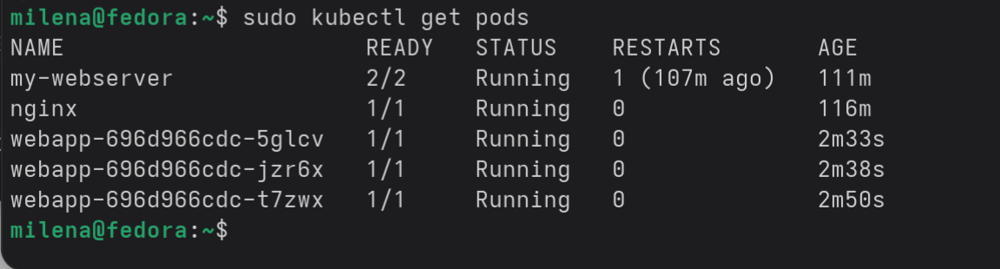
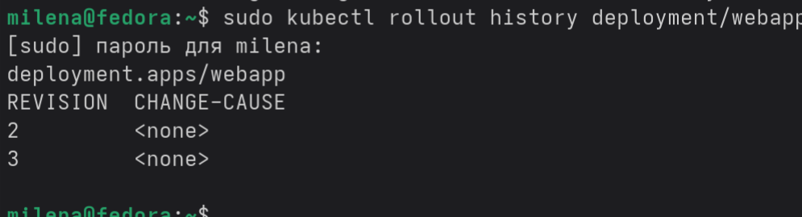
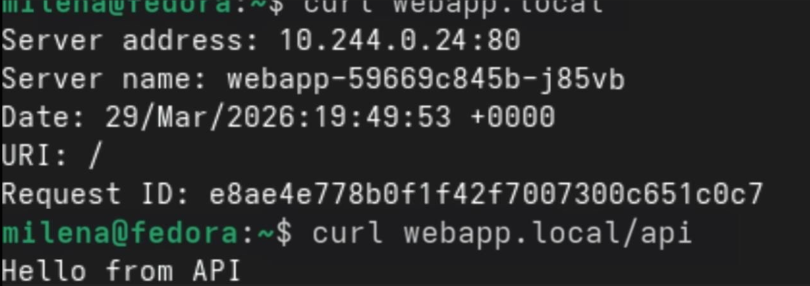

# Отчет о проделанной работе

## Блок 1 — Deployment

Создан файл конфигурации Deployment для запуска трех копий веб-приложения с метками для идентификации. Настроена стратегия обновления RollingUpdate, которая заменяет поды по одному без остановки сервиса. Заданы ограничения по памяти и процессору для стабильной работы, добавлена проверка готовности через HTTP-запрос. Применена конфигурация командой apply, отслежен запуск подов и статус развертывания. Подтверждено, что Deployment управляет подами через объект ReplicaSet.

## Блок 2 — Service + Rolling Update

Добавлен сервис типа NodePort, открывающий порт 30080 на каждом узле кластера для внешнего доступа. Протестировано распределение трафика между подами в режиме циклического перебора через запросы curl. Выполнено обновление образа контейнера на новую версию без разрыва соединений с клиентами. Изучена история ревизий деплоймента, успешно выполнен откат к предыдущей версии и подтверждена корректность возврата.

## Блок 3 — Ingress

Развернут второй сервис с тестовым ответом для демонстрации маршрутизации. Настроен Ingress с правилами: запросы к корню домена направляются на основное приложение, запросы к пути /api — на бэкенд-сервис. Добавлена запись в /etc/hosts для эмуляции домена webapp.local. Протестирована маршрутизация: запросы к разным путям возвращают корректные ответы от соответствующих сервисов. Проверена работоспособность подов контроллера Ingress.

## Блок 4 — Сравнение типов Service

Создан сервис типа ClusterIP для проверки внутреннего взаимодействия — подтверждено, что он доступен только из других подов внутри кластера. Сравнен с сервисом NodePort, который принимает соединения извне через порт на узле. Кратко рассмотрен тип LoadBalancer, который в облачных средах автоматически создает внешний балансировщик, а в локальном окружении остается в статусе ожидания.

## Основные выводы

Deployment обеспечивает стабильный запуск и обновление приложения без остановки сервиса. Service предоставляет единый адрес для доступа к группе подов и балансирует нагрузку. Ingress позволяет направлять внешние запросы на разные сервисы по одному домену. Выбор типа сервиса определяет, кто и как может подключиться к приложению.

## Разница между ClusterIP и NodePort

ClusterIP выдает приложению внутренний адрес, доступный только изнутри кластера — используется для связи микросервисов между собой. NodePort открывает порт на каждом узле кластера, через который внешний пользователь может обратиться к сервису; запрос сначала попадает на узел, затем перенаправляется внутрь через ClusterIP. Простыми словами: ClusterIP — для внутреннего общения, NodePort — для доступа снаружи.NodePort — для доступа снаружи.

