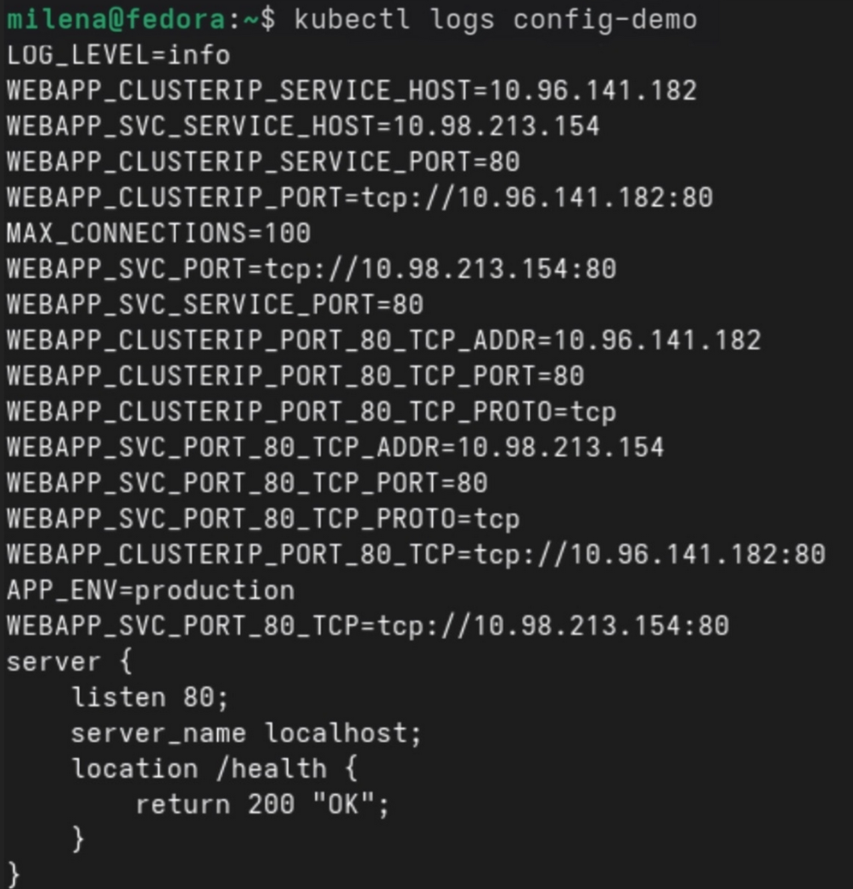
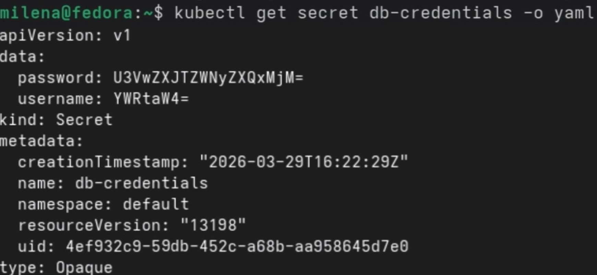
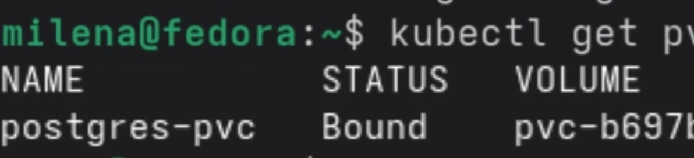
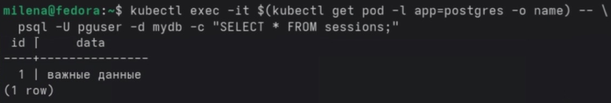

Ход работы

# #Блок 1 — ConfigMap

Создан ConfigMap из литералов с параметрами окружения. ConfigMap передан в под тремя способами: через переменные окружения (все ключи и отдельный ключ с новым именем) и через монтирование как файла конфигурации. В логах пода подтверждена передача всех данных.

# Блок 2 — Secrets
Создан Secret с учетными данными. При просмотре Secret данные отображаются в кодировке base64, что не является шифрованием. Secret передан в под как переменные окружения, под успешно их прочитал. Отмечено, что для реального шифрования требуется EncryptionConfiguration или внешние решения.

# Блок 3 — PersistentVolume
Создан PVC для PostgreSQL, развернут Deployment с базой данных, Secret для учетных записей и сервис. После записи тестовых данных в БД под был удален. Deployment автоматически создал новый под. При повторном подключении к БД ранее записанные данные сохранились, что подтверждает работу PersistentVolume.

Основные выводы
ConfigMap позволяет передавать конфигурацию тремя способами: переменные окружения, выборочные переменные и файлы. Secret по умолчанию использует только base64-кодирование и не обеспечивает шифрования, требуя дополнительной настройки. PersistentVolume и PVC обеспечивают сохранность данных при пересоздании пода, Deployment автоматически восстанавливает поды, а данные сохраняются независимо от жизненного цикла контейнера.

