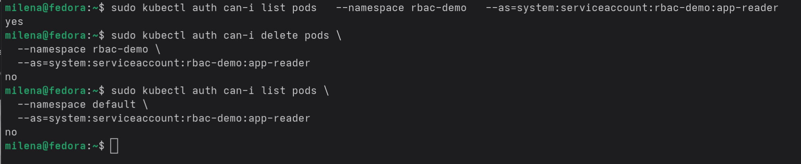
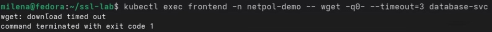
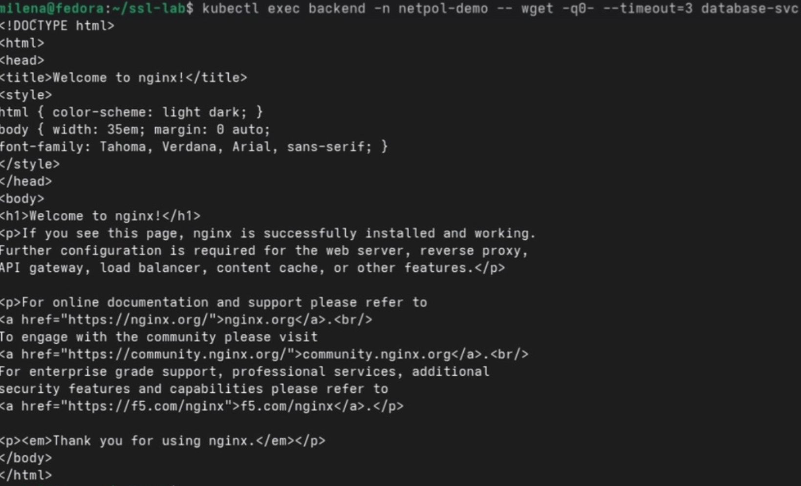
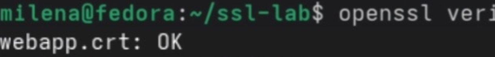
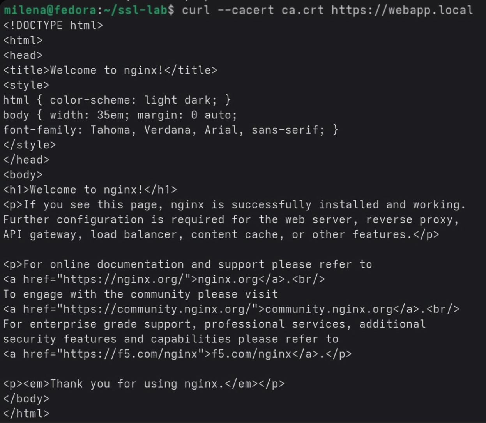

Блок 1 — RBAC

Создан отдельный namespace и ServiceAccount с ограниченными правами. Для ServiceAccount определена Role, разрешающая только просмотр подов и их логов без права удаления или изменения. RoleBinding связал ServiceAccount с этой Role в рамках namespace. Проверка прав подтвердила, что ServiceAccount может просматривать поды в своем namespace, но не может их удалять и не видит поды в других namespace. Запущенный от имени этого ServiceAccount под успешно выполняет команды чтения, но получает отказ при попытке удаления.

Блок 2 — NetworkPolicy
Созданы три тестовых пода с метками frontend, backend и database, каждый с сервисом. Изначально все поды имели свободный доступ друг к другу. Применены четыре политики: запрет всего входящего трафика по умолчанию, разрешение входящего трафика к frontend, разрешение доступа к backend только от frontend, разрешение доступа к database только от backend. Проверка показала, что frontend обращается к backend успешно, но не может обратиться к database. Backend к database обращается успешно. Схема сетевой изоляции полностью отработала.

Блок 3 — TLS сертификаты с OpenSSL
Создан собственный удостоверяющий центр с самоподписанным корневым сертификатом сроком на десять лет. Сгенерированы ключ и запрос на сертификат для веб-сервера с указанием альтернативных имен хостов. Запрос подписан созданным CA, получен сертификат на один год с проверкой цепочки доверия. Сертификат и ключ загружены в Kubernetes как TLS Secret. Создан Ingress с привязкой этого Secret, настроен перенаправление на HTTPS. После добавления записи в hosts проверка через curl с указанием CA подтвердила успешное TLS соединение. Декодирование сертификата из Secret показало корректные данные о владельце, издателе и сроках действия.

Блок 4 — Falco
При попытке запуска интерактивной оболочки в работающем контейнере Falco сгенерировал предупреждение о запуске оболочки в контейнере. При попытке чтения чувствительного файла в контейнере Falco зафиксировал попытку чтения системного файла из ненадежного источника.

Основные выводы
RBAC обеспечивает детальное разграничение доступа на уровне отдельных действий в рамках namespace через связку ServiceAccount, Role и RoleBinding. NetworkPolicy позволяет строить многоуровневую сетевую изоляцию по принципу наименьших привилегий, запрещая весь трафик по умолчанию и разрешая только необходимые соединения между конкретными компонентами. Собственный удостоверяющий центр позволяет выпускать и подписывать сертификаты для внутренних сервисов, которые могут быть подключены к Ingress через TLS Secret для шифрования трафика. Falco обнаруживает подозрительную активность в контейнерах, такую как запуск оболочки или чтение чувствительных файлов, обеспечивая мониторинг безопасности в реальном времени.

