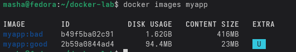
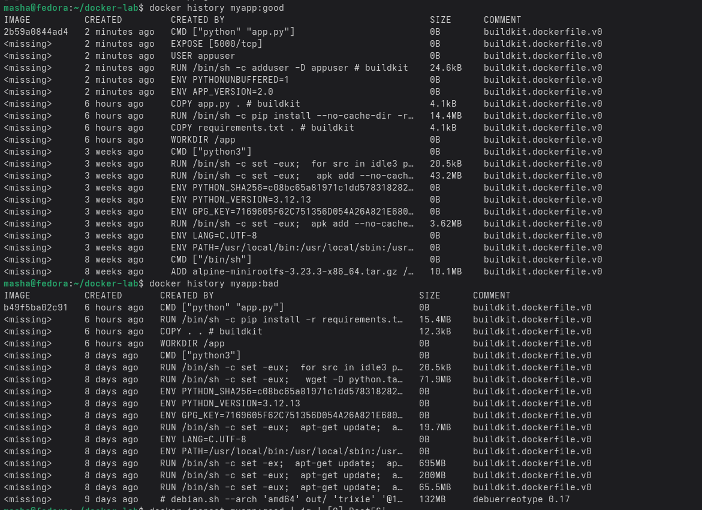
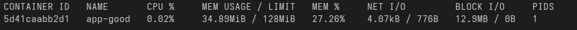

# Отчет по лабораторной работе

## Блок 1. Вывод

Когда я использовала полный образ Python с Debian, размер составил около гигабайта. Это происходит потому, что в базовом образе содержится полная операционная система со всеми утилитами, которые не нужны для простого приложения.

## Блок 2. Вывод

Во втором блоке стало понятно, что нужно брать маленький базовый образ. Alpine Linux весит мало, а Debian — много.

## Блок 3. Вывод

Каждый образ состоит из слоёв, и каждая команда в Dockerfile создаёт новый слой. Если в слое что-то добавить, а потом удалить, то слой всё равно будет занимать место. Можно увидеть что в оптимизированном образе содержатся только необходимые файлы приложения и минимальный набор системных утилит, в то время как в большом образе было много лишнего.

## Блок 4. Вывод

Docker Hub — это хранилище, где можно публиковать свои образы и скачивать чужие, подобно тому как GitHub работает с кодом. После публикации мой образ стал доступен всем желающим по ссылке (https://hub.docker.com/r/nynydod/flask-demo), и его можно запустить на почти любом компьютере.
//

